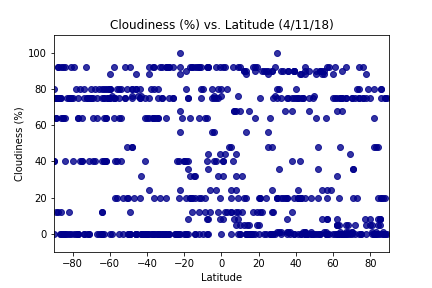
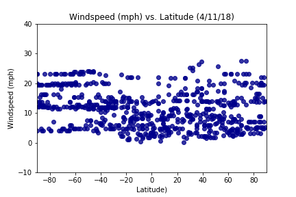

# WeatherPy #

### Analysis ###
From the graphs we can conclude that the temperature does increase the closer a city is to the equator. As a city's latitude approaches 0, the temperature increases.

The other weather conditions that were looked at: humidity, cloudiness, and windspeed, do not appear to be affected by their latitude.


```python
# Dependencies
from citipy import citipy
import pandas as pd
import matplotlib.pyplot as plt
import requests as req
import numpy as np
import json
import seaborn as sns
```


```python
# generate random lat and long
ran_lat = np.random.randint(-90, 90, size=600)
ran_lon = np.random.randint(-180, 180, size=600)

# create dataframe to hold the goods
latlon_df = pd.DataFrame({'Lat':ran_lat, 'Lon':ran_lon}).astype(float)
latlon_df["City"] = ""
latlon_df["Country Code"] = ""
latlon_df["Temperature (F)"] = ""
latlon_df["Humidity (%)"] = ""
latlon_df["Cloudiness (%)"] = ""
latlon_df["Windspeed (mph)"] = ""

#latlon_df.head()
```

### Generate Cities List ###


```python
# find closest cities to random lat and lon
for index, row in latlon_df.iterrows():
    latlon_df.at[index, 'City'] = citipy.nearest_city(row["Lat"], row["Lon"]).city_name
    latlon_df.at[index, 'Country Code'] = citipy.nearest_city(row["Lat"], row["Lon"]).country_code

#latlon_df.head()
```


```python
# Save config information
import config

api_key = config.key
url = "http://api.openweathermap.org/data/2.5/weather?"
units = "imperial"
```

### Perform API Calls ###


```python
template = "# {:^10}|{:^20}|{:^70}#"
header = template.format("wid", "city", "url (http://api.openweathermap.org/data/2.5/)")

# go through rows and define cities and countries
for index, row in latlon_df.iterrows():
    city_name = row["City"].replace(" ","+")
    country_code = row["Country Code"]
    
    # create query url using the city_name and country_code
    target_url = "http://api.openweathermap.org/data/2.5/weather?" + "appid=" + api_key + "&units=" + units + "&q=" + city_name + "," + country_code
    
    #print(target_url)
    try: 
        resp = req.get(target_url)
    except:
        continue
    
    #if resp.status_code == 404:
        #print("Houston we have a problem")
        #print(resp.text, target_url)
        #continue
        
    cities_lat_lon = resp.json()
#     cities_lat_lon = req.get(target_url, timeout=5).json()
    #print(json.dumps(cities_lat_lon, indent=4, sort_keys=True))
    
# retrieve data for each column using try and except in case the city does not have weather tracking
    try:
        latlon_df.at[index, "Temperature (F)"] = cities_lat_lon["main"]["temp"]
        latlon_df.at[index, "Humidity (%)"] = cities_lat_lon["main"]["humidity"]
        latlon_df.at[index, "Cloudiness (%)"] = cities_lat_lon["clouds"]["all"]
        latlon_df.at[index, "Windspeed (mph)"] = cities_lat_lon["wind"]["speed"]
    
    except:
        #print("Missing field... skipping.")
        latlon_df.at[index, "Temperature (F)"] = "NaN"
        latlon_df.at[index, "Humidity (%)"] = "NaN"
        latlon_df.at[index, "Cloudiness (%)"] = "NaN"
        latlon_df.at[index, "Windspeed (mph)"] = "NaN"
        
        latlon_df = latlon_df[~latlon_df['Temperature (F)'].isin(['NaN'])]

# cities and urls
    try:
        print(header)
        print("".join(["-" for i in range(110)]))
        print(template.format(cities_lat_lon["id"], cities_lat_lon["name"], target_url))
    except KeyError:
        print("City does not have weather tracked.")
        
latlon_df.head()
        

```

    #    wid    |        city        |            url (http://api.openweathermap.org/data/2.5/)             #
    --------------------------------------------------------------------------------------------------------------
    #   923652  |       Thyolo       |http://api.openweathermap.org/data/2.5/weather?appid=4eaf5a97d657efce15237d1ddca8220b&units=imperial&q=thyolo,mw#
    #    wid    |        city        |            url (http://api.openweathermap.org/data/2.5/)             #
    --------------------------------------------------------------------------------------------------------------
    #  1116760  |      Don Sak       |http://api.openweathermap.org/data/2.5/weather?appid=4eaf5a97d657efce15237d1ddca8220b&units=imperial&q=don+sak,th#
    #    wid    |        city        |            url (http://api.openweathermap.org/data/2.5/)             #
    --------------------------------------------------------------------------------------------------------------
    #  5367788  |       Lompoc       |http://api.openweathermap.org/data/2.5/weather?appid=4eaf5a97d657efce15237d1ddca8220b&units=imperial&q=lompoc,us#
    #    wid    |        city        |            url (http://api.openweathermap.org/data/2.5/)             #
    --------------------------------------------------------------------------------------------------------------
    City does not have weather tracked.
    #    wid    |        city        |            url (http://api.openweathermap.org/data/2.5/)             #
    --------------------------------------------------------------------------------------------------------------
    City does not have weather tracked.
    #    wid    |        city        |            url (http://api.openweathermap.org/data/2.5/)             #
    --------------------------------------------------------------------------------------------------------------
    #  2075265  |     Busselton      |http://api.openweathermap.org/data/2.5/weather?appid=4eaf5a97d657efce15237d1ddca8220b&units=imperial&q=busselton,au#
    #    wid    |        city        |            url (http://api.openweathermap.org/data/2.5/)             #
    --------------------------------------------------------------------------------------------------------------
    #  4035715  |       Avarua       |http://api.openweathermap.org/data/2.5/weather?appid=4eaf5a97d657efce15237d1ddca8220b&units=imperial&q=avarua,ck#
    #    wid    |        city        |            url (http://api.openweathermap.org/data/2.5/)             #
    --------------------------------------------------------------------------------------------------------------
    #  1490256  |      Talnakh       |http://api.openweathermap.org/data/2.5/weather?appid=4eaf5a97d657efce15237d1ddca8220b&units=imperial&q=talnakh,ru#
    #    wid    |        city        |            url (http://api.openweathermap.org/data/2.5/)             #
    --------------------------------------------------------------------------------------------------------------
    #  2122090  |       Pevek        |http://api.openweathermap.org/data/2.5/weather?appid=4eaf5a97d657efce15237d1ddca8220b&units=imperial&q=pevek,ru#
    #    wid    |        city        |            url (http://api.openweathermap.org/data/2.5/)             #
    --------------------------------------------------------------------------------------------------------------
    #  3874787  |    Punta Arenas    |http://api.openweathermap.org/data/2.5/weather?appid=4eaf5a97d657efce15237d1ddca8220b&units=imperial&q=punta+arenas,cl#
    #    wid    |        city        |            url (http://api.openweathermap.org/data/2.5/)             #
    --------------------------------------------------------------------------------------------------------------
    #  4252975  |       Barrow       |http://api.openweathermap.org/data/2.5/weather?appid=4eaf5a97d657efce15237d1ddca8220b&units=imperial&q=barrow,us#
    #    wid    |        city        |            url (http://api.openweathermap.org/data/2.5/)             #
    --------------------------------------------------------------------------------------------------------------
    #  2077963  |       Albany       |http://api.openweathermap.org/data/2.5/weather?appid=4eaf5a97d657efce15237d1ddca8220b&units=imperial&q=albany,au#
    #    wid    |        city        |            url (http://api.openweathermap.org/data/2.5/)             #
    --------------------------------------------------------------------------------------------------------------
    #  3863379  |   Mar del Plata    |http://api.openweathermap.org/data/2.5/weather?appid=4eaf5a97d657efce15237d1ddca8220b&units=imperial&q=mar+del+plata,ar#
    #    wid    |        city        |            url (http://api.openweathermap.org/data/2.5/)             #
    --------------------------------------------------------------------------------------------------------------
    #  2267254  |       Lagoa        |http://api.openweathermap.org/data/2.5/weather?appid=4eaf5a97d657efce15237d1ddca8220b&units=imperial&q=lagoa,pt#
    #    wid    |        city        |            url (http://api.openweathermap.org/data/2.5/)             #
    --------------------------------------------------------------------------------------------------------------
    #  2729907  |    Longyearbyen    |http://api.openweathermap.org/data/2.5/weather?appid=4eaf5a97d657efce15237d1ddca8220b&units=imperial&q=longyearbyen,sj#
    #    wid    |        city        |            url (http://api.openweathermap.org/data/2.5/)             #
    --------------------------------------------------------------------------------------------------------------
    #  6185377  |    Yellowknife     |http://api.openweathermap.org/data/2.5/weather?appid=4eaf5a97d657efce15237d1ddca8220b&units=imperial&q=yellowknife,ca#
    #    wid    |        city        |            url (http://api.openweathermap.org/data/2.5/)             #
    --------------------------------------------------------------------------------------------------------------
    City does not have weather tracked.
    #    wid    |        city        |            url (http://api.openweathermap.org/data/2.5/)             #
    --------------------------------------------------------------------------------------------------------------
    #  2093685  |       Kokopo       |http://api.openweathermap.org/data/2.5/weather?appid=4eaf5a97d657efce15237d1ddca8220b&units=imperial&q=kokopo,pg#
    #    wid    |        city        |            url (http://api.openweathermap.org/data/2.5/)             #
    --------------------------------------------------------------------------------------------------------------
    #  2075265  |     Busselton      |http://api.openweathermap.org/data/2.5/weather?appid=4eaf5a97d657efce15237d1ddca8220b&units=imperial&q=busselton,au#
    #    wid    |        city        |            url (http://api.openweathermap.org/data/2.5/)             #
    --------------------------------------------------------------------------------------------------------------
    City does not have weather tracked.
    #    wid    |        city        |            url (http://api.openweathermap.org/data/2.5/)             #
    --------------------------------------------------------------------------------------------------------------
    #  3369157  |     Cape Town      |http://api.openweathermap.org/data/2.5/weather?appid=4eaf5a97d657efce15237d1ddca8220b&units=imperial&q=cape+town,za#
    #    wid    |        city        |            url (http://api.openweathermap.org/data/2.5/)             #
    --------------------------------------------------------------------------------------------------------------
    #  2155415  |    New Norfolk     |http://api.openweathermap.org/data/2.5/weather?appid=4eaf5a97d657efce15237d1ddca8220b&units=imperial&q=new+norfolk,au#
    #    wid    |        city        |            url (http://api.openweathermap.org/data/2.5/)             #
    --------------------------------------------------------------------------------------------------------------
    #  3366880  |      Hermanus      |http://api.openweathermap.org/data/2.5/weather?appid=4eaf5a97d657efce15237d1ddca8220b&units=imperial&q=hermanus,za#
    #    wid    |        city        |            url (http://api.openweathermap.org/data/2.5/)             #
    --------------------------------------------------------------------------------------------------------------
    #  1106677  |  Bambous Virieux   |http://api.openweathermap.org/data/2.5/weather?appid=4eaf5a97d657efce15237d1ddca8220b&units=imperial&q=bambous+virieux,mu#
    #    wid    |        city        |            url (http://api.openweathermap.org/data/2.5/)             #
    --------------------------------------------------------------------------------------------------------------
    #  4020109  |       Atuona       |http://api.openweathermap.org/data/2.5/weather?appid=4eaf5a97d657efce15237d1ddca8220b&units=imperial&q=atuona,pf#
    #    wid    |        city        |            url (http://api.openweathermap.org/data/2.5/)             #
    --------------------------------------------------------------------------------------------------------------
    City does not have weather tracked.
    #    wid    |        city        |            url (http://api.openweathermap.org/data/2.5/)             #
    --------------------------------------------------------------------------------------------------------------
    #  3369157  |     Cape Town      |http://api.openweathermap.org/data/2.5/weather?appid=4eaf5a97d657efce15237d1ddca8220b&units=imperial&q=cape+town,za#
    #    wid    |        city        |            url (http://api.openweathermap.org/data/2.5/)             #
    --------------------------------------------------------------------------------------------------------------
    #   370510  |      Marabba       |http://api.openweathermap.org/data/2.5/weather?appid=4eaf5a97d657efce15237d1ddca8220b&units=imperial&q=marabba,sd#
    #    wid    |        city        |            url (http://api.openweathermap.org/data/2.5/)             #
    --------------------------------------------------------------------------------------------------------------
    City does not have weather tracked.
    #    wid    |        city        |            url (http://api.openweathermap.org/data/2.5/)             #
    --------------------------------------------------------------------------------------------------------------
    #  2163355  |       Hobart       |http://api.openweathermap.org/data/2.5/weather?appid=4eaf5a97d657efce15237d1ddca8220b&units=imperial&q=hobart,au#
    #    wid    |        city        |            url (http://api.openweathermap.org/data/2.5/)             #
    --------------------------------------------------------------------------------------------------------------
    #  3833367  |      Ushuaia       |http://api.openweathermap.org/data/2.5/weather?appid=4eaf5a97d657efce15237d1ddca8220b&units=imperial&q=ushuaia,ar#
    #    wid    |        city        |            url (http://api.openweathermap.org/data/2.5/)             #
    --------------------------------------------------------------------------------------------------------------
    #  5895424  |    Bay Roberts     |http://api.openweathermap.org/data/2.5/weather?appid=4eaf5a97d657efce15237d1ddca8220b&units=imperial&q=bay+roberts,ca#
    #    wid    |        city        |            url (http://api.openweathermap.org/data/2.5/)             #
    --------------------------------------------------------------------------------------------------------------
    #  1795095  |      Mingshui      |http://api.openweathermap.org/data/2.5/weather?appid=4eaf5a97d657efce15237d1ddca8220b&units=imperial&q=mingshui,cn#
    #    wid    |        city        |            url (http://api.openweathermap.org/data/2.5/)             #
    --------------------------------------------------------------------------------------------------------------
    City does not have weather tracked.
    #    wid    |        city        |            url (http://api.openweathermap.org/data/2.5/)             #
    --------------------------------------------------------------------------------------------------------------
    #  2077963  |       Albany       |http://api.openweathermap.org/data/2.5/weather?appid=4eaf5a97d657efce15237d1ddca8220b&units=imperial&q=albany,au#
    #    wid    |        city        |            url (http://api.openweathermap.org/data/2.5/)             #
    --------------------------------------------------------------------------------------------------------------
    #  2134814  |        Sola        |http://api.openweathermap.org/data/2.5/weather?appid=4eaf5a97d657efce15237d1ddca8220b&units=imperial&q=sola,vu#
    #    wid    |        city        |            url (http://api.openweathermap.org/data/2.5/)             #
    --------------------------------------------------------------------------------------------------------------
    #  2621072  |      Guderup       |http://api.openweathermap.org/data/2.5/weather?appid=4eaf5a97d657efce15237d1ddca8220b&units=imperial&q=guderup,dk#
    #    wid    |        city        |            url (http://api.openweathermap.org/data/2.5/)             #
    --------------------------------------------------------------------------------------------------------------
    #  2077963  |       Albany       |http://api.openweathermap.org/data/2.5/weather?appid=4eaf5a97d657efce15237d1ddca8220b&units=imperial&q=albany,au#
    #    wid    |        city        |            url (http://api.openweathermap.org/data/2.5/)             #
    --------------------------------------------------------------------------------------------------------------
    #  1213855  |      Sibolga       |http://api.openweathermap.org/data/2.5/weather?appid=4eaf5a97d657efce15237d1ddca8220b&units=imperial&q=sibolga,id#
    #    wid    |        city        |            url (http://api.openweathermap.org/data/2.5/)             #
    --------------------------------------------------------------------------------------------------------------
    #  2636790  |     Stornoway      |http://api.openweathermap.org/data/2.5/weather?appid=4eaf5a97d657efce15237d1ddca8220b&units=imperial&q=stornoway,gb#
    #    wid    |        city        |            url (http://api.openweathermap.org/data/2.5/)             #
    --------------------------------------------------------------------------------------------------------------
    #  2309528  |        Luba        |http://api.openweathermap.org/data/2.5/weather?appid=4eaf5a97d657efce15237d1ddca8220b&units=imperial&q=luba,gq#
    #    wid    |        city        |            url (http://api.openweathermap.org/data/2.5/)             #
    --------------------------------------------------------------------------------------------------------------
    #  5367788  |       Lompoc       |http://api.openweathermap.org/data/2.5/weather?appid=4eaf5a97d657efce15237d1ddca8220b&units=imperial&q=lompoc,us#
    #    wid    |        city        |            url (http://api.openweathermap.org/data/2.5/)             #
    --------------------------------------------------------------------------------------------------------------
    #  1264976  |        Leh         |http://api.openweathermap.org/data/2.5/weather?appid=4eaf5a97d657efce15237d1ddca8220b&units=imperial&q=leh,in#
    #    wid    |        city        |            url (http://api.openweathermap.org/data/2.5/)             #
    --------------------------------------------------------------------------------------------------------------
    #  4252975  |       Barrow       |http://api.openweathermap.org/data/2.5/weather?appid=4eaf5a97d657efce15237d1ddca8220b&units=imperial&q=barrow,us#
    #    wid    |        city        |            url (http://api.openweathermap.org/data/2.5/)             #
    --------------------------------------------------------------------------------------------------------------
    #  4030556  |      Rikitea       |http://api.openweathermap.org/data/2.5/weather?appid=4eaf5a97d657efce15237d1ddca8220b&units=imperial&q=rikitea,pf#
    #    wid    |        city        |            url (http://api.openweathermap.org/data/2.5/)             #
    --------------------------------------------------------------------------------------------------------------
    #  1787901  |      Xunchang      |http://api.openweathermap.org/data/2.5/weather?appid=4eaf5a97d657efce15237d1ddca8220b&units=imperial&q=xunchang,cn#
    #    wid    |        city        |            url (http://api.openweathermap.org/data/2.5/)             #
    --------------------------------------------------------------------------------------------------------------
    City does not have weather tracked.
    #    wid    |        city        |            url (http://api.openweathermap.org/data/2.5/)             #
    --------------------------------------------------------------------------------------------------------------
    City does not have weather tracked.
    #    wid    |        city        |            url (http://api.openweathermap.org/data/2.5/)             #
    --------------------------------------------------------------------------------------------------------------
    #  3397763  |    Jacareacanga    |http://api.openweathermap.org/data/2.5/weather?appid=4eaf5a97d657efce15237d1ddca8220b&units=imperial&q=jacareacanga,br#
    #    wid    |        city        |            url (http://api.openweathermap.org/data/2.5/)             #
    --------------------------------------------------------------------------------------------------------------
    #  2075265  |     Busselton      |http://api.openweathermap.org/data/2.5/weather?appid=4eaf5a97d657efce15237d1ddca8220b&units=imperial&q=busselton,au#
    #    wid    |        city        |            url (http://api.openweathermap.org/data/2.5/)             #
    --------------------------------------------------------------------------------------------------------------
    #  3874787  |    Punta Arenas    |http://api.openweathermap.org/data/2.5/weather?appid=4eaf5a97d657efce15237d1ddca8220b&units=imperial&q=punta+arenas,cl#
    #    wid    |        city        |            url (http://api.openweathermap.org/data/2.5/)             #
    --------------------------------------------------------------------------------------------------------------
    #  2128975  |       Nemuro       |http://api.openweathermap.org/data/2.5/weather?appid=4eaf5a97d657efce15237d1ddca8220b&units=imperial&q=nemuro,jp#
    #    wid    |        city        |            url (http://api.openweathermap.org/data/2.5/)             #
    --------------------------------------------------------------------------------------------------------------
    City does not have weather tracked.
    #    wid    |        city        |            url (http://api.openweathermap.org/data/2.5/)             #
    --------------------------------------------------------------------------------------------------------------
    #  1507390  |       Dikson       |http://api.openweathermap.org/data/2.5/weather?appid=4eaf5a97d657efce15237d1ddca8220b&units=imperial&q=dikson,ru#
    #    wid    |        city        |            url (http://api.openweathermap.org/data/2.5/)             #
    --------------------------------------------------------------------------------------------------------------
    #  3874787  |    Punta Arenas    |http://api.openweathermap.org/data/2.5/weather?appid=4eaf5a97d657efce15237d1ddca8220b&units=imperial&q=punta+arenas,cl#
    #    wid    |        city        |            url (http://api.openweathermap.org/data/2.5/)             #
    --------------------------------------------------------------------------------------------------------------
    #  2013918  |      Ust-Maya      |http://api.openweathermap.org/data/2.5/weather?appid=4eaf5a97d657efce15237d1ddca8220b&units=imperial&q=ust-maya,ru#
    #    wid    |        city        |            url (http://api.openweathermap.org/data/2.5/)             #
    --------------------------------------------------------------------------------------------------------------
    #  3355672  |      Luderitz      |http://api.openweathermap.org/data/2.5/weather?appid=4eaf5a97d657efce15237d1ddca8220b&units=imperial&q=luderitz,na#
    #    wid    |        city        |            url (http://api.openweathermap.org/data/2.5/)             #
    --------------------------------------------------------------------------------------------------------------
    #  4032243  |       Vaini        |http://api.openweathermap.org/data/2.5/weather?appid=4eaf5a97d657efce15237d1ddca8220b&units=imperial&q=vaini,to#
    #    wid    |        city        |            url (http://api.openweathermap.org/data/2.5/)             #
    --------------------------------------------------------------------------------------------------------------
    #  1510998  |      Balakhta      |http://api.openweathermap.org/data/2.5/weather?appid=4eaf5a97d657efce15237d1ddca8220b&units=imperial&q=balakhta,ru#
    #    wid    |        city        |            url (http://api.openweathermap.org/data/2.5/)             #
    --------------------------------------------------------------------------------------------------------------
    #  2332515  |       Lafia        |http://api.openweathermap.org/data/2.5/weather?appid=4eaf5a97d657efce15237d1ddca8220b&units=imperial&q=lafia,ng#
    #    wid    |        city        |            url (http://api.openweathermap.org/data/2.5/)             #
    --------------------------------------------------------------------------------------------------------------
    #  1640044  |       Kijang       |http://api.openweathermap.org/data/2.5/weather?appid=4eaf5a97d657efce15237d1ddca8220b&units=imperial&q=kijang,id#
    #    wid    |        city        |            url (http://api.openweathermap.org/data/2.5/)             #
    --------------------------------------------------------------------------------------------------------------
    City does not have weather tracked.
    #    wid    |        city        |            url (http://api.openweathermap.org/data/2.5/)             #
    --------------------------------------------------------------------------------------------------------------
    #  3366880  |      Hermanus      |http://api.openweathermap.org/data/2.5/weather?appid=4eaf5a97d657efce15237d1ddca8220b&units=imperial&q=hermanus,za#
    #    wid    |        city        |            url (http://api.openweathermap.org/data/2.5/)             #
    --------------------------------------------------------------------------------------------------------------
    #  2782053  |   Bad Hofgastein   |http://api.openweathermap.org/data/2.5/weather?appid=4eaf5a97d657efce15237d1ddca8220b&units=imperial&q=bad+hofgastein,at#
    #    wid    |        city        |            url (http://api.openweathermap.org/data/2.5/)             #
    --------------------------------------------------------------------------------------------------------------
    #  4020109  |       Atuona       |http://api.openweathermap.org/data/2.5/weather?appid=4eaf5a97d657efce15237d1ddca8220b&units=imperial&q=atuona,pf#
    #    wid    |        city        |            url (http://api.openweathermap.org/data/2.5/)             #
    --------------------------------------------------------------------------------------------------------------
    #  3372707  |   Ribeira Grande   |http://api.openweathermap.org/data/2.5/weather?appid=4eaf5a97d657efce15237d1ddca8220b&units=imperial&q=ribeira+grande,pt#
    #    wid    |        city        |            url (http://api.openweathermap.org/data/2.5/)             #
    --------------------------------------------------------------------------------------------------------------
    #  4252975  |       Barrow       |http://api.openweathermap.org/data/2.5/weather?appid=4eaf5a97d657efce15237d1ddca8220b&units=imperial&q=barrow,us#
    #    wid    |        city        |            url (http://api.openweathermap.org/data/2.5/)             #
    --------------------------------------------------------------------------------------------------------------
    #  4030556  |      Rikitea       |http://api.openweathermap.org/data/2.5/weather?appid=4eaf5a97d657efce15237d1ddca8220b&units=imperial&q=rikitea,pf#
    #    wid    |        city        |            url (http://api.openweathermap.org/data/2.5/)             #
    --------------------------------------------------------------------------------------------------------------
    #  1490085  |     Tarko-Sale     |http://api.openweathermap.org/data/2.5/weather?appid=4eaf5a97d657efce15237d1ddca8220b&units=imperial&q=tarko-sale,ru#
    #    wid    |        city        |            url (http://api.openweathermap.org/data/2.5/)             #
    --------------------------------------------------------------------------------------------------------------
    #  3448903  | Sao Joao da Barra  |http://api.openweathermap.org/data/2.5/weather?appid=4eaf5a97d657efce15237d1ddca8220b&units=imperial&q=sao+joao+da+barra,br#
    #    wid    |        city        |            url (http://api.openweathermap.org/data/2.5/)             #
    --------------------------------------------------------------------------------------------------------------
    #  3356832  |    Henties Bay     |http://api.openweathermap.org/data/2.5/weather?appid=4eaf5a97d657efce15237d1ddca8220b&units=imperial&q=henties+bay,na#
    #    wid    |        city        |            url (http://api.openweathermap.org/data/2.5/)             #
    --------------------------------------------------------------------------------------------------------------
    #   112656  |     Tonekabon      |http://api.openweathermap.org/data/2.5/weather?appid=4eaf5a97d657efce15237d1ddca8220b&units=imperial&q=tonekabon,ir#
    #    wid    |        city        |            url (http://api.openweathermap.org/data/2.5/)             #
    --------------------------------------------------------------------------------------------------------------
    City does not have weather tracked.
    #    wid    |        city        |            url (http://api.openweathermap.org/data/2.5/)             #
    --------------------------------------------------------------------------------------------------------------
    #  2256895  |     Mossendjo      |http://api.openweathermap.org/data/2.5/weather?appid=4eaf5a97d657efce15237d1ddca8220b&units=imperial&q=mossendjo,cg#
    #    wid    |        city        |            url (http://api.openweathermap.org/data/2.5/)             #
    --------------------------------------------------------------------------------------------------------------
    #   64814   |    Bandarbeyla     |http://api.openweathermap.org/data/2.5/weather?appid=4eaf5a97d657efce15237d1ddca8220b&units=imperial&q=bandarbeyla,so#
    #    wid    |        city        |            url (http://api.openweathermap.org/data/2.5/)             #
    --------------------------------------------------------------------------------------------------------------
    #  3870243  |       Taltal       |http://api.openweathermap.org/data/2.5/weather?appid=4eaf5a97d657efce15237d1ddca8220b&units=imperial&q=taltal,cl#
    #    wid    |        city        |            url (http://api.openweathermap.org/data/2.5/)             #
    --------------------------------------------------------------------------------------------------------------
    #  5380437  |   Pacific Grove    |http://api.openweathermap.org/data/2.5/weather?appid=4eaf5a97d657efce15237d1ddca8220b&units=imperial&q=pacific+grove,us#
    #    wid    |        city        |            url (http://api.openweathermap.org/data/2.5/)             #
    --------------------------------------------------------------------------------------------------------------
    #  3114567  |    Palafrugell     |http://api.openweathermap.org/data/2.5/weather?appid=4eaf5a97d657efce15237d1ddca8220b&units=imperial&q=palafrugell,es#
    #    wid    |        city        |            url (http://api.openweathermap.org/data/2.5/)             #
    --------------------------------------------------------------------------------------------------------------
    City does not have weather tracked.
    #    wid    |        city        |            url (http://api.openweathermap.org/data/2.5/)             #
    --------------------------------------------------------------------------------------------------------------
    #  1015776  |     Bredasdorp     |http://api.openweathermap.org/data/2.5/weather?appid=4eaf5a97d657efce15237d1ddca8220b&units=imperial&q=bredasdorp,za#
    #    wid    |        city        |            url (http://api.openweathermap.org/data/2.5/)             #
    --------------------------------------------------------------------------------------------------------------
    #  1259385  |     Port Blair     |http://api.openweathermap.org/data/2.5/weather?appid=4eaf5a97d657efce15237d1ddca8220b&units=imperial&q=port+blair,in#
    #    wid    |        city        |            url (http://api.openweathermap.org/data/2.5/)             #
    --------------------------------------------------------------------------------------------------------------
    #  4030556  |      Rikitea       |http://api.openweathermap.org/data/2.5/weather?appid=4eaf5a97d657efce15237d1ddca8220b&units=imperial&q=rikitea,pf#
    #    wid    |        city        |            url (http://api.openweathermap.org/data/2.5/)             #
    --------------------------------------------------------------------------------------------------------------
    City does not have weather tracked.
    #    wid    |        city        |            url (http://api.openweathermap.org/data/2.5/)             #
    --------------------------------------------------------------------------------------------------------------
    #  4030556  |      Rikitea       |http://api.openweathermap.org/data/2.5/weather?appid=4eaf5a97d657efce15237d1ddca8220b&units=imperial&q=rikitea,pf#
    #    wid    |        city        |            url (http://api.openweathermap.org/data/2.5/)             #
    --------------------------------------------------------------------------------------------------------------
    #  4030556  |      Rikitea       |http://api.openweathermap.org/data/2.5/weather?appid=4eaf5a97d657efce15237d1ddca8220b&units=imperial&q=rikitea,pf#
    #    wid    |        city        |            url (http://api.openweathermap.org/data/2.5/)             #
    --------------------------------------------------------------------------------------------------------------
    #  4032243  |       Vaini        |http://api.openweathermap.org/data/2.5/weather?appid=4eaf5a97d657efce15237d1ddca8220b&units=imperial&q=vaini,to#
    #    wid    |        city        |            url (http://api.openweathermap.org/data/2.5/)             #
    --------------------------------------------------------------------------------------------------------------
    #  3374210  |     Sao Filipe     |http://api.openweathermap.org/data/2.5/weather?appid=4eaf5a97d657efce15237d1ddca8220b&units=imperial&q=sao+filipe,cv#
    #    wid    |        city        |            url (http://api.openweathermap.org/data/2.5/)             #
    --------------------------------------------------------------------------------------------------------------
    #  4267710  |       Sitka        |http://api.openweathermap.org/data/2.5/weather?appid=4eaf5a97d657efce15237d1ddca8220b&units=imperial&q=sitka,us#
    #    wid    |        city        |            url (http://api.openweathermap.org/data/2.5/)             #
    --------------------------------------------------------------------------------------------------------------
    City does not have weather tracked.
    #    wid    |        city        |            url (http://api.openweathermap.org/data/2.5/)             #
    --------------------------------------------------------------------------------------------------------------
    #   964420  |   Port Elizabeth   |http://api.openweathermap.org/data/2.5/weather?appid=4eaf5a97d657efce15237d1ddca8220b&units=imperial&q=port+elizabeth,za#
    #    wid    |        city        |            url (http://api.openweathermap.org/data/2.5/)             #
    --------------------------------------------------------------------------------------------------------------
    #  3833367  |      Ushuaia       |http://api.openweathermap.org/data/2.5/weather?appid=4eaf5a97d657efce15237d1ddca8220b&units=imperial&q=ushuaia,ar#
    #    wid    |        city        |            url (http://api.openweathermap.org/data/2.5/)             #
    --------------------------------------------------------------------------------------------------------------
    #  4032243  |       Vaini        |http://api.openweathermap.org/data/2.5/weather?appid=4eaf5a97d657efce15237d1ddca8220b&units=imperial&q=vaini,to#
    #    wid    |        city        |            url (http://api.openweathermap.org/data/2.5/)             #
    --------------------------------------------------------------------------------------------------------------
    #  1015776  |     Bredasdorp     |http://api.openweathermap.org/data/2.5/weather?appid=4eaf5a97d657efce15237d1ddca8220b&units=imperial&q=bredasdorp,za#
    #    wid    |        city        |            url (http://api.openweathermap.org/data/2.5/)             #
    --------------------------------------------------------------------------------------------------------------
    #  2156643  |   Mount Gambier    |http://api.openweathermap.org/data/2.5/weather?appid=4eaf5a97d657efce15237d1ddca8220b&units=imperial&q=mount+gambier,au#
    #    wid    |        city        |            url (http://api.openweathermap.org/data/2.5/)             #
    --------------------------------------------------------------------------------------------------------------
    #  6089245  |    Norman Wells    |http://api.openweathermap.org/data/2.5/weather?appid=4eaf5a97d657efce15237d1ddca8220b&units=imperial&q=norman+wells,ca#
    #    wid    |        city        |            url (http://api.openweathermap.org/data/2.5/)             #
    --------------------------------------------------------------------------------------------------------------
    #  1486321  |      Yar-Sale      |http://api.openweathermap.org/data/2.5/weather?appid=4eaf5a97d657efce15237d1ddca8220b&units=imperial&q=yar-sale,ru#
    #    wid    |        city        |            url (http://api.openweathermap.org/data/2.5/)             #
    --------------------------------------------------------------------------------------------------------------
    #  2075265  |     Busselton      |http://api.openweathermap.org/data/2.5/weather?appid=4eaf5a97d657efce15237d1ddca8220b&units=imperial&q=busselton,au#
    #    wid    |        city        |            url (http://api.openweathermap.org/data/2.5/)             #
    --------------------------------------------------------------------------------------------------------------
    #  3386213  |       Touros       |http://api.openweathermap.org/data/2.5/weather?appid=4eaf5a97d657efce15237d1ddca8220b&units=imperial&q=touros,br#
    #    wid    |        city        |            url (http://api.openweathermap.org/data/2.5/)             #
    --------------------------------------------------------------------------------------------------------------
    #  2017155  |     Saskylakh      |http://api.openweathermap.org/data/2.5/weather?appid=4eaf5a97d657efce15237d1ddca8220b&units=imperial&q=saskylakh,ru#
    #    wid    |        city        |            url (http://api.openweathermap.org/data/2.5/)             #
    --------------------------------------------------------------------------------------------------------------
    #  3874787  |    Punta Arenas    |http://api.openweathermap.org/data/2.5/weather?appid=4eaf5a97d657efce15237d1ddca8220b&units=imperial&q=punta+arenas,cl#
    #    wid    |        city        |            url (http://api.openweathermap.org/data/2.5/)             #
    --------------------------------------------------------------------------------------------------------------
    City does not have weather tracked.
    #    wid    |        city        |            url (http://api.openweathermap.org/data/2.5/)             #
    --------------------------------------------------------------------------------------------------------------
    #  2281120  |       Tabou        |http://api.openweathermap.org/data/2.5/weather?appid=4eaf5a97d657efce15237d1ddca8220b&units=imperial&q=tabou,ci#
    #    wid    |        city        |            url (http://api.openweathermap.org/data/2.5/)             #
    --------------------------------------------------------------------------------------------------------------
    #  4944903  |     Nantucket      |http://api.openweathermap.org/data/2.5/weather?appid=4eaf5a97d657efce15237d1ddca8220b&units=imperial&q=nantucket,us#
    #    wid    |        city        |            url (http://api.openweathermap.org/data/2.5/)             #
    --------------------------------------------------------------------------------------------------------------
    City does not have weather tracked.
    #    wid    |        city        |            url (http://api.openweathermap.org/data/2.5/)             #
    --------------------------------------------------------------------------------------------------------------
    #   964432  |    Port Alfred     |http://api.openweathermap.org/data/2.5/weather?appid=4eaf5a97d657efce15237d1ddca8220b&units=imperial&q=port+alfred,za#
    #    wid    |        city        |            url (http://api.openweathermap.org/data/2.5/)             #
    --------------------------------------------------------------------------------------------------------------
    #  3863379  |   Mar del Plata    |http://api.openweathermap.org/data/2.5/weather?appid=4eaf5a97d657efce15237d1ddca8220b&units=imperial&q=mar+del+plata,ar#
    #    wid    |        city        |            url (http://api.openweathermap.org/data/2.5/)             #
    --------------------------------------------------------------------------------------------------------------
    #  5848280  |       Kapaa        |http://api.openweathermap.org/data/2.5/weather?appid=4eaf5a97d657efce15237d1ddca8220b&units=imperial&q=kapaa,us#
    #    wid    |        city        |            url (http://api.openweathermap.org/data/2.5/)             #
    --------------------------------------------------------------------------------------------------------------
    #  1793533  |      Taixing       |http://api.openweathermap.org/data/2.5/weather?appid=4eaf5a97d657efce15237d1ddca8220b&units=imperial&q=taixing,cn#
    #    wid    |        city        |            url (http://api.openweathermap.org/data/2.5/)             #
    --------------------------------------------------------------------------------------------------------------
    #  3833367  |      Ushuaia       |http://api.openweathermap.org/data/2.5/weather?appid=4eaf5a97d657efce15237d1ddca8220b&units=imperial&q=ushuaia,ar#
    #    wid    |        city        |            url (http://api.openweathermap.org/data/2.5/)             #
    --------------------------------------------------------------------------------------------------------------
    #  3369157  |     Cape Town      |http://api.openweathermap.org/data/2.5/weather?appid=4eaf5a97d657efce15237d1ddca8220b&units=imperial&q=cape+town,za#
    #    wid    |        city        |            url (http://api.openweathermap.org/data/2.5/)             #
    --------------------------------------------------------------------------------------------------------------
    #  2163355  |       Hobart       |http://api.openweathermap.org/data/2.5/weather?appid=4eaf5a97d657efce15237d1ddca8220b&units=imperial&q=hobart,au#
    #    wid    |        city        |            url (http://api.openweathermap.org/data/2.5/)             #
    --------------------------------------------------------------------------------------------------------------
    #  5848280  |       Kapaa        |http://api.openweathermap.org/data/2.5/weather?appid=4eaf5a97d657efce15237d1ddca8220b&units=imperial&q=kapaa,us#
    #    wid    |        city        |            url (http://api.openweathermap.org/data/2.5/)             #
    --------------------------------------------------------------------------------------------------------------
    #  3466970  |      Cardoso       |http://api.openweathermap.org/data/2.5/weather?appid=4eaf5a97d657efce15237d1ddca8220b&units=imperial&q=cardoso,br#
    #    wid    |        city        |            url (http://api.openweathermap.org/data/2.5/)             #
    --------------------------------------------------------------------------------------------------------------
    City does not have weather tracked.
    #    wid    |        city        |            url (http://api.openweathermap.org/data/2.5/)             #
    --------------------------------------------------------------------------------------------------------------
    #  2094144  |       Kerema       |http://api.openweathermap.org/data/2.5/weather?appid=4eaf5a97d657efce15237d1ddca8220b&units=imperial&q=kerema,pg#
    #    wid    |        city        |            url (http://api.openweathermap.org/data/2.5/)             #
    --------------------------------------------------------------------------------------------------------------
    City does not have weather tracked.
    #    wid    |        city        |            url (http://api.openweathermap.org/data/2.5/)             #
    --------------------------------------------------------------------------------------------------------------
    #  3833367  |      Ushuaia       |http://api.openweathermap.org/data/2.5/weather?appid=4eaf5a97d657efce15237d1ddca8220b&units=imperial&q=ushuaia,ar#
    #    wid    |        city        |            url (http://api.openweathermap.org/data/2.5/)             #
    --------------------------------------------------------------------------------------------------------------
    #  2075265  |     Busselton      |http://api.openweathermap.org/data/2.5/weather?appid=4eaf5a97d657efce15237d1ddca8220b&units=imperial&q=busselton,au#
    #    wid    |        city        |            url (http://api.openweathermap.org/data/2.5/)             #
    --------------------------------------------------------------------------------------------------------------
    #  2119964  |     Vakhrushev     |http://api.openweathermap.org/data/2.5/weather?appid=4eaf5a97d657efce15237d1ddca8220b&units=imperial&q=vakhrushev,ru#
    #    wid    |        city        |            url (http://api.openweathermap.org/data/2.5/)             #
    --------------------------------------------------------------------------------------------------------------
    #  3833367  |      Ushuaia       |http://api.openweathermap.org/data/2.5/weather?appid=4eaf5a97d657efce15237d1ddca8220b&units=imperial&q=ushuaia,ar#
    #    wid    |        city        |            url (http://api.openweathermap.org/data/2.5/)             #
    --------------------------------------------------------------------------------------------------------------
    #  3652764  |    Puerto Ayora    |http://api.openweathermap.org/data/2.5/weather?appid=4eaf5a97d657efce15237d1ddca8220b&units=imperial&q=puerto+ayora,ec#
    #    wid    |        city        |            url (http://api.openweathermap.org/data/2.5/)             #
    --------------------------------------------------------------------------------------------------------------
    #   964432  |    Port Alfred     |http://api.openweathermap.org/data/2.5/weather?appid=4eaf5a97d657efce15237d1ddca8220b&units=imperial&q=port+alfred,za#
    #    wid    |        city        |            url (http://api.openweathermap.org/data/2.5/)             #
    --------------------------------------------------------------------------------------------------------------
    #  2075265  |     Busselton      |http://api.openweathermap.org/data/2.5/weather?appid=4eaf5a97d657efce15237d1ddca8220b&units=imperial&q=busselton,au#
    #    wid    |        city        |            url (http://api.openweathermap.org/data/2.5/)             #
    --------------------------------------------------------------------------------------------------------------
    #  3883457  |        Lebu        |http://api.openweathermap.org/data/2.5/weather?appid=4eaf5a97d657efce15237d1ddca8220b&units=imperial&q=lebu,cl#
    #    wid    |        city        |            url (http://api.openweathermap.org/data/2.5/)             #
    --------------------------------------------------------------------------------------------------------------
    #  2206939  |       Bluff        |http://api.openweathermap.org/data/2.5/weather?appid=4eaf5a97d657efce15237d1ddca8220b&units=imperial&q=bluff,nz#
    #    wid    |        city        |            url (http://api.openweathermap.org/data/2.5/)             #
    --------------------------------------------------------------------------------------------------------------
    #  4030556  |      Rikitea       |http://api.openweathermap.org/data/2.5/weather?appid=4eaf5a97d657efce15237d1ddca8220b&units=imperial&q=rikitea,pf#
    #    wid    |        city        |            url (http://api.openweathermap.org/data/2.5/)             #
    --------------------------------------------------------------------------------------------------------------
    #   556268  |     Ostrovnoy      |http://api.openweathermap.org/data/2.5/weather?appid=4eaf5a97d657efce15237d1ddca8220b&units=imperial&q=ostrovnoy,ru#
    #    wid    |        city        |            url (http://api.openweathermap.org/data/2.5/)             #
    --------------------------------------------------------------------------------------------------------------
    #  3833367  |      Ushuaia       |http://api.openweathermap.org/data/2.5/weather?appid=4eaf5a97d657efce15237d1ddca8220b&units=imperial&q=ushuaia,ar#
    #    wid    |        city        |            url (http://api.openweathermap.org/data/2.5/)             #
    --------------------------------------------------------------------------------------------------------------
    #  5924351  |    Clyde River     |http://api.openweathermap.org/data/2.5/weather?appid=4eaf5a97d657efce15237d1ddca8220b&units=imperial&q=clyde+river,ca#
    #    wid    |        city        |            url (http://api.openweathermap.org/data/2.5/)             #
    --------------------------------------------------------------------------------------------------------------
    #  4030556  |      Rikitea       |http://api.openweathermap.org/data/2.5/weather?appid=4eaf5a97d657efce15237d1ddca8220b&units=imperial&q=rikitea,pf#
    #    wid    |        city        |            url (http://api.openweathermap.org/data/2.5/)             #
    --------------------------------------------------------------------------------------------------------------
    City does not have weather tracked.
    #    wid    |        city        |            url (http://api.openweathermap.org/data/2.5/)             #
    --------------------------------------------------------------------------------------------------------------
    #  2142316  |      Yeppoon       |http://api.openweathermap.org/data/2.5/weather?appid=4eaf5a97d657efce15237d1ddca8220b&units=imperial&q=yeppoon,au#
    #    wid    |        city        |            url (http://api.openweathermap.org/data/2.5/)             #
    --------------------------------------------------------------------------------------------------------------
    #  5855927  |        Hilo        |http://api.openweathermap.org/data/2.5/weather?appid=4eaf5a97d657efce15237d1ddca8220b&units=imperial&q=hilo,us#
    #    wid    |        city        |            url (http://api.openweathermap.org/data/2.5/)             #
    --------------------------------------------------------------------------------------------------------------
    #   219057  |        Beni        |http://api.openweathermap.org/data/2.5/weather?appid=4eaf5a97d657efce15237d1ddca8220b&units=imperial&q=beni,cd#
    #    wid    |        city        |            url (http://api.openweathermap.org/data/2.5/)             #
    --------------------------------------------------------------------------------------------------------------
    #  4252975  |       Barrow       |http://api.openweathermap.org/data/2.5/weather?appid=4eaf5a97d657efce15237d1ddca8220b&units=imperial&q=barrow,us#
    #    wid    |        city        |            url (http://api.openweathermap.org/data/2.5/)             #
    --------------------------------------------------------------------------------------------------------------
    #  4032243  |       Vaini        |http://api.openweathermap.org/data/2.5/weather?appid=4eaf5a97d657efce15237d1ddca8220b&units=imperial&q=vaini,to#
    #    wid    |        city        |            url (http://api.openweathermap.org/data/2.5/)             #
    --------------------------------------------------------------------------------------------------------------
    #  1015776  |     Bredasdorp     |http://api.openweathermap.org/data/2.5/weather?appid=4eaf5a97d657efce15237d1ddca8220b&units=imperial&q=bredasdorp,za#
    #    wid    |        city        |            url (http://api.openweathermap.org/data/2.5/)             #
    --------------------------------------------------------------------------------------------------------------
    #  3374346  |    Ponta do Sol    |http://api.openweathermap.org/data/2.5/weather?appid=4eaf5a97d657efce15237d1ddca8220b&units=imperial&q=ponta+do+sol,cv#
    #    wid    |        city        |            url (http://api.openweathermap.org/data/2.5/)             #
    --------------------------------------------------------------------------------------------------------------
    #  5002344  |       Monroe       |http://api.openweathermap.org/data/2.5/weather?appid=4eaf5a97d657efce15237d1ddca8220b&units=imperial&q=monroe,us#
    #    wid    |        city        |            url (http://api.openweathermap.org/data/2.5/)             #
    --------------------------------------------------------------------------------------------------------------
    City does not have weather tracked.
    #    wid    |        city        |            url (http://api.openweathermap.org/data/2.5/)             #
    --------------------------------------------------------------------------------------------------------------
    #  2075265  |     Busselton      |http://api.openweathermap.org/data/2.5/weather?appid=4eaf5a97d657efce15237d1ddca8220b&units=imperial&q=busselton,au#
    #    wid    |        city        |            url (http://api.openweathermap.org/data/2.5/)             #
    --------------------------------------------------------------------------------------------------------------
    #  1503037  |      Kodinsk       |http://api.openweathermap.org/data/2.5/weather?appid=4eaf5a97d657efce15237d1ddca8220b&units=imperial&q=kodinsk,ru#
    #    wid    |        city        |            url (http://api.openweathermap.org/data/2.5/)             #
    --------------------------------------------------------------------------------------------------------------
    #   964432  |    Port Alfred     |http://api.openweathermap.org/data/2.5/weather?appid=4eaf5a97d657efce15237d1ddca8220b&units=imperial&q=port+alfred,za#
    #    wid    |        city        |            url (http://api.openweathermap.org/data/2.5/)             #
    --------------------------------------------------------------------------------------------------------------
    #  3390160  |       Russas       |http://api.openweathermap.org/data/2.5/weather?appid=4eaf5a97d657efce15237d1ddca8220b&units=imperial&q=russas,br#
    #    wid    |        city        |            url (http://api.openweathermap.org/data/2.5/)             #
    --------------------------------------------------------------------------------------------------------------
    #  3661894  |     Tonantins      |http://api.openweathermap.org/data/2.5/weather?appid=4eaf5a97d657efce15237d1ddca8220b&units=imperial&q=tonantins,br#
    #    wid    |        city        |            url (http://api.openweathermap.org/data/2.5/)             #
    --------------------------------------------------------------------------------------------------------------
    #  4030556  |      Rikitea       |http://api.openweathermap.org/data/2.5/weather?appid=4eaf5a97d657efce15237d1ddca8220b&units=imperial&q=rikitea,pf#
    #    wid    |        city        |            url (http://api.openweathermap.org/data/2.5/)             #
    --------------------------------------------------------------------------------------------------------------
    #   482432  |      Tolbazy       |http://api.openweathermap.org/data/2.5/weather?appid=4eaf5a97d657efce15237d1ddca8220b&units=imperial&q=tolbazy,ru#
    #    wid    |        city        |            url (http://api.openweathermap.org/data/2.5/)             #
    --------------------------------------------------------------------------------------------------------------
    #  3423146  |     Ilulissat      |http://api.openweathermap.org/data/2.5/weather?appid=4eaf5a97d657efce15237d1ddca8220b&units=imperial&q=ilulissat,gl#
    #    wid    |        city        |            url (http://api.openweathermap.org/data/2.5/)             #
    --------------------------------------------------------------------------------------------------------------
    #  2110227  |     Butaritari     |http://api.openweathermap.org/data/2.5/weather?appid=4eaf5a97d657efce15237d1ddca8220b&units=imperial&q=butaritari,ki#
    #    wid    |        city        |            url (http://api.openweathermap.org/data/2.5/)             #
    --------------------------------------------------------------------------------------------------------------
    #  1502697  |    Kondinskoye     |http://api.openweathermap.org/data/2.5/weather?appid=4eaf5a97d657efce15237d1ddca8220b&units=imperial&q=kondinskoye,ru#
    #    wid    |        city        |            url (http://api.openweathermap.org/data/2.5/)             #
    --------------------------------------------------------------------------------------------------------------
    #  3691954  |      Sechura       |http://api.openweathermap.org/data/2.5/weather?appid=4eaf5a97d657efce15237d1ddca8220b&units=imperial&q=sechura,pe#
    #    wid    |        city        |            url (http://api.openweathermap.org/data/2.5/)             #
    --------------------------------------------------------------------------------------------------------------
    #  2015306  |       Tiksi        |http://api.openweathermap.org/data/2.5/weather?appid=4eaf5a97d657efce15237d1ddca8220b&units=imperial&q=tiksi,ru#
    #    wid    |        city        |            url (http://api.openweathermap.org/data/2.5/)             #
    --------------------------------------------------------------------------------------------------------------
    #  2075265  |     Busselton      |http://api.openweathermap.org/data/2.5/weather?appid=4eaf5a97d657efce15237d1ddca8220b&units=imperial&q=busselton,au#
    #    wid    |        city        |            url (http://api.openweathermap.org/data/2.5/)             #
    --------------------------------------------------------------------------------------------------------------
    #  4030556  |      Rikitea       |http://api.openweathermap.org/data/2.5/weather?appid=4eaf5a97d657efce15237d1ddca8220b&units=imperial&q=rikitea,pf#
    #    wid    |        city        |            url (http://api.openweathermap.org/data/2.5/)             #
    --------------------------------------------------------------------------------------------------------------
    #  3393692  |      Itarema       |http://api.openweathermap.org/data/2.5/weather?appid=4eaf5a97d657efce15237d1ddca8220b&units=imperial&q=itarema,br#
    #    wid    |        city        |            url (http://api.openweathermap.org/data/2.5/)             #
    --------------------------------------------------------------------------------------------------------------
    #  4030556  |      Rikitea       |http://api.openweathermap.org/data/2.5/weather?appid=4eaf5a97d657efce15237d1ddca8220b&units=imperial&q=rikitea,pf#
    #    wid    |        city        |            url (http://api.openweathermap.org/data/2.5/)             #
    --------------------------------------------------------------------------------------------------------------
    #   241131  |      Victoria      |http://api.openweathermap.org/data/2.5/weather?appid=4eaf5a97d657efce15237d1ddca8220b&units=imperial&q=victoria,sc#
    #    wid    |        city        |            url (http://api.openweathermap.org/data/2.5/)             #
    --------------------------------------------------------------------------------------------------------------
    #  1006984  |    East London     |http://api.openweathermap.org/data/2.5/weather?appid=4eaf5a97d657efce15237d1ddca8220b&units=imperial&q=east+london,za#
    #    wid    |        city        |            url (http://api.openweathermap.org/data/2.5/)             #
    --------------------------------------------------------------------------------------------------------------
    #  2276492  |       Harper       |http://api.openweathermap.org/data/2.5/weather?appid=4eaf5a97d657efce15237d1ddca8220b&units=imperial&q=harper,lr#
    #    wid    |        city        |            url (http://api.openweathermap.org/data/2.5/)             #
    --------------------------------------------------------------------------------------------------------------
    #  6170031  |    Tuktoyaktuk     |http://api.openweathermap.org/data/2.5/weather?appid=4eaf5a97d657efce15237d1ddca8220b&units=imperial&q=tuktoyaktuk,ca#
    #    wid    |        city        |            url (http://api.openweathermap.org/data/2.5/)             #
    --------------------------------------------------------------------------------------------------------------
    #  6779095  |        Nara        |http://api.openweathermap.org/data/2.5/weather?appid=4eaf5a97d657efce15237d1ddca8220b&units=imperial&q=nara,ml#
    #    wid    |        city        |            url (http://api.openweathermap.org/data/2.5/)             #
    --------------------------------------------------------------------------------------------------------------
    #  4030556  |      Rikitea       |http://api.openweathermap.org/data/2.5/weather?appid=4eaf5a97d657efce15237d1ddca8220b&units=imperial&q=rikitea,pf#
    #    wid    |        city        |            url (http://api.openweathermap.org/data/2.5/)             #
    --------------------------------------------------------------------------------------------------------------
    #  4030556  |      Rikitea       |http://api.openweathermap.org/data/2.5/weather?appid=4eaf5a97d657efce15237d1ddca8220b&units=imperial&q=rikitea,pf#
    #    wid    |        city        |            url (http://api.openweathermap.org/data/2.5/)             #
    --------------------------------------------------------------------------------------------------------------
    City does not have weather tracked.
    #    wid    |        city        |            url (http://api.openweathermap.org/data/2.5/)             #
    --------------------------------------------------------------------------------------------------------------
    #   286245  |        Sur         |http://api.openweathermap.org/data/2.5/weather?appid=4eaf5a97d657efce15237d1ddca8220b&units=imperial&q=sur,om#
    #    wid    |        city        |            url (http://api.openweathermap.org/data/2.5/)             #
    --------------------------------------------------------------------------------------------------------------
    City does not have weather tracked.
    #    wid    |        city        |            url (http://api.openweathermap.org/data/2.5/)             #
    --------------------------------------------------------------------------------------------------------------
    #  4030556  |      Rikitea       |http://api.openweathermap.org/data/2.5/weather?appid=4eaf5a97d657efce15237d1ddca8220b&units=imperial&q=rikitea,pf#
    #    wid    |        city        |            url (http://api.openweathermap.org/data/2.5/)             #
    --------------------------------------------------------------------------------------------------------------
    City does not have weather tracked.
    #    wid    |        city        |            url (http://api.openweathermap.org/data/2.5/)             #
    --------------------------------------------------------------------------------------------------------------
    #  4030556  |      Rikitea       |http://api.openweathermap.org/data/2.5/weather?appid=4eaf5a97d657efce15237d1ddca8220b&units=imperial&q=rikitea,pf#
    #    wid    |        city        |            url (http://api.openweathermap.org/data/2.5/)             #
    --------------------------------------------------------------------------------------------------------------
    #  2374583  |      Bubaque       |http://api.openweathermap.org/data/2.5/weather?appid=4eaf5a97d657efce15237d1ddca8220b&units=imperial&q=bubaque,gw#
    #    wid    |        city        |            url (http://api.openweathermap.org/data/2.5/)             #
    --------------------------------------------------------------------------------------------------------------
    #  3421765  |     Nanortalik     |http://api.openweathermap.org/data/2.5/weather?appid=4eaf5a97d657efce15237d1ddca8220b&units=imperial&q=nanortalik,gl#
    #    wid    |        city        |            url (http://api.openweathermap.org/data/2.5/)             #
    --------------------------------------------------------------------------------------------------------------
    #   780687  |      Berlevag      |http://api.openweathermap.org/data/2.5/weather?appid=4eaf5a97d657efce15237d1ddca8220b&units=imperial&q=berlevag,no#
    #    wid    |        city        |            url (http://api.openweathermap.org/data/2.5/)             #
    --------------------------------------------------------------------------------------------------------------
    #  2155415  |    New Norfolk     |http://api.openweathermap.org/data/2.5/weather?appid=4eaf5a97d657efce15237d1ddca8220b&units=imperial&q=new+norfolk,au#
    #    wid    |        city        |            url (http://api.openweathermap.org/data/2.5/)             #
    --------------------------------------------------------------------------------------------------------------
    #  2015306  |       Tiksi        |http://api.openweathermap.org/data/2.5/weather?appid=4eaf5a97d657efce15237d1ddca8220b&units=imperial&q=tiksi,ru#
    #    wid    |        city        |            url (http://api.openweathermap.org/data/2.5/)             #
    --------------------------------------------------------------------------------------------------------------
    #  3874787  |    Punta Arenas    |http://api.openweathermap.org/data/2.5/weather?appid=4eaf5a97d657efce15237d1ddca8220b&units=imperial&q=punta+arenas,cl#
    #    wid    |        city        |            url (http://api.openweathermap.org/data/2.5/)             #
    --------------------------------------------------------------------------------------------------------------
    City does not have weather tracked.
    #    wid    |        city        |            url (http://api.openweathermap.org/data/2.5/)             #
    --------------------------------------------------------------------------------------------------------------
    #  2441526  |     Madarounfa     |http://api.openweathermap.org/data/2.5/weather?appid=4eaf5a97d657efce15237d1ddca8220b&units=imperial&q=madarounfa,ne#
    #    wid    |        city        |            url (http://api.openweathermap.org/data/2.5/)             #
    --------------------------------------------------------------------------------------------------------------
    #  2286304  |      Korhogo       |http://api.openweathermap.org/data/2.5/weather?appid=4eaf5a97d657efce15237d1ddca8220b&units=imperial&q=korhogo,ci#
    #    wid    |        city        |            url (http://api.openweathermap.org/data/2.5/)             #
    --------------------------------------------------------------------------------------------------------------
    #  4036284  |       Alofi        |http://api.openweathermap.org/data/2.5/weather?appid=4eaf5a97d657efce15237d1ddca8220b&units=imperial&q=alofi,nu#
    #    wid    |        city        |            url (http://api.openweathermap.org/data/2.5/)             #
    --------------------------------------------------------------------------------------------------------------
    #  3833367  |      Ushuaia       |http://api.openweathermap.org/data/2.5/weather?appid=4eaf5a97d657efce15237d1ddca8220b&units=imperial&q=ushuaia,ar#
    #    wid    |        city        |            url (http://api.openweathermap.org/data/2.5/)             #
    --------------------------------------------------------------------------------------------------------------
    #  1488903  |     Turukhansk     |http://api.openweathermap.org/data/2.5/weather?appid=4eaf5a97d657efce15237d1ddca8220b&units=imperial&q=turukhansk,ru#
    #    wid    |        city        |            url (http://api.openweathermap.org/data/2.5/)             #
    --------------------------------------------------------------------------------------------------------------
    City does not have weather tracked.
    #    wid    |        city        |            url (http://api.openweathermap.org/data/2.5/)             #
    --------------------------------------------------------------------------------------------------------------
    #  5848280  |       Kapaa        |http://api.openweathermap.org/data/2.5/weather?appid=4eaf5a97d657efce15237d1ddca8220b&units=imperial&q=kapaa,us#
    #    wid    |        city        |            url (http://api.openweathermap.org/data/2.5/)             #
    --------------------------------------------------------------------------------------------------------------
    #  3874787  |    Punta Arenas    |http://api.openweathermap.org/data/2.5/weather?appid=4eaf5a97d657efce15237d1ddca8220b&units=imperial&q=punta+arenas,cl#
    #    wid    |        city        |            url (http://api.openweathermap.org/data/2.5/)             #
    --------------------------------------------------------------------------------------------------------------
    #  5848280  |       Kapaa        |http://api.openweathermap.org/data/2.5/weather?appid=4eaf5a97d657efce15237d1ddca8220b&units=imperial&q=kapaa,us#
    #    wid    |        city        |            url (http://api.openweathermap.org/data/2.5/)             #
    --------------------------------------------------------------------------------------------------------------
    #  2075265  |     Busselton      |http://api.openweathermap.org/data/2.5/weather?appid=4eaf5a97d657efce15237d1ddca8220b&units=imperial&q=busselton,au#
    #    wid    |        city        |            url (http://api.openweathermap.org/data/2.5/)             #
    --------------------------------------------------------------------------------------------------------------
    #  3873441  |       Rengo        |http://api.openweathermap.org/data/2.5/weather?appid=4eaf5a97d657efce15237d1ddca8220b&units=imperial&q=rengo,cl#
    #    wid    |        city        |            url (http://api.openweathermap.org/data/2.5/)             #
    --------------------------------------------------------------------------------------------------------------
    #  4035715  |       Avarua       |http://api.openweathermap.org/data/2.5/weather?appid=4eaf5a97d657efce15237d1ddca8220b&units=imperial&q=avarua,ck#
    #    wid    |        city        |            url (http://api.openweathermap.org/data/2.5/)             #
    --------------------------------------------------------------------------------------------------------------
    #  3407407  |      Aquiraz       |http://api.openweathermap.org/data/2.5/weather?appid=4eaf5a97d657efce15237d1ddca8220b&units=imperial&q=aquiraz,br#
    #    wid    |        city        |            url (http://api.openweathermap.org/data/2.5/)             #
    --------------------------------------------------------------------------------------------------------------
    #  2075265  |     Busselton      |http://api.openweathermap.org/data/2.5/weather?appid=4eaf5a97d657efce15237d1ddca8220b&units=imperial&q=busselton,au#
    #    wid    |        city        |            url (http://api.openweathermap.org/data/2.5/)             #
    --------------------------------------------------------------------------------------------------------------
    #  3899695  |       Ancud        |http://api.openweathermap.org/data/2.5/weather?appid=4eaf5a97d657efce15237d1ddca8220b&units=imperial&q=ancud,cl#
    #    wid    |        city        |            url (http://api.openweathermap.org/data/2.5/)             #
    --------------------------------------------------------------------------------------------------------------
    #  4030556  |      Rikitea       |http://api.openweathermap.org/data/2.5/weather?appid=4eaf5a97d657efce15237d1ddca8220b&units=imperial&q=rikitea,pf#
    #    wid    |        city        |            url (http://api.openweathermap.org/data/2.5/)             #
    --------------------------------------------------------------------------------------------------------------
    #  3874787  |    Punta Arenas    |http://api.openweathermap.org/data/2.5/weather?appid=4eaf5a97d657efce15237d1ddca8220b&units=imperial&q=punta+arenas,cl#
    #    wid    |        city        |            url (http://api.openweathermap.org/data/2.5/)             #
    --------------------------------------------------------------------------------------------------------------
    #  2070998  |     Geraldton      |http://api.openweathermap.org/data/2.5/weather?appid=4eaf5a97d657efce15237d1ddca8220b&units=imperial&q=geraldton,au#
    #    wid    |        city        |            url (http://api.openweathermap.org/data/2.5/)             #
    --------------------------------------------------------------------------------------------------------------
    City does not have weather tracked.
    #    wid    |        city        |            url (http://api.openweathermap.org/data/2.5/)             #
    --------------------------------------------------------------------------------------------------------------
    #  1636806  |       Majene       |http://api.openweathermap.org/data/2.5/weather?appid=4eaf5a97d657efce15237d1ddca8220b&units=imperial&q=majene,id#
    #    wid    |        city        |            url (http://api.openweathermap.org/data/2.5/)             #
    --------------------------------------------------------------------------------------------------------------
    #  4030556  |      Rikitea       |http://api.openweathermap.org/data/2.5/weather?appid=4eaf5a97d657efce15237d1ddca8220b&units=imperial&q=rikitea,pf#
    #    wid    |        city        |            url (http://api.openweathermap.org/data/2.5/)             #
    --------------------------------------------------------------------------------------------------------------
    #  6171633  |      Ucluelet      |http://api.openweathermap.org/data/2.5/weather?appid=4eaf5a97d657efce15237d1ddca8220b&units=imperial&q=ucluelet,ca#
    #    wid    |        city        |            url (http://api.openweathermap.org/data/2.5/)             #
    --------------------------------------------------------------------------------------------------------------
    #  4011743  |    Constitucion    |http://api.openweathermap.org/data/2.5/weather?appid=4eaf5a97d657efce15237d1ddca8220b&units=imperial&q=constitucion,mx#
    #    wid    |        city        |            url (http://api.openweathermap.org/data/2.5/)             #
    --------------------------------------------------------------------------------------------------------------
    #  2090021  |     Namatanai      |http://api.openweathermap.org/data/2.5/weather?appid=4eaf5a97d657efce15237d1ddca8220b&units=imperial&q=namatanai,pg#
    #    wid    |        city        |            url (http://api.openweathermap.org/data/2.5/)             #
    --------------------------------------------------------------------------------------------------------------
    #  4407665  |       Kodiak       |http://api.openweathermap.org/data/2.5/weather?appid=4eaf5a97d657efce15237d1ddca8220b&units=imperial&q=kodiak,us#
    #    wid    |        city        |            url (http://api.openweathermap.org/data/2.5/)             #
    --------------------------------------------------------------------------------------------------------------
    City does not have weather tracked.
    #    wid    |        city        |            url (http://api.openweathermap.org/data/2.5/)             #
    --------------------------------------------------------------------------------------------------------------
    #  3598787  |     Champerico     |http://api.openweathermap.org/data/2.5/weather?appid=4eaf5a97d657efce15237d1ddca8220b&units=imperial&q=champerico,gt#
    #    wid    |        city        |            url (http://api.openweathermap.org/data/2.5/)             #
    --------------------------------------------------------------------------------------------------------------
    #  2112802  |       Hasaki       |http://api.openweathermap.org/data/2.5/weather?appid=4eaf5a97d657efce15237d1ddca8220b&units=imperial&q=hasaki,jp#
    #    wid    |        city        |            url (http://api.openweathermap.org/data/2.5/)             #
    --------------------------------------------------------------------------------------------------------------
    City does not have weather tracked.
    #    wid    |        city        |            url (http://api.openweathermap.org/data/2.5/)             #
    --------------------------------------------------------------------------------------------------------------
    #  2450173  |     Taoudenni      |http://api.openweathermap.org/data/2.5/weather?appid=4eaf5a97d657efce15237d1ddca8220b&units=imperial&q=taoudenni,ml#
    #    wid    |        city        |            url (http://api.openweathermap.org/data/2.5/)             #
    --------------------------------------------------------------------------------------------------------------
    #  2065594  |     Mount Isa      |http://api.openweathermap.org/data/2.5/weather?appid=4eaf5a97d657efce15237d1ddca8220b&units=imperial&q=mount+isa,au#
    #    wid    |        city        |            url (http://api.openweathermap.org/data/2.5/)             #
    --------------------------------------------------------------------------------------------------------------
    #  1494482  |    Polunochnoye    |http://api.openweathermap.org/data/2.5/weather?appid=4eaf5a97d657efce15237d1ddca8220b&units=imperial&q=polunochnoye,ru#
    #    wid    |        city        |            url (http://api.openweathermap.org/data/2.5/)             #
    --------------------------------------------------------------------------------------------------------------
    #  2110227  |     Butaritari     |http://api.openweathermap.org/data/2.5/weather?appid=4eaf5a97d657efce15237d1ddca8220b&units=imperial&q=butaritari,ki#
    #    wid    |        city        |            url (http://api.openweathermap.org/data/2.5/)             #
    --------------------------------------------------------------------------------------------------------------
    #  2180815  |     Tuatapere      |http://api.openweathermap.org/data/2.5/weather?appid=4eaf5a97d657efce15237d1ddca8220b&units=imperial&q=tuatapere,nz#
    #    wid    |        city        |            url (http://api.openweathermap.org/data/2.5/)             #
    --------------------------------------------------------------------------------------------------------------
    #  3652764  |    Puerto Ayora    |http://api.openweathermap.org/data/2.5/weather?appid=4eaf5a97d657efce15237d1ddca8220b&units=imperial&q=puerto+ayora,ec#
    #    wid    |        city        |            url (http://api.openweathermap.org/data/2.5/)             #
    --------------------------------------------------------------------------------------------------------------
    #   525426  |      Sobolevo      |http://api.openweathermap.org/data/2.5/weather?appid=4eaf5a97d657efce15237d1ddca8220b&units=imperial&q=sobolevo,ru#
    #    wid    |        city        |            url (http://api.openweathermap.org/data/2.5/)             #
    --------------------------------------------------------------------------------------------------------------
    City does not have weather tracked.
    #    wid    |        city        |            url (http://api.openweathermap.org/data/2.5/)             #
    --------------------------------------------------------------------------------------------------------------
    City does not have weather tracked.
    #    wid    |        city        |            url (http://api.openweathermap.org/data/2.5/)             #
    --------------------------------------------------------------------------------------------------------------
    #  4032243  |       Vaini        |http://api.openweathermap.org/data/2.5/weather?appid=4eaf5a97d657efce15237d1ddca8220b&units=imperial&q=vaini,to#
    #    wid    |        city        |            url (http://api.openweathermap.org/data/2.5/)             #
    --------------------------------------------------------------------------------------------------------------
    #  5911745  |     Burns Lake     |http://api.openweathermap.org/data/2.5/weather?appid=4eaf5a97d657efce15237d1ddca8220b&units=imperial&q=burns+lake,ca#
    #    wid    |        city        |            url (http://api.openweathermap.org/data/2.5/)             #
    --------------------------------------------------------------------------------------------------------------
    #  2077963  |       Albany       |http://api.openweathermap.org/data/2.5/weather?appid=4eaf5a97d657efce15237d1ddca8220b&units=imperial&q=albany,au#
    #    wid    |        city        |            url (http://api.openweathermap.org/data/2.5/)             #
    --------------------------------------------------------------------------------------------------------------
    City does not have weather tracked.
    #    wid    |        city        |            url (http://api.openweathermap.org/data/2.5/)             #
    --------------------------------------------------------------------------------------------------------------
    #  3370903  |     Jamestown      |http://api.openweathermap.org/data/2.5/weather?appid=4eaf5a97d657efce15237d1ddca8220b&units=imperial&q=jamestown,sh#
    #    wid    |        city        |            url (http://api.openweathermap.org/data/2.5/)             #
    --------------------------------------------------------------------------------------------------------------
    #  3833367  |      Ushuaia       |http://api.openweathermap.org/data/2.5/weather?appid=4eaf5a97d657efce15237d1ddca8220b&units=imperial&q=ushuaia,ar#
    #    wid    |        city        |            url (http://api.openweathermap.org/data/2.5/)             #
    --------------------------------------------------------------------------------------------------------------
    #  2063523  |       Perth        |http://api.openweathermap.org/data/2.5/weather?appid=4eaf5a97d657efce15237d1ddca8220b&units=imperial&q=perth,au#
    #    wid    |        city        |            url (http://api.openweathermap.org/data/2.5/)             #
    --------------------------------------------------------------------------------------------------------------
    #  2075265  |     Busselton      |http://api.openweathermap.org/data/2.5/weather?appid=4eaf5a97d657efce15237d1ddca8220b&units=imperial&q=busselton,au#
    #    wid    |        city        |            url (http://api.openweathermap.org/data/2.5/)             #
    --------------------------------------------------------------------------------------------------------------
    #   315202  |     Eskisehir      |http://api.openweathermap.org/data/2.5/weather?appid=4eaf5a97d657efce15237d1ddca8220b&units=imperial&q=eskisehir,tr#
    #    wid    |        city        |            url (http://api.openweathermap.org/data/2.5/)             #
    --------------------------------------------------------------------------------------------------------------
    City does not have weather tracked.
    #    wid    |        city        |            url (http://api.openweathermap.org/data/2.5/)             #
    --------------------------------------------------------------------------------------------------------------
    #  3985710  |   Cabo San Lucas   |http://api.openweathermap.org/data/2.5/weather?appid=4eaf5a97d657efce15237d1ddca8220b&units=imperial&q=cabo+san+lucas,mx#
    #    wid    |        city        |            url (http://api.openweathermap.org/data/2.5/)             #
    --------------------------------------------------------------------------------------------------------------
    City does not have weather tracked.
    #    wid    |        city        |            url (http://api.openweathermap.org/data/2.5/)             #
    --------------------------------------------------------------------------------------------------------------
    #  3833859  |    Tres Arroyos    |http://api.openweathermap.org/data/2.5/weather?appid=4eaf5a97d657efce15237d1ddca8220b&units=imperial&q=tres+arroyos,ar#
    #    wid    |        city        |            url (http://api.openweathermap.org/data/2.5/)             #
    --------------------------------------------------------------------------------------------------------------
    #  2122783  |      Katangli      |http://api.openweathermap.org/data/2.5/weather?appid=4eaf5a97d657efce15237d1ddca8220b&units=imperial&q=katangli,ru#
    #    wid    |        city        |            url (http://api.openweathermap.org/data/2.5/)             #
    --------------------------------------------------------------------------------------------------------------
    #   553725  |      Kamenka       |http://api.openweathermap.org/data/2.5/weather?appid=4eaf5a97d657efce15237d1ddca8220b&units=imperial&q=kamenka,ru#
    #    wid    |        city        |            url (http://api.openweathermap.org/data/2.5/)             #
    --------------------------------------------------------------------------------------------------------------
    #  2449893  |      Tessalit      |http://api.openweathermap.org/data/2.5/weather?appid=4eaf5a97d657efce15237d1ddca8220b&units=imperial&q=tessalit,ml#
    #    wid    |        city        |            url (http://api.openweathermap.org/data/2.5/)             #
    --------------------------------------------------------------------------------------------------------------
    #  3831208  |      Qaanaaq       |http://api.openweathermap.org/data/2.5/weather?appid=4eaf5a97d657efce15237d1ddca8220b&units=imperial&q=qaanaaq,gl#
    #    wid    |        city        |            url (http://api.openweathermap.org/data/2.5/)             #
    --------------------------------------------------------------------------------------------------------------
    #  3874787  |    Punta Arenas    |http://api.openweathermap.org/data/2.5/weather?appid=4eaf5a97d657efce15237d1ddca8220b&units=imperial&q=punta+arenas,cl#
    #    wid    |        city        |            url (http://api.openweathermap.org/data/2.5/)             #
    --------------------------------------------------------------------------------------------------------------
    #  3382160  |      Cayenne       |http://api.openweathermap.org/data/2.5/weather?appid=4eaf5a97d657efce15237d1ddca8220b&units=imperial&q=cayenne,gf#
    #    wid    |        city        |            url (http://api.openweathermap.org/data/2.5/)             #
    --------------------------------------------------------------------------------------------------------------
    #  2146219  |     Hervey Bay     |http://api.openweathermap.org/data/2.5/weather?appid=4eaf5a97d657efce15237d1ddca8220b&units=imperial&q=hervey+bay,au#
    #    wid    |        city        |            url (http://api.openweathermap.org/data/2.5/)             #
    --------------------------------------------------------------------------------------------------------------
    #  2208248  |     Kaitangata     |http://api.openweathermap.org/data/2.5/weather?appid=4eaf5a97d657efce15237d1ddca8220b&units=imperial&q=kaitangata,nz#
    #    wid    |        city        |            url (http://api.openweathermap.org/data/2.5/)             #
    --------------------------------------------------------------------------------------------------------------
    #  3163146  |      Andenes       |http://api.openweathermap.org/data/2.5/weather?appid=4eaf5a97d657efce15237d1ddca8220b&units=imperial&q=andenes,no#
    #    wid    |        city        |            url (http://api.openweathermap.org/data/2.5/)             #
    --------------------------------------------------------------------------------------------------------------
    #  1263942  |  Manavalakurichi   |http://api.openweathermap.org/data/2.5/weather?appid=4eaf5a97d657efce15237d1ddca8220b&units=imperial&q=manavalakurichi,in#
    #    wid    |        city        |            url (http://api.openweathermap.org/data/2.5/)             #
    --------------------------------------------------------------------------------------------------------------
    #  3896218  |       Castro       |http://api.openweathermap.org/data/2.5/weather?appid=4eaf5a97d657efce15237d1ddca8220b&units=imperial&q=castro,cl#
    #    wid    |        city        |            url (http://api.openweathermap.org/data/2.5/)             #
    --------------------------------------------------------------------------------------------------------------
    #  3418910  |     Upernavik      |http://api.openweathermap.org/data/2.5/weather?appid=4eaf5a97d657efce15237d1ddca8220b&units=imperial&q=upernavik,gl#
    #    wid    |        city        |            url (http://api.openweathermap.org/data/2.5/)             #
    --------------------------------------------------------------------------------------------------------------
    #  2163355  |       Hobart       |http://api.openweathermap.org/data/2.5/weather?appid=4eaf5a97d657efce15237d1ddca8220b&units=imperial&q=hobart,au#
    #    wid    |        city        |            url (http://api.openweathermap.org/data/2.5/)             #
    --------------------------------------------------------------------------------------------------------------
    #   935214  |    Saint-Pierre    |http://api.openweathermap.org/data/2.5/weather?appid=4eaf5a97d657efce15237d1ddca8220b&units=imperial&q=saint-pierre,re#
    #    wid    |        city        |            url (http://api.openweathermap.org/data/2.5/)             #
    --------------------------------------------------------------------------------------------------------------
    #  2016708  |       Shilka       |http://api.openweathermap.org/data/2.5/weather?appid=4eaf5a97d657efce15237d1ddca8220b&units=imperial&q=shilka,ru#
    #    wid    |        city        |            url (http://api.openweathermap.org/data/2.5/)             #
    --------------------------------------------------------------------------------------------------------------
    #   546105  |     Nikolskoye     |http://api.openweathermap.org/data/2.5/weather?appid=4eaf5a97d657efce15237d1ddca8220b&units=imperial&q=nikolskoye,ru#
    #    wid    |        city        |            url (http://api.openweathermap.org/data/2.5/)             #
    --------------------------------------------------------------------------------------------------------------
    #  2077963  |       Albany       |http://api.openweathermap.org/data/2.5/weather?appid=4eaf5a97d657efce15237d1ddca8220b&units=imperial&q=albany,au#
    #    wid    |        city        |            url (http://api.openweathermap.org/data/2.5/)             #
    --------------------------------------------------------------------------------------------------------------
    City does not have weather tracked.
    #    wid    |        city        |            url (http://api.openweathermap.org/data/2.5/)             #
    --------------------------------------------------------------------------------------------------------------
    #  2110227  |     Butaritari     |http://api.openweathermap.org/data/2.5/weather?appid=4eaf5a97d657efce15237d1ddca8220b&units=imperial&q=butaritari,ki#
    #    wid    |        city        |            url (http://api.openweathermap.org/data/2.5/)             #
    --------------------------------------------------------------------------------------------------------------
    #   986717  |    Kruisfontein    |http://api.openweathermap.org/data/2.5/weather?appid=4eaf5a97d657efce15237d1ddca8220b&units=imperial&q=kruisfontein,za#
    #    wid    |        city        |            url (http://api.openweathermap.org/data/2.5/)             #
    --------------------------------------------------------------------------------------------------------------
    #  2075265  |     Busselton      |http://api.openweathermap.org/data/2.5/weather?appid=4eaf5a97d657efce15237d1ddca8220b&units=imperial&q=busselton,au#
    #    wid    |        city        |            url (http://api.openweathermap.org/data/2.5/)             #
    --------------------------------------------------------------------------------------------------------------
    #  2136825  |      Isangel       |http://api.openweathermap.org/data/2.5/weather?appid=4eaf5a97d657efce15237d1ddca8220b&units=imperial&q=isangel,vu#
    #    wid    |        city        |            url (http://api.openweathermap.org/data/2.5/)             #
    --------------------------------------------------------------------------------------------------------------
    #   293992  |       Ofaqim       |http://api.openweathermap.org/data/2.5/weather?appid=4eaf5a97d657efce15237d1ddca8220b&units=imperial&q=ofaqim,il#
    #    wid    |        city        |            url (http://api.openweathermap.org/data/2.5/)             #
    --------------------------------------------------------------------------------------------------------------
    #  6185377  |    Yellowknife     |http://api.openweathermap.org/data/2.5/weather?appid=4eaf5a97d657efce15237d1ddca8220b&units=imperial&q=yellowknife,ca#
    #    wid    |        city        |            url (http://api.openweathermap.org/data/2.5/)             #
    --------------------------------------------------------------------------------------------------------------
    #  3883457  |        Lebu        |http://api.openweathermap.org/data/2.5/weather?appid=4eaf5a97d657efce15237d1ddca8220b&units=imperial&q=lebu,cl#
    #    wid    |        city        |            url (http://api.openweathermap.org/data/2.5/)             #
    --------------------------------------------------------------------------------------------------------------
    #   933995  |      Souillac      |http://api.openweathermap.org/data/2.5/weather?appid=4eaf5a97d657efce15237d1ddca8220b&units=imperial&q=souillac,mu#
    #    wid    |        city        |            url (http://api.openweathermap.org/data/2.5/)             #
    --------------------------------------------------------------------------------------------------------------
    #  3874787  |    Punta Arenas    |http://api.openweathermap.org/data/2.5/weather?appid=4eaf5a97d657efce15237d1ddca8220b&units=imperial&q=punta+arenas,cl#
    #    wid    |        city        |            url (http://api.openweathermap.org/data/2.5/)             #
    --------------------------------------------------------------------------------------------------------------
    #  5848280  |       Kapaa        |http://api.openweathermap.org/data/2.5/weather?appid=4eaf5a97d657efce15237d1ddca8220b&units=imperial&q=kapaa,us#
    #    wid    |        city        |            url (http://api.openweathermap.org/data/2.5/)             #
    --------------------------------------------------------------------------------------------------------------
    #  1688696  |   San Policarpo    |http://api.openweathermap.org/data/2.5/weather?appid=4eaf5a97d657efce15237d1ddca8220b&units=imperial&q=san+policarpo,ph#
    #    wid    |        city        |            url (http://api.openweathermap.org/data/2.5/)             #
    --------------------------------------------------------------------------------------------------------------
    #   361058  |     Alexandria     |http://api.openweathermap.org/data/2.5/weather?appid=4eaf5a97d657efce15237d1ddca8220b&units=imperial&q=alexandria,eg#
    #    wid    |        city        |            url (http://api.openweathermap.org/data/2.5/)             #
    --------------------------------------------------------------------------------------------------------------
    #  1648186  |      Bontang       |http://api.openweathermap.org/data/2.5/weather?appid=4eaf5a97d657efce15237d1ddca8220b&units=imperial&q=bontang,id#
    #    wid    |        city        |            url (http://api.openweathermap.org/data/2.5/)             #
    --------------------------------------------------------------------------------------------------------------
    #  4030556  |      Rikitea       |http://api.openweathermap.org/data/2.5/weather?appid=4eaf5a97d657efce15237d1ddca8220b&units=imperial&q=rikitea,pf#
    #    wid    |        city        |            url (http://api.openweathermap.org/data/2.5/)             #
    --------------------------------------------------------------------------------------------------------------
    #  3833367  |      Ushuaia       |http://api.openweathermap.org/data/2.5/weather?appid=4eaf5a97d657efce15237d1ddca8220b&units=imperial&q=ushuaia,ar#
    #    wid    |        city        |            url (http://api.openweathermap.org/data/2.5/)             #
    --------------------------------------------------------------------------------------------------------------
    #  3138076  |       Snasa        |http://api.openweathermap.org/data/2.5/weather?appid=4eaf5a97d657efce15237d1ddca8220b&units=imperial&q=snasa,no#
    #    wid    |        city        |            url (http://api.openweathermap.org/data/2.5/)             #
    --------------------------------------------------------------------------------------------------------------
    #  2094746  |      Kandrian      |http://api.openweathermap.org/data/2.5/weather?appid=4eaf5a97d657efce15237d1ddca8220b&units=imperial&q=kandrian,pg#
    #    wid    |        city        |            url (http://api.openweathermap.org/data/2.5/)             #
    --------------------------------------------------------------------------------------------------------------
    #  5882953  |      Aklavik       |http://api.openweathermap.org/data/2.5/weather?appid=4eaf5a97d657efce15237d1ddca8220b&units=imperial&q=aklavik,ca#
    #    wid    |        city        |            url (http://api.openweathermap.org/data/2.5/)             #
    --------------------------------------------------------------------------------------------------------------
    #  2126199  |      Cherskiy      |http://api.openweathermap.org/data/2.5/weather?appid=4eaf5a97d657efce15237d1ddca8220b&units=imperial&q=cherskiy,ru#
    #    wid    |        city        |            url (http://api.openweathermap.org/data/2.5/)             #
    --------------------------------------------------------------------------------------------------------------
    #  1175712  |       Jiwani       |http://api.openweathermap.org/data/2.5/weather?appid=4eaf5a97d657efce15237d1ddca8220b&units=imperial&q=jiwani,pk#
    #    wid    |        city        |            url (http://api.openweathermap.org/data/2.5/)             #
    --------------------------------------------------------------------------------------------------------------
    #  1525798  |      Balkhash      |http://api.openweathermap.org/data/2.5/weather?appid=4eaf5a97d657efce15237d1ddca8220b&units=imperial&q=balkhash,kz#
    #    wid    |        city        |            url (http://api.openweathermap.org/data/2.5/)             #
    --------------------------------------------------------------------------------------------------------------
    #  3424607  |      Tasiilaq      |http://api.openweathermap.org/data/2.5/weather?appid=4eaf5a97d657efce15237d1ddca8220b&units=imperial&q=tasiilaq,gl#
    #    wid    |        city        |            url (http://api.openweathermap.org/data/2.5/)             #
    --------------------------------------------------------------------------------------------------------------
    #  1852225  |    Shimonoseki     |http://api.openweathermap.org/data/2.5/weather?appid=4eaf5a97d657efce15237d1ddca8220b&units=imperial&q=shimonoseki,jp#
    #    wid    |        city        |            url (http://api.openweathermap.org/data/2.5/)             #
    --------------------------------------------------------------------------------------------------------------
    #  3573840  |     Rio Claro      |http://api.openweathermap.org/data/2.5/weather?appid=4eaf5a97d657efce15237d1ddca8220b&units=imperial&q=rio+claro,tt#
    #    wid    |        city        |            url (http://api.openweathermap.org/data/2.5/)             #
    --------------------------------------------------------------------------------------------------------------
    #  4030556  |      Rikitea       |http://api.openweathermap.org/data/2.5/weather?appid=4eaf5a97d657efce15237d1ddca8220b&units=imperial&q=rikitea,pf#
    #    wid    |        city        |            url (http://api.openweathermap.org/data/2.5/)             #
    --------------------------------------------------------------------------------------------------------------
    #  1624041  |      Ternate       |http://api.openweathermap.org/data/2.5/weather?appid=4eaf5a97d657efce15237d1ddca8220b&units=imperial&q=ternate,id#
    #    wid    |        city        |            url (http://api.openweathermap.org/data/2.5/)             #
    --------------------------------------------------------------------------------------------------------------
    City does not have weather tracked.
    #    wid    |        city        |            url (http://api.openweathermap.org/data/2.5/)             #
    --------------------------------------------------------------------------------------------------------------
    #  2110227  |     Butaritari     |http://api.openweathermap.org/data/2.5/weather?appid=4eaf5a97d657efce15237d1ddca8220b&units=imperial&q=butaritari,ki#
    #    wid    |        city        |            url (http://api.openweathermap.org/data/2.5/)             #
    --------------------------------------------------------------------------------------------------------------
    #  3439389  |      Asuncion      |http://api.openweathermap.org/data/2.5/weather?appid=4eaf5a97d657efce15237d1ddca8220b&units=imperial&q=asuncion,py#
    #    wid    |        city        |            url (http://api.openweathermap.org/data/2.5/)             #
    --------------------------------------------------------------------------------------------------------------
    #  6185377  |    Yellowknife     |http://api.openweathermap.org/data/2.5/weather?appid=4eaf5a97d657efce15237d1ddca8220b&units=imperial&q=yellowknife,ca#
    #    wid    |        city        |            url (http://api.openweathermap.org/data/2.5/)             #
    --------------------------------------------------------------------------------------------------------------
    #  1737185  |       Kapit        |http://api.openweathermap.org/data/2.5/weather?appid=4eaf5a97d657efce15237d1ddca8220b&units=imperial&q=kapit,my#
    #    wid    |        city        |            url (http://api.openweathermap.org/data/2.5/)             #
    --------------------------------------------------------------------------------------------------------------
    #  3838233  |       Salta        |http://api.openweathermap.org/data/2.5/weather?appid=4eaf5a97d657efce15237d1ddca8220b&units=imperial&q=salta,ar#
    #    wid    |        city        |            url (http://api.openweathermap.org/data/2.5/)             #
    --------------------------------------------------------------------------------------------------------------
    City does not have weather tracked.
    #    wid    |        city        |            url (http://api.openweathermap.org/data/2.5/)             #
    --------------------------------------------------------------------------------------------------------------
    City does not have weather tracked.
    #    wid    |        city        |            url (http://api.openweathermap.org/data/2.5/)             #
    --------------------------------------------------------------------------------------------------------------
    #   935215  |   Saint-Philippe   |http://api.openweathermap.org/data/2.5/weather?appid=4eaf5a97d657efce15237d1ddca8220b&units=imperial&q=saint-philippe,re#
    #    wid    |        city        |            url (http://api.openweathermap.org/data/2.5/)             #
    --------------------------------------------------------------------------------------------------------------
    #  3874787  |    Punta Arenas    |http://api.openweathermap.org/data/2.5/weather?appid=4eaf5a97d657efce15237d1ddca8220b&units=imperial&q=punta+arenas,cl#
    #    wid    |        city        |            url (http://api.openweathermap.org/data/2.5/)             #
    --------------------------------------------------------------------------------------------------------------
    #  1636544  |       Manado       |http://api.openweathermap.org/data/2.5/weather?appid=4eaf5a97d657efce15237d1ddca8220b&units=imperial&q=manado,id#
    #    wid    |        city        |            url (http://api.openweathermap.org/data/2.5/)             #
    --------------------------------------------------------------------------------------------------------------
    #  3573197  |      Hamilton      |http://api.openweathermap.org/data/2.5/weather?appid=4eaf5a97d657efce15237d1ddca8220b&units=imperial&q=hamilton,bm#
    #    wid    |        city        |            url (http://api.openweathermap.org/data/2.5/)             #
    --------------------------------------------------------------------------------------------------------------
    #  1166066  |   Sarai Naurang    |http://api.openweathermap.org/data/2.5/weather?appid=4eaf5a97d657efce15237d1ddca8220b&units=imperial&q=sarai+naurang,pk#
    #    wid    |        city        |            url (http://api.openweathermap.org/data/2.5/)             #
    --------------------------------------------------------------------------------------------------------------
    #  2126199  |      Cherskiy      |http://api.openweathermap.org/data/2.5/weather?appid=4eaf5a97d657efce15237d1ddca8220b&units=imperial&q=cherskiy,ru#
    #    wid    |        city        |            url (http://api.openweathermap.org/data/2.5/)             #
    --------------------------------------------------------------------------------------------------------------
    #   567177  |     Danilovka      |http://api.openweathermap.org/data/2.5/weather?appid=4eaf5a97d657efce15237d1ddca8220b&units=imperial&q=danilovka,ru#
    #    wid    |        city        |            url (http://api.openweathermap.org/data/2.5/)             #
    --------------------------------------------------------------------------------------------------------------
    #   74185   |       Jiblah       |http://api.openweathermap.org/data/2.5/weather?appid=4eaf5a97d657efce15237d1ddca8220b&units=imperial&q=jiblah,ye#
    #    wid    |        city        |            url (http://api.openweathermap.org/data/2.5/)             #
    --------------------------------------------------------------------------------------------------------------
    #   546105  |     Nikolskoye     |http://api.openweathermap.org/data/2.5/weather?appid=4eaf5a97d657efce15237d1ddca8220b&units=imperial&q=nikolskoye,ru#
    #    wid    |        city        |            url (http://api.openweathermap.org/data/2.5/)             #
    --------------------------------------------------------------------------------------------------------------
    #  5983720  |      Iqaluit       |http://api.openweathermap.org/data/2.5/weather?appid=4eaf5a97d657efce15237d1ddca8220b&units=imperial&q=iqaluit,ca#
    #    wid    |        city        |            url (http://api.openweathermap.org/data/2.5/)             #
    --------------------------------------------------------------------------------------------------------------
    #  3370903  |     Jamestown      |http://api.openweathermap.org/data/2.5/weather?appid=4eaf5a97d657efce15237d1ddca8220b&units=imperial&q=jamestown,sh#
    #    wid    |        city        |            url (http://api.openweathermap.org/data/2.5/)             #
    --------------------------------------------------------------------------------------------------------------
    #  3896218  |       Castro       |http://api.openweathermap.org/data/2.5/weather?appid=4eaf5a97d657efce15237d1ddca8220b&units=imperial&q=castro,cl#
    #    wid    |        city        |            url (http://api.openweathermap.org/data/2.5/)             #
    --------------------------------------------------------------------------------------------------------------
    #  2077963  |       Albany       |http://api.openweathermap.org/data/2.5/weather?appid=4eaf5a97d657efce15237d1ddca8220b&units=imperial&q=albany,au#
    #    wid    |        city        |            url (http://api.openweathermap.org/data/2.5/)             #
    --------------------------------------------------------------------------------------------------------------
    #  2075265  |     Busselton      |http://api.openweathermap.org/data/2.5/weather?appid=4eaf5a97d657efce15237d1ddca8220b&units=imperial&q=busselton,au#
    #    wid    |        city        |            url (http://api.openweathermap.org/data/2.5/)             #
    --------------------------------------------------------------------------------------------------------------
    #  3863379  |   Mar del Plata    |http://api.openweathermap.org/data/2.5/weather?appid=4eaf5a97d657efce15237d1ddca8220b&units=imperial&q=mar+del+plata,ar#
    #    wid    |        city        |            url (http://api.openweathermap.org/data/2.5/)             #
    --------------------------------------------------------------------------------------------------------------
    #  2077963  |       Albany       |http://api.openweathermap.org/data/2.5/weather?appid=4eaf5a97d657efce15237d1ddca8220b&units=imperial&q=albany,au#
    #    wid    |        city        |            url (http://api.openweathermap.org/data/2.5/)             #
    --------------------------------------------------------------------------------------------------------------
    #  3465145  |       Crixas       |http://api.openweathermap.org/data/2.5/weather?appid=4eaf5a97d657efce15237d1ddca8220b&units=imperial&q=crixas,br#
    #    wid    |        city        |            url (http://api.openweathermap.org/data/2.5/)             #
    --------------------------------------------------------------------------------------------------------------
    #  4035715  |       Avarua       |http://api.openweathermap.org/data/2.5/weather?appid=4eaf5a97d657efce15237d1ddca8220b&units=imperial&q=avarua,ck#
    #    wid    |        city        |            url (http://api.openweathermap.org/data/2.5/)             #
    --------------------------------------------------------------------------------------------------------------
    #  3652764  |    Puerto Ayora    |http://api.openweathermap.org/data/2.5/weather?appid=4eaf5a97d657efce15237d1ddca8220b&units=imperial&q=puerto+ayora,ec#
    #    wid    |        city        |            url (http://api.openweathermap.org/data/2.5/)             #
    --------------------------------------------------------------------------------------------------------------
    #  6062563  |      Macamic       |http://api.openweathermap.org/data/2.5/weather?appid=4eaf5a97d657efce15237d1ddca8220b&units=imperial&q=macamic,ca#
    #    wid    |        city        |            url (http://api.openweathermap.org/data/2.5/)             #
    --------------------------------------------------------------------------------------------------------------
    #  2015306  |       Tiksi        |http://api.openweathermap.org/data/2.5/weather?appid=4eaf5a97d657efce15237d1ddca8220b&units=imperial&q=tiksi,ru#
    #    wid    |        city        |            url (http://api.openweathermap.org/data/2.5/)             #
    --------------------------------------------------------------------------------------------------------------
    #  4020109  |       Atuona       |http://api.openweathermap.org/data/2.5/weather?appid=4eaf5a97d657efce15237d1ddca8220b&units=imperial&q=atuona,pf#
    #    wid    |        city        |            url (http://api.openweathermap.org/data/2.5/)             #
    --------------------------------------------------------------------------------------------------------------
    #  2075265  |     Busselton      |http://api.openweathermap.org/data/2.5/weather?appid=4eaf5a97d657efce15237d1ddca8220b&units=imperial&q=busselton,au#
    #    wid    |        city        |            url (http://api.openweathermap.org/data/2.5/)             #
    --------------------------------------------------------------------------------------------------------------
    #  2271968  |      Aljezur       |http://api.openweathermap.org/data/2.5/weather?appid=4eaf5a97d657efce15237d1ddca8220b&units=imperial&q=aljezur,pt#
    #    wid    |        city        |            url (http://api.openweathermap.org/data/2.5/)             #
    --------------------------------------------------------------------------------------------------------------
    #  1015776  |     Bredasdorp     |http://api.openweathermap.org/data/2.5/weather?appid=4eaf5a97d657efce15237d1ddca8220b&units=imperial&q=bredasdorp,za#
    #    wid    |        city        |            url (http://api.openweathermap.org/data/2.5/)             #
    --------------------------------------------------------------------------------------------------------------
    #   286245  |        Sur         |http://api.openweathermap.org/data/2.5/weather?appid=4eaf5a97d657efce15237d1ddca8220b&units=imperial&q=sur,om#
    #    wid    |        city        |            url (http://api.openweathermap.org/data/2.5/)             #
    --------------------------------------------------------------------------------------------------------------
    #   893549  |      Chipinge      |http://api.openweathermap.org/data/2.5/weather?appid=4eaf5a97d657efce15237d1ddca8220b&units=imperial&q=chipinge,zw#
    #    wid    |        city        |            url (http://api.openweathermap.org/data/2.5/)             #
    --------------------------------------------------------------------------------------------------------------
    #  2155415  |    New Norfolk     |http://api.openweathermap.org/data/2.5/weather?appid=4eaf5a97d657efce15237d1ddca8220b&units=imperial&q=new+norfolk,au#
    #    wid    |        city        |            url (http://api.openweathermap.org/data/2.5/)             #
    --------------------------------------------------------------------------------------------------------------
    #   964432  |    Port Alfred     |http://api.openweathermap.org/data/2.5/weather?appid=4eaf5a97d657efce15237d1ddca8220b&units=imperial&q=port+alfred,za#
    #    wid    |        city        |            url (http://api.openweathermap.org/data/2.5/)             #
    --------------------------------------------------------------------------------------------------------------
    #  5554428  |     Ketchikan      |http://api.openweathermap.org/data/2.5/weather?appid=4eaf5a97d657efce15237d1ddca8220b&units=imperial&q=ketchikan,us#
    #    wid    |        city        |            url (http://api.openweathermap.org/data/2.5/)             #
    --------------------------------------------------------------------------------------------------------------
    #  2152668  |      Portland      |http://api.openweathermap.org/data/2.5/weather?appid=4eaf5a97d657efce15237d1ddca8220b&units=imperial&q=portland,au#
    #    wid    |        city        |            url (http://api.openweathermap.org/data/2.5/)             #
    --------------------------------------------------------------------------------------------------------------
    #  3981460  |     Coahuayana     |http://api.openweathermap.org/data/2.5/weather?appid=4eaf5a97d657efce15237d1ddca8220b&units=imperial&q=coahuayana,mx#
    #    wid    |        city        |            url (http://api.openweathermap.org/data/2.5/)             #
    --------------------------------------------------------------------------------------------------------------
    City does not have weather tracked.
    #    wid    |        city        |            url (http://api.openweathermap.org/data/2.5/)             #
    --------------------------------------------------------------------------------------------------------------
    #  2125693  |       Evensk       |http://api.openweathermap.org/data/2.5/weather?appid=4eaf5a97d657efce15237d1ddca8220b&units=imperial&q=evensk,ru#
    #    wid    |        city        |            url (http://api.openweathermap.org/data/2.5/)             #
    --------------------------------------------------------------------------------------------------------------
    #  2411397  |     Georgetown     |http://api.openweathermap.org/data/2.5/weather?appid=4eaf5a97d657efce15237d1ddca8220b&units=imperial&q=georgetown,sh#
    #    wid    |        city        |            url (http://api.openweathermap.org/data/2.5/)             #
    --------------------------------------------------------------------------------------------------------------
    #  3366880  |      Hermanus      |http://api.openweathermap.org/data/2.5/weather?appid=4eaf5a97d657efce15237d1ddca8220b&units=imperial&q=hermanus,za#
    #    wid    |        city        |            url (http://api.openweathermap.org/data/2.5/)             #
    --------------------------------------------------------------------------------------------------------------
    #  5855927  |        Hilo        |http://api.openweathermap.org/data/2.5/weather?appid=4eaf5a97d657efce15237d1ddca8220b&units=imperial&q=hilo,us#
    #    wid    |        city        |            url (http://api.openweathermap.org/data/2.5/)             #
    --------------------------------------------------------------------------------------------------------------
    #  2077895  |   Alice Springs    |http://api.openweathermap.org/data/2.5/weather?appid=4eaf5a97d657efce15237d1ddca8220b&units=imperial&q=alice+springs,au#
    #    wid    |        city        |            url (http://api.openweathermap.org/data/2.5/)             #
    --------------------------------------------------------------------------------------------------------------
    #  4030556  |      Rikitea       |http://api.openweathermap.org/data/2.5/weather?appid=4eaf5a97d657efce15237d1ddca8220b&units=imperial&q=rikitea,pf#
    #    wid    |        city        |            url (http://api.openweathermap.org/data/2.5/)             #
    --------------------------------------------------------------------------------------------------------------
    #  4030556  |      Rikitea       |http://api.openweathermap.org/data/2.5/weather?appid=4eaf5a97d657efce15237d1ddca8220b&units=imperial&q=rikitea,pf#
    #    wid    |        city        |            url (http://api.openweathermap.org/data/2.5/)             #
    --------------------------------------------------------------------------------------------------------------
    #  2075265  |     Busselton      |http://api.openweathermap.org/data/2.5/weather?appid=4eaf5a97d657efce15237d1ddca8220b&units=imperial&q=busselton,au#
    #    wid    |        city        |            url (http://api.openweathermap.org/data/2.5/)             #
    --------------------------------------------------------------------------------------------------------------
    #  4030556  |      Rikitea       |http://api.openweathermap.org/data/2.5/weather?appid=4eaf5a97d657efce15237d1ddca8220b&units=imperial&q=rikitea,pf#
    #    wid    |        city        |            url (http://api.openweathermap.org/data/2.5/)             #
    --------------------------------------------------------------------------------------------------------------
    #  2194098  |      Ahipara       |http://api.openweathermap.org/data/2.5/weather?appid=4eaf5a97d657efce15237d1ddca8220b&units=imperial&q=ahipara,nz#
    #    wid    |        city        |            url (http://api.openweathermap.org/data/2.5/)             #
    --------------------------------------------------------------------------------------------------------------
    #  1504382  |      Kargasok      |http://api.openweathermap.org/data/2.5/weather?appid=4eaf5a97d657efce15237d1ddca8220b&units=imperial&q=kargasok,ru#
    #    wid    |        city        |            url (http://api.openweathermap.org/data/2.5/)             #
    --------------------------------------------------------------------------------------------------------------
    #  2381334  |        Atar        |http://api.openweathermap.org/data/2.5/weather?appid=4eaf5a97d657efce15237d1ddca8220b&units=imperial&q=atar,mr#
    #    wid    |        city        |            url (http://api.openweathermap.org/data/2.5/)             #
    --------------------------------------------------------------------------------------------------------------
    #  1509844  |     Boguchany      |http://api.openweathermap.org/data/2.5/weather?appid=4eaf5a97d657efce15237d1ddca8220b&units=imperial&q=boguchany,ru#
    #    wid    |        city        |            url (http://api.openweathermap.org/data/2.5/)             #
    --------------------------------------------------------------------------------------------------------------
    #  3896218  |       Castro       |http://api.openweathermap.org/data/2.5/weather?appid=4eaf5a97d657efce15237d1ddca8220b&units=imperial&q=castro,cl#
    #    wid    |        city        |            url (http://api.openweathermap.org/data/2.5/)             #
    --------------------------------------------------------------------------------------------------------------
    #  2268339  |        Faro        |http://api.openweathermap.org/data/2.5/weather?appid=4eaf5a97d657efce15237d1ddca8220b&units=imperial&q=faro,pt#
    #    wid    |        city        |            url (http://api.openweathermap.org/data/2.5/)             #
    --------------------------------------------------------------------------------------------------------------
    #  3833367  |      Ushuaia       |http://api.openweathermap.org/data/2.5/weather?appid=4eaf5a97d657efce15237d1ddca8220b&units=imperial&q=ushuaia,ar#
    #    wid    |        city        |            url (http://api.openweathermap.org/data/2.5/)             #
    --------------------------------------------------------------------------------------------------------------
    #  4030556  |      Rikitea       |http://api.openweathermap.org/data/2.5/weather?appid=4eaf5a97d657efce15237d1ddca8220b&units=imperial&q=rikitea,pf#
    #    wid    |        city        |            url (http://api.openweathermap.org/data/2.5/)             #
    --------------------------------------------------------------------------------------------------------------
    City does not have weather tracked.
    #    wid    |        city        |            url (http://api.openweathermap.org/data/2.5/)             #
    --------------------------------------------------------------------------------------------------------------
    #  1015776  |     Bredasdorp     |http://api.openweathermap.org/data/2.5/weather?appid=4eaf5a97d657efce15237d1ddca8220b&units=imperial&q=bredasdorp,za#
    #    wid    |        city        |            url (http://api.openweathermap.org/data/2.5/)             #
    --------------------------------------------------------------------------------------------------------------
    #  1015776  |     Bredasdorp     |http://api.openweathermap.org/data/2.5/weather?appid=4eaf5a97d657efce15237d1ddca8220b&units=imperial&q=bredasdorp,za#
    #    wid    |        city        |            url (http://api.openweathermap.org/data/2.5/)             #
    --------------------------------------------------------------------------------------------------------------
    #   986717  |    Kruisfontein    |http://api.openweathermap.org/data/2.5/weather?appid=4eaf5a97d657efce15237d1ddca8220b&units=imperial&q=kruisfontein,za#
    #    wid    |        city        |            url (http://api.openweathermap.org/data/2.5/)             #
    --------------------------------------------------------------------------------------------------------------
    #   964432  |    Port Alfred     |http://api.openweathermap.org/data/2.5/weather?appid=4eaf5a97d657efce15237d1ddca8220b&units=imperial&q=port+alfred,za#
    #    wid    |        city        |            url (http://api.openweathermap.org/data/2.5/)             #
    --------------------------------------------------------------------------------------------------------------
    #  1529484  |        Hami        |http://api.openweathermap.org/data/2.5/weather?appid=4eaf5a97d657efce15237d1ddca8220b&units=imperial&q=hami,cn#
    #    wid    |        city        |            url (http://api.openweathermap.org/data/2.5/)             #
    --------------------------------------------------------------------------------------------------------------
    #  5703670  |        Elko        |http://api.openweathermap.org/data/2.5/weather?appid=4eaf5a97d657efce15237d1ddca8220b&units=imperial&q=elko,us#
    #    wid    |        city        |            url (http://api.openweathermap.org/data/2.5/)             #
    --------------------------------------------------------------------------------------------------------------
    #  2077963  |       Albany       |http://api.openweathermap.org/data/2.5/weather?appid=4eaf5a97d657efce15237d1ddca8220b&units=imperial&q=albany,au#
    #    wid    |        city        |            url (http://api.openweathermap.org/data/2.5/)             #
    --------------------------------------------------------------------------------------------------------------
    #  2075265  |     Busselton      |http://api.openweathermap.org/data/2.5/weather?appid=4eaf5a97d657efce15237d1ddca8220b&units=imperial&q=busselton,au#
    #    wid    |        city        |            url (http://api.openweathermap.org/data/2.5/)             #
    --------------------------------------------------------------------------------------------------------------
    #  1106677  |  Bambous Virieux   |http://api.openweathermap.org/data/2.5/weather?appid=4eaf5a97d657efce15237d1ddca8220b&units=imperial&q=bambous+virieux,mu#
    #    wid    |        city        |            url (http://api.openweathermap.org/data/2.5/)             #
    --------------------------------------------------------------------------------------------------------------
    #  6185377  |    Yellowknife     |http://api.openweathermap.org/data/2.5/weather?appid=4eaf5a97d657efce15237d1ddca8220b&units=imperial&q=yellowknife,ca#
    #    wid    |        city        |            url (http://api.openweathermap.org/data/2.5/)             #
    --------------------------------------------------------------------------------------------------------------
    City does not have weather tracked.
    #    wid    |        city        |            url (http://api.openweathermap.org/data/2.5/)             #
    --------------------------------------------------------------------------------------------------------------
    #  3377301  |      Mabaruma      |http://api.openweathermap.org/data/2.5/weather?appid=4eaf5a97d657efce15237d1ddca8220b&units=imperial&q=mabaruma,gy#
    #    wid    |        city        |            url (http://api.openweathermap.org/data/2.5/)             #
    --------------------------------------------------------------------------------------------------------------
    City does not have weather tracked.
    #    wid    |        city        |            url (http://api.openweathermap.org/data/2.5/)             #
    --------------------------------------------------------------------------------------------------------------
    #  4004293  |       Ixtapa       |http://api.openweathermap.org/data/2.5/weather?appid=4eaf5a97d657efce15237d1ddca8220b&units=imperial&q=ixtapa,mx#
    #    wid    |        city        |            url (http://api.openweathermap.org/data/2.5/)             #
    --------------------------------------------------------------------------------------------------------------
    #  3833367  |      Ushuaia       |http://api.openweathermap.org/data/2.5/weather?appid=4eaf5a97d657efce15237d1ddca8220b&units=imperial&q=ushuaia,ar#
    #    wid    |        city        |            url (http://api.openweathermap.org/data/2.5/)             #
    --------------------------------------------------------------------------------------------------------------
    #  1280037  |       Shache       |http://api.openweathermap.org/data/2.5/weather?appid=4eaf5a97d657efce15237d1ddca8220b&units=imperial&q=shache,cn#
    #    wid    |        city        |            url (http://api.openweathermap.org/data/2.5/)             #
    --------------------------------------------------------------------------------------------------------------
    City does not have weather tracked.
    #    wid    |        city        |            url (http://api.openweathermap.org/data/2.5/)             #
    --------------------------------------------------------------------------------------------------------------
    #  1796340  |     Shancheng      |http://api.openweathermap.org/data/2.5/weather?appid=4eaf5a97d657efce15237d1ddca8220b&units=imperial&q=shancheng,cn#
    #    wid    |        city        |            url (http://api.openweathermap.org/data/2.5/)             #
    --------------------------------------------------------------------------------------------------------------
    #  6170031  |    Tuktoyaktuk     |http://api.openweathermap.org/data/2.5/weather?appid=4eaf5a97d657efce15237d1ddca8220b&units=imperial&q=tuktoyaktuk,ca#
    #    wid    |        city        |            url (http://api.openweathermap.org/data/2.5/)             #
    --------------------------------------------------------------------------------------------------------------
    #  2270385  |      Camacha       |http://api.openweathermap.org/data/2.5/weather?appid=4eaf5a97d657efce15237d1ddca8220b&units=imperial&q=camacha,pt#
    #    wid    |        city        |            url (http://api.openweathermap.org/data/2.5/)             #
    --------------------------------------------------------------------------------------------------------------
    #  2458624  |        Dire        |http://api.openweathermap.org/data/2.5/weather?appid=4eaf5a97d657efce15237d1ddca8220b&units=imperial&q=dire,ml#
    #    wid    |        city        |            url (http://api.openweathermap.org/data/2.5/)             #
    --------------------------------------------------------------------------------------------------------------
    #  3393764  |       Oeiras       |http://api.openweathermap.org/data/2.5/weather?appid=4eaf5a97d657efce15237d1ddca8220b&units=imperial&q=oeiras,br#
    #    wid    |        city        |            url (http://api.openweathermap.org/data/2.5/)             #
    --------------------------------------------------------------------------------------------------------------
    #   934322  |     Mahebourg      |http://api.openweathermap.org/data/2.5/weather?appid=4eaf5a97d657efce15237d1ddca8220b&units=imperial&q=mahebourg,mu#
    #    wid    |        city        |            url (http://api.openweathermap.org/data/2.5/)             #
    --------------------------------------------------------------------------------------------------------------
    #  1507390  |       Dikson       |http://api.openweathermap.org/data/2.5/weather?appid=4eaf5a97d657efce15237d1ddca8220b&units=imperial&q=dikson,ru#
    #    wid    |        city        |            url (http://api.openweathermap.org/data/2.5/)             #
    --------------------------------------------------------------------------------------------------------------
    #  3833367  |      Ushuaia       |http://api.openweathermap.org/data/2.5/weather?appid=4eaf5a97d657efce15237d1ddca8220b&units=imperial&q=ushuaia,ar#
    #    wid    |        city        |            url (http://api.openweathermap.org/data/2.5/)             #
    --------------------------------------------------------------------------------------------------------------
    #   147504  |      Mincivan      |http://api.openweathermap.org/data/2.5/weather?appid=4eaf5a97d657efce15237d1ddca8220b&units=imperial&q=mincivan,az#
    #    wid    |        city        |            url (http://api.openweathermap.org/data/2.5/)             #
    --------------------------------------------------------------------------------------------------------------
    #  4030556  |      Rikitea       |http://api.openweathermap.org/data/2.5/weather?appid=4eaf5a97d657efce15237d1ddca8220b&units=imperial&q=rikitea,pf#
    #    wid    |        city        |            url (http://api.openweathermap.org/data/2.5/)             #
    --------------------------------------------------------------------------------------------------------------
    #  3893629  |      Coquimbo      |http://api.openweathermap.org/data/2.5/weather?appid=4eaf5a97d657efce15237d1ddca8220b&units=imperial&q=coquimbo,cl#
    #    wid    |        city        |            url (http://api.openweathermap.org/data/2.5/)             #
    --------------------------------------------------------------------------------------------------------------
    City does not have weather tracked.
    #    wid    |        city        |            url (http://api.openweathermap.org/data/2.5/)             #
    --------------------------------------------------------------------------------------------------------------
    #  4020109  |       Atuona       |http://api.openweathermap.org/data/2.5/weather?appid=4eaf5a97d657efce15237d1ddca8220b&units=imperial&q=atuona,pf#
    #    wid    |        city        |            url (http://api.openweathermap.org/data/2.5/)             #
    --------------------------------------------------------------------------------------------------------------
    City does not have weather tracked.
    #    wid    |        city        |            url (http://api.openweathermap.org/data/2.5/)             #
    --------------------------------------------------------------------------------------------------------------
    #  3874787  |    Punta Arenas    |http://api.openweathermap.org/data/2.5/weather?appid=4eaf5a97d657efce15237d1ddca8220b&units=imperial&q=punta+arenas,cl#
    #    wid    |        city        |            url (http://api.openweathermap.org/data/2.5/)             #
    --------------------------------------------------------------------------------------------------------------
    #   934649  |   Cap Malheureux   |http://api.openweathermap.org/data/2.5/weather?appid=4eaf5a97d657efce15237d1ddca8220b&units=imperial&q=cap+malheureux,mu#
    #    wid    |        city        |            url (http://api.openweathermap.org/data/2.5/)             #
    --------------------------------------------------------------------------------------------------------------
    #  1180942  |      Chunian       |http://api.openweathermap.org/data/2.5/weather?appid=4eaf5a97d657efce15237d1ddca8220b&units=imperial&q=chunian,pk#
    #    wid    |        city        |            url (http://api.openweathermap.org/data/2.5/)             #
    --------------------------------------------------------------------------------------------------------------
    #  2123814  |   Leningradskiy    |http://api.openweathermap.org/data/2.5/weather?appid=4eaf5a97d657efce15237d1ddca8220b&units=imperial&q=leningradskiy,ru#
    #    wid    |        city        |            url (http://api.openweathermap.org/data/2.5/)             #
    --------------------------------------------------------------------------------------------------------------
    #  6113406  |   Prince Rupert    |http://api.openweathermap.org/data/2.5/weather?appid=4eaf5a97d657efce15237d1ddca8220b&units=imperial&q=prince+rupert,ca#
    #    wid    |        city        |            url (http://api.openweathermap.org/data/2.5/)             #
    --------------------------------------------------------------------------------------------------------------
    #   167357  |       Manbij       |http://api.openweathermap.org/data/2.5/weather?appid=4eaf5a97d657efce15237d1ddca8220b&units=imperial&q=manbij,sy#
    #    wid    |        city        |            url (http://api.openweathermap.org/data/2.5/)             #
    --------------------------------------------------------------------------------------------------------------
    #  2122783  |      Katangli      |http://api.openweathermap.org/data/2.5/weather?appid=4eaf5a97d657efce15237d1ddca8220b&units=imperial&q=katangli,ru#
    #    wid    |        city        |            url (http://api.openweathermap.org/data/2.5/)             #
    --------------------------------------------------------------------------------------------------------------
    City does not have weather tracked.
    #    wid    |        city        |            url (http://api.openweathermap.org/data/2.5/)             #
    --------------------------------------------------------------------------------------------------------------
    #  2063036  |    Port Lincoln    |http://api.openweathermap.org/data/2.5/weather?appid=4eaf5a97d657efce15237d1ddca8220b&units=imperial&q=port+lincoln,au#
    #    wid    |        city        |            url (http://api.openweathermap.org/data/2.5/)             #
    --------------------------------------------------------------------------------------------------------------
    #  6167817  |       Torbay       |http://api.openweathermap.org/data/2.5/weather?appid=4eaf5a97d657efce15237d1ddca8220b&units=imperial&q=torbay,ca#
    #    wid    |        city        |            url (http://api.openweathermap.org/data/2.5/)             #
    --------------------------------------------------------------------------------------------------------------
    #  2381334  |        Atar        |http://api.openweathermap.org/data/2.5/weather?appid=4eaf5a97d657efce15237d1ddca8220b&units=imperial&q=atar,mr#
    #    wid    |        city        |            url (http://api.openweathermap.org/data/2.5/)             #
    --------------------------------------------------------------------------------------------------------------
    #  2448245  |       Abalak       |http://api.openweathermap.org/data/2.5/weather?appid=4eaf5a97d657efce15237d1ddca8220b&units=imperial&q=abalak,ne#
    #    wid    |        city        |            url (http://api.openweathermap.org/data/2.5/)             #
    --------------------------------------------------------------------------------------------------------------
    #  2163355  |       Hobart       |http://api.openweathermap.org/data/2.5/weather?appid=4eaf5a97d657efce15237d1ddca8220b&units=imperial&q=hobart,au#
    #    wid    |        city        |            url (http://api.openweathermap.org/data/2.5/)             #
    --------------------------------------------------------------------------------------------------------------
    #  3874787  |    Punta Arenas    |http://api.openweathermap.org/data/2.5/weather?appid=4eaf5a97d657efce15237d1ddca8220b&units=imperial&q=punta+arenas,cl#
    #    wid    |        city        |            url (http://api.openweathermap.org/data/2.5/)             #
    --------------------------------------------------------------------------------------------------------------
    #  3833367  |      Ushuaia       |http://api.openweathermap.org/data/2.5/weather?appid=4eaf5a97d657efce15237d1ddca8220b&units=imperial&q=ushuaia,ar#
    #    wid    |        city        |            url (http://api.openweathermap.org/data/2.5/)             #
    --------------------------------------------------------------------------------------------------------------
    #  3369157  |     Cape Town      |http://api.openweathermap.org/data/2.5/weather?appid=4eaf5a97d657efce15237d1ddca8220b&units=imperial&q=cape+town,za#
    #    wid    |        city        |            url (http://api.openweathermap.org/data/2.5/)             #
    --------------------------------------------------------------------------------------------------------------
    #  5848280  |       Kapaa        |http://api.openweathermap.org/data/2.5/weather?appid=4eaf5a97d657efce15237d1ddca8220b&units=imperial&q=kapaa,us#
    #    wid    |        city        |            url (http://api.openweathermap.org/data/2.5/)             #
    --------------------------------------------------------------------------------------------------------------
    #  3833367  |      Ushuaia       |http://api.openweathermap.org/data/2.5/weather?appid=4eaf5a97d657efce15237d1ddca8220b&units=imperial&q=ushuaia,ar#
    #    wid    |        city        |            url (http://api.openweathermap.org/data/2.5/)             #
    --------------------------------------------------------------------------------------------------------------
    #  2446796  |       Bilma        |http://api.openweathermap.org/data/2.5/weather?appid=4eaf5a97d657efce15237d1ddca8220b&units=imperial&q=bilma,ne#
    #    wid    |        city        |            url (http://api.openweathermap.org/data/2.5/)             #
    --------------------------------------------------------------------------------------------------------------
    #  1267390  |     Kavaratti      |http://api.openweathermap.org/data/2.5/weather?appid=4eaf5a97d657efce15237d1ddca8220b&units=imperial&q=kavaratti,in#
    #    wid    |        city        |            url (http://api.openweathermap.org/data/2.5/)             #
    --------------------------------------------------------------------------------------------------------------
    City does not have weather tracked.
    #    wid    |        city        |            url (http://api.openweathermap.org/data/2.5/)             #
    --------------------------------------------------------------------------------------------------------------
    #  3509363  |     Constanza      |http://api.openweathermap.org/data/2.5/weather?appid=4eaf5a97d657efce15237d1ddca8220b&units=imperial&q=constanza,do#
    #    wid    |        city        |            url (http://api.openweathermap.org/data/2.5/)             #
    --------------------------------------------------------------------------------------------------------------
    City does not have weather tracked.
    #    wid    |        city        |            url (http://api.openweathermap.org/data/2.5/)             #
    --------------------------------------------------------------------------------------------------------------
    #  3366880  |      Hermanus      |http://api.openweathermap.org/data/2.5/weather?appid=4eaf5a97d657efce15237d1ddca8220b&units=imperial&q=hermanus,za#
    #    wid    |        city        |            url (http://api.openweathermap.org/data/2.5/)             #
    --------------------------------------------------------------------------------------------------------------
    City does not have weather tracked.
    #    wid    |        city        |            url (http://api.openweathermap.org/data/2.5/)             #
    --------------------------------------------------------------------------------------------------------------
    #  2121025  |   Srednekolymsk    |http://api.openweathermap.org/data/2.5/weather?appid=4eaf5a97d657efce15237d1ddca8220b&units=imperial&q=srednekolymsk,ru#
    #    wid    |        city        |            url (http://api.openweathermap.org/data/2.5/)             #
    --------------------------------------------------------------------------------------------------------------
    #  2090021  |     Namatanai      |http://api.openweathermap.org/data/2.5/weather?appid=4eaf5a97d657efce15237d1ddca8220b&units=imperial&q=namatanai,pg#
    #    wid    |        city        |            url (http://api.openweathermap.org/data/2.5/)             #
    --------------------------------------------------------------------------------------------------------------
    #   187896  |      Mandera       |http://api.openweathermap.org/data/2.5/weather?appid=4eaf5a97d657efce15237d1ddca8220b&units=imperial&q=mandera,ke#
    #    wid    |        city        |            url (http://api.openweathermap.org/data/2.5/)             #
    --------------------------------------------------------------------------------------------------------------
    #  3374346  |    Ponta do Sol    |http://api.openweathermap.org/data/2.5/weather?appid=4eaf5a97d657efce15237d1ddca8220b&units=imperial&q=ponta+do+sol,cv#
    #    wid    |        city        |            url (http://api.openweathermap.org/data/2.5/)             #
    --------------------------------------------------------------------------------------------------------------
    #  3424607  |      Tasiilaq      |http://api.openweathermap.org/data/2.5/weather?appid=4eaf5a97d657efce15237d1ddca8220b&units=imperial&q=tasiilaq,gl#
    #    wid    |        city        |            url (http://api.openweathermap.org/data/2.5/)             #
    --------------------------------------------------------------------------------------------------------------
    City does not have weather tracked.
    #    wid    |        city        |            url (http://api.openweathermap.org/data/2.5/)             #
    --------------------------------------------------------------------------------------------------------------
    #  1282256  |     Hithadhoo      |http://api.openweathermap.org/data/2.5/weather?appid=4eaf5a97d657efce15237d1ddca8220b&units=imperial&q=hithadhoo,mv#
    #    wid    |        city        |            url (http://api.openweathermap.org/data/2.5/)             #
    --------------------------------------------------------------------------------------------------------------
    #  3572627  |   Cockburn Town    |http://api.openweathermap.org/data/2.5/weather?appid=4eaf5a97d657efce15237d1ddca8220b&units=imperial&q=cockburn+town,bs#
    #    wid    |        city        |            url (http://api.openweathermap.org/data/2.5/)             #
    --------------------------------------------------------------------------------------------------------------
    #  3424607  |      Tasiilaq      |http://api.openweathermap.org/data/2.5/weather?appid=4eaf5a97d657efce15237d1ddca8220b&units=imperial&q=tasiilaq,gl#
    #    wid    |        city        |            url (http://api.openweathermap.org/data/2.5/)             #
    --------------------------------------------------------------------------------------------------------------
    #  2514651  |Los Llanos de Aridane|http://api.openweathermap.org/data/2.5/weather?appid=4eaf5a97d657efce15237d1ddca8220b&units=imperial&q=los+llanos+de+aridane,es#
    #    wid    |        city        |            url (http://api.openweathermap.org/data/2.5/)             #
    --------------------------------------------------------------------------------------------------------------
    #  4005143  |      Guaymas       |http://api.openweathermap.org/data/2.5/weather?appid=4eaf5a97d657efce15237d1ddca8220b&units=imperial&q=guaymas,mx#
    #    wid    |        city        |            url (http://api.openweathermap.org/data/2.5/)             #
    --------------------------------------------------------------------------------------------------------------
    City does not have weather tracked.
    #    wid    |        city        |            url (http://api.openweathermap.org/data/2.5/)             #
    --------------------------------------------------------------------------------------------------------------
    City does not have weather tracked.
    #    wid    |        city        |            url (http://api.openweathermap.org/data/2.5/)             #
    --------------------------------------------------------------------------------------------------------------
    #   556268  |     Ostrovnoy      |http://api.openweathermap.org/data/2.5/weather?appid=4eaf5a97d657efce15237d1ddca8220b&units=imperial&q=ostrovnoy,ru#
    #    wid    |        city        |            url (http://api.openweathermap.org/data/2.5/)             #
    --------------------------------------------------------------------------------------------------------------
    #  1788452  |      Zhucheng      |http://api.openweathermap.org/data/2.5/weather?appid=4eaf5a97d657efce15237d1ddca8220b&units=imperial&q=zhucheng,cn#
    #    wid    |        city        |            url (http://api.openweathermap.org/data/2.5/)             #
    --------------------------------------------------------------------------------------------------------------
    #  4030556  |      Rikitea       |http://api.openweathermap.org/data/2.5/weather?appid=4eaf5a97d657efce15237d1ddca8220b&units=imperial&q=rikitea,pf#
    #    wid    |        city        |            url (http://api.openweathermap.org/data/2.5/)             #
    --------------------------------------------------------------------------------------------------------------
    #  3369157  |     Cape Town      |http://api.openweathermap.org/data/2.5/weather?appid=4eaf5a97d657efce15237d1ddca8220b&units=imperial&q=cape+town,za#
    #    wid    |        city        |            url (http://api.openweathermap.org/data/2.5/)             #
    --------------------------------------------------------------------------------------------------------------
    #  3833367  |      Ushuaia       |http://api.openweathermap.org/data/2.5/weather?appid=4eaf5a97d657efce15237d1ddca8220b&units=imperial&q=ushuaia,ar#
    #    wid    |        city        |            url (http://api.openweathermap.org/data/2.5/)             #
    --------------------------------------------------------------------------------------------------------------
    #   328716  |      Shakiso       |http://api.openweathermap.org/data/2.5/weather?appid=4eaf5a97d657efce15237d1ddca8220b&units=imperial&q=shakiso,et#
    #    wid    |        city        |            url (http://api.openweathermap.org/data/2.5/)             #
    --------------------------------------------------------------------------------------------------------------
    #  3366880  |      Hermanus      |http://api.openweathermap.org/data/2.5/weather?appid=4eaf5a97d657efce15237d1ddca8220b&units=imperial&q=hermanus,za#
    #    wid    |        city        |            url (http://api.openweathermap.org/data/2.5/)             #
    --------------------------------------------------------------------------------------------------------------
    #  4032243  |       Vaini        |http://api.openweathermap.org/data/2.5/weather?appid=4eaf5a97d657efce15237d1ddca8220b&units=imperial&q=vaini,to#
    #    wid    |        city        |            url (http://api.openweathermap.org/data/2.5/)             #
    --------------------------------------------------------------------------------------------------------------
    #  4032243  |       Vaini        |http://api.openweathermap.org/data/2.5/weather?appid=4eaf5a97d657efce15237d1ddca8220b&units=imperial&q=vaini,to#
    #    wid    |        city        |            url (http://api.openweathermap.org/data/2.5/)             #
    --------------------------------------------------------------------------------------------------------------
    #  1015776  |     Bredasdorp     |http://api.openweathermap.org/data/2.5/weather?appid=4eaf5a97d657efce15237d1ddca8220b&units=imperial&q=bredasdorp,za#
    #    wid    |        city        |            url (http://api.openweathermap.org/data/2.5/)             #
    --------------------------------------------------------------------------------------------------------------
    #  3833367  |      Ushuaia       |http://api.openweathermap.org/data/2.5/weather?appid=4eaf5a97d657efce15237d1ddca8220b&units=imperial&q=ushuaia,ar#
    #    wid    |        city        |            url (http://api.openweathermap.org/data/2.5/)             #
    --------------------------------------------------------------------------------------------------------------
    #  2173911  |    Broken Hill     |http://api.openweathermap.org/data/2.5/weather?appid=4eaf5a97d657efce15237d1ddca8220b&units=imperial&q=broken+hill,au#
    #    wid    |        city        |            url (http://api.openweathermap.org/data/2.5/)             #
    --------------------------------------------------------------------------------------------------------------
    #  2186239  |    New Plymouth    |http://api.openweathermap.org/data/2.5/weather?appid=4eaf5a97d657efce15237d1ddca8220b&units=imperial&q=new+plymouth,nz#
    #    wid    |        city        |            url (http://api.openweathermap.org/data/2.5/)             #
    --------------------------------------------------------------------------------------------------------------
    #  2264557  |    Ponta do Sol    |http://api.openweathermap.org/data/2.5/weather?appid=4eaf5a97d657efce15237d1ddca8220b&units=imperial&q=ponta+do+sol,pt#
    #    wid    |        city        |            url (http://api.openweathermap.org/data/2.5/)             #
    --------------------------------------------------------------------------------------------------------------
    #  5880568  |       Bethel       |http://api.openweathermap.org/data/2.5/weather?appid=4eaf5a97d657efce15237d1ddca8220b&units=imperial&q=bethel,us#
    #    wid    |        city        |            url (http://api.openweathermap.org/data/2.5/)             #
    --------------------------------------------------------------------------------------------------------------
    #  1214488  |      Meulaboh      |http://api.openweathermap.org/data/2.5/weather?appid=4eaf5a97d657efce15237d1ddca8220b&units=imperial&q=meulaboh,id#
    #    wid    |        city        |            url (http://api.openweathermap.org/data/2.5/)             #
    --------------------------------------------------------------------------------------------------------------
    #  4252975  |       Barrow       |http://api.openweathermap.org/data/2.5/weather?appid=4eaf5a97d657efce15237d1ddca8220b&units=imperial&q=barrow,us#
    #    wid    |        city        |            url (http://api.openweathermap.org/data/2.5/)             #
    --------------------------------------------------------------------------------------------------------------
    #  3397108  |      Jucurutu      |http://api.openweathermap.org/data/2.5/weather?appid=4eaf5a97d657efce15237d1ddca8220b&units=imperial&q=jucurutu,br#
    #    wid    |        city        |            url (http://api.openweathermap.org/data/2.5/)             #
    --------------------------------------------------------------------------------------------------------------
    #  6185377  |    Yellowknife     |http://api.openweathermap.org/data/2.5/weather?appid=4eaf5a97d657efce15237d1ddca8220b&units=imperial&q=yellowknife,ca#
    #    wid    |        city        |            url (http://api.openweathermap.org/data/2.5/)             #
    --------------------------------------------------------------------------------------------------------------
    #  3515431  |    Tlalnepantla    |http://api.openweathermap.org/data/2.5/weather?appid=4eaf5a97d657efce15237d1ddca8220b&units=imperial&q=tlalnepantla,mx#
    #    wid    |        city        |            url (http://api.openweathermap.org/data/2.5/)             #
    --------------------------------------------------------------------------------------------------------------
    City does not have weather tracked.
    #    wid    |        city        |            url (http://api.openweathermap.org/data/2.5/)             #
    --------------------------------------------------------------------------------------------------------------
    #  5848280  |       Kapaa        |http://api.openweathermap.org/data/2.5/weather?appid=4eaf5a97d657efce15237d1ddca8220b&units=imperial&q=kapaa,us#
    #    wid    |        city        |            url (http://api.openweathermap.org/data/2.5/)             #
    --------------------------------------------------------------------------------------------------------------
    #  4030556  |      Rikitea       |http://api.openweathermap.org/data/2.5/weather?appid=4eaf5a97d657efce15237d1ddca8220b&units=imperial&q=rikitea,pf#
    #    wid    |        city        |            url (http://api.openweathermap.org/data/2.5/)             #
    --------------------------------------------------------------------------------------------------------------
    #  3646767  |    Caraballeda     |http://api.openweathermap.org/data/2.5/weather?appid=4eaf5a97d657efce15237d1ddca8220b&units=imperial&q=caraballeda,ve#
    #    wid    |        city        |            url (http://api.openweathermap.org/data/2.5/)             #
    --------------------------------------------------------------------------------------------------------------
    #  2063036  |    Port Lincoln    |http://api.openweathermap.org/data/2.5/weather?appid=4eaf5a97d657efce15237d1ddca8220b&units=imperial&q=port+lincoln,au#
    #    wid    |        city        |            url (http://api.openweathermap.org/data/2.5/)             #
    --------------------------------------------------------------------------------------------------------------
    #   933995  |      Souillac      |http://api.openweathermap.org/data/2.5/weather?appid=4eaf5a97d657efce15237d1ddca8220b&units=imperial&q=souillac,mu#
    #    wid    |        city        |            url (http://api.openweathermap.org/data/2.5/)             #
    --------------------------------------------------------------------------------------------------------------
    #  2024626  |  Dzhebariki-Khaya  |http://api.openweathermap.org/data/2.5/weather?appid=4eaf5a97d657efce15237d1ddca8220b&units=imperial&q=dzhebariki-khaya,ru#
    #    wid    |        city        |            url (http://api.openweathermap.org/data/2.5/)             #
    --------------------------------------------------------------------------------------------------------------
    #  2075265  |     Busselton      |http://api.openweathermap.org/data/2.5/weather?appid=4eaf5a97d657efce15237d1ddca8220b&units=imperial&q=busselton,au#
    #    wid    |        city        |            url (http://api.openweathermap.org/data/2.5/)             #
    --------------------------------------------------------------------------------------------------------------
    #  3833367  |      Ushuaia       |http://api.openweathermap.org/data/2.5/weather?appid=4eaf5a97d657efce15237d1ddca8220b&units=imperial&q=ushuaia,ar#
    #    wid    |        city        |            url (http://api.openweathermap.org/data/2.5/)             #
    --------------------------------------------------------------------------------------------------------------
    #  3874787  |    Punta Arenas    |http://api.openweathermap.org/data/2.5/weather?appid=4eaf5a97d657efce15237d1ddca8220b&units=imperial&q=punta+arenas,cl#
    #    wid    |        city        |            url (http://api.openweathermap.org/data/2.5/)             #
    --------------------------------------------------------------------------------------------------------------
    #  3374210  |     Sao Filipe     |http://api.openweathermap.org/data/2.5/weather?appid=4eaf5a97d657efce15237d1ddca8220b&units=imperial&q=sao+filipe,cv#
    #    wid    |        city        |            url (http://api.openweathermap.org/data/2.5/)             #
    --------------------------------------------------------------------------------------------------------------
    #  3833367  |      Ushuaia       |http://api.openweathermap.org/data/2.5/weather?appid=4eaf5a97d657efce15237d1ddca8220b&units=imperial&q=ushuaia,ar#
    #    wid    |        city        |            url (http://api.openweathermap.org/data/2.5/)             #
    --------------------------------------------------------------------------------------------------------------
    #  2138555  |        Poum        |http://api.openweathermap.org/data/2.5/weather?appid=4eaf5a97d657efce15237d1ddca8220b&units=imperial&q=poum,nc#
    #    wid    |        city        |            url (http://api.openweathermap.org/data/2.5/)             #
    --------------------------------------------------------------------------------------------------------------
    City does not have weather tracked.
    #    wid    |        city        |            url (http://api.openweathermap.org/data/2.5/)             #
    --------------------------------------------------------------------------------------------------------------
    #  2075265  |     Busselton      |http://api.openweathermap.org/data/2.5/weather?appid=4eaf5a97d657efce15237d1ddca8220b&units=imperial&q=busselton,au#
    #    wid    |        city        |            url (http://api.openweathermap.org/data/2.5/)             #
    --------------------------------------------------------------------------------------------------------------
    #  3874787  |    Punta Arenas    |http://api.openweathermap.org/data/2.5/weather?appid=4eaf5a97d657efce15237d1ddca8220b&units=imperial&q=punta+arenas,cl#
    #    wid    |        city        |            url (http://api.openweathermap.org/data/2.5/)             #
    --------------------------------------------------------------------------------------------------------------
    #   552256  |     Karpogory      |http://api.openweathermap.org/data/2.5/weather?appid=4eaf5a97d657efce15237d1ddca8220b&units=imperial&q=karpogory,ru#
    #    wid    |        city        |            url (http://api.openweathermap.org/data/2.5/)             #
    --------------------------------------------------------------------------------------------------------------
    #  3833367  |      Ushuaia       |http://api.openweathermap.org/data/2.5/weather?appid=4eaf5a97d657efce15237d1ddca8220b&units=imperial&q=ushuaia,ar#
    #    wid    |        city        |            url (http://api.openweathermap.org/data/2.5/)             #
    --------------------------------------------------------------------------------------------------------------
    City does not have weather tracked.
    #    wid    |        city        |            url (http://api.openweathermap.org/data/2.5/)             #
    --------------------------------------------------------------------------------------------------------------
    City does not have weather tracked.
    #    wid    |        city        |            url (http://api.openweathermap.org/data/2.5/)             #
    --------------------------------------------------------------------------------------------------------------
    #  4032243  |       Vaini        |http://api.openweathermap.org/data/2.5/weather?appid=4eaf5a97d657efce15237d1ddca8220b&units=imperial&q=vaini,to#
    #    wid    |        city        |            url (http://api.openweathermap.org/data/2.5/)             #
    --------------------------------------------------------------------------------------------------------------
    #  4030556  |      Rikitea       |http://api.openweathermap.org/data/2.5/weather?appid=4eaf5a97d657efce15237d1ddca8220b&units=imperial&q=rikitea,pf#
    #    wid    |        city        |            url (http://api.openweathermap.org/data/2.5/)             #
    --------------------------------------------------------------------------------------------------------------
    #  6185377  |    Yellowknife     |http://api.openweathermap.org/data/2.5/weather?appid=4eaf5a97d657efce15237d1ddca8220b&units=imperial&q=yellowknife,ca#
    #    wid    |        city        |            url (http://api.openweathermap.org/data/2.5/)             #
    --------------------------------------------------------------------------------------------------------------
    #  5855927  |        Hilo        |http://api.openweathermap.org/data/2.5/weather?appid=4eaf5a97d657efce15237d1ddca8220b&units=imperial&q=hilo,us#
    #    wid    |        city        |            url (http://api.openweathermap.org/data/2.5/)             #
    --------------------------------------------------------------------------------------------------------------
    #  3573061  |    Saint George    |http://api.openweathermap.org/data/2.5/weather?appid=4eaf5a97d657efce15237d1ddca8220b&units=imperial&q=saint+george,bm#
    #    wid    |        city        |            url (http://api.openweathermap.org/data/2.5/)             #
    --------------------------------------------------------------------------------------------------------------
    #  2077963  |       Albany       |http://api.openweathermap.org/data/2.5/weather?appid=4eaf5a97d657efce15237d1ddca8220b&units=imperial&q=albany,au#
    #    wid    |        city        |            url (http://api.openweathermap.org/data/2.5/)             #
    --------------------------------------------------------------------------------------------------------------
    #  2075265  |     Busselton      |http://api.openweathermap.org/data/2.5/weather?appid=4eaf5a97d657efce15237d1ddca8220b&units=imperial&q=busselton,au#
    #    wid    |        city        |            url (http://api.openweathermap.org/data/2.5/)             #
    --------------------------------------------------------------------------------------------------------------
    #  1792087  |      Jiaonan       |http://api.openweathermap.org/data/2.5/weather?appid=4eaf5a97d657efce15237d1ddca8220b&units=imperial&q=jiaonan,cn#
    #    wid    |        city        |            url (http://api.openweathermap.org/data/2.5/)             #
    --------------------------------------------------------------------------------------------------------------
    #  2361177  |       Djibo        |http://api.openweathermap.org/data/2.5/weather?appid=4eaf5a97d657efce15237d1ddca8220b&units=imperial&q=djibo,bf#
    #    wid    |        city        |            url (http://api.openweathermap.org/data/2.5/)             #
    --------------------------------------------------------------------------------------------------------------
    #  2212775  |       Sabha        |http://api.openweathermap.org/data/2.5/weather?appid=4eaf5a97d657efce15237d1ddca8220b&units=imperial&q=sabha,ly#
    #    wid    |        city        |            url (http://api.openweathermap.org/data/2.5/)             #
    --------------------------------------------------------------------------------------------------------------
    #  3440777  |       Rocha        |http://api.openweathermap.org/data/2.5/weather?appid=4eaf5a97d657efce15237d1ddca8220b&units=imperial&q=rocha,uy#
    #    wid    |        city        |            url (http://api.openweathermap.org/data/2.5/)             #
    --------------------------------------------------------------------------------------------------------------
    #  3386213  |       Touros       |http://api.openweathermap.org/data/2.5/weather?appid=4eaf5a97d657efce15237d1ddca8220b&units=imperial&q=touros,br#
    #    wid    |        city        |            url (http://api.openweathermap.org/data/2.5/)             #
    --------------------------------------------------------------------------------------------------------------
    #  2015306  |       Tiksi        |http://api.openweathermap.org/data/2.5/weather?appid=4eaf5a97d657efce15237d1ddca8220b&units=imperial&q=tiksi,ru#
    #    wid    |        city        |            url (http://api.openweathermap.org/data/2.5/)             #
    --------------------------------------------------------------------------------------------------------------
    #  2063042  |    Port Hedland    |http://api.openweathermap.org/data/2.5/weather?appid=4eaf5a97d657efce15237d1ddca8220b&units=imperial&q=port+hedland,au#
    #    wid    |        city        |            url (http://api.openweathermap.org/data/2.5/)             #
    --------------------------------------------------------------------------------------------------------------
    #  3115824  |       Muros        |http://api.openweathermap.org/data/2.5/weather?appid=4eaf5a97d657efce15237d1ddca8220b&units=imperial&q=muros,es#
    #    wid    |        city        |            url (http://api.openweathermap.org/data/2.5/)             #
    --------------------------------------------------------------------------------------------------------------
    #  2077963  |       Albany       |http://api.openweathermap.org/data/2.5/weather?appid=4eaf5a97d657efce15237d1ddca8220b&units=imperial&q=albany,au#
    #    wid    |        city        |            url (http://api.openweathermap.org/data/2.5/)             #
    --------------------------------------------------------------------------------------------------------------
    #  4021858  |   Guerrero Negro   |http://api.openweathermap.org/data/2.5/weather?appid=4eaf5a97d657efce15237d1ddca8220b&units=imperial&q=guerrero+negro,mx#
    #    wid    |        city        |            url (http://api.openweathermap.org/data/2.5/)             #
    --------------------------------------------------------------------------------------------------------------
    #  3380290  |     Sinnamary      |http://api.openweathermap.org/data/2.5/weather?appid=4eaf5a97d657efce15237d1ddca8220b&units=imperial&q=sinnamary,gf#
    #    wid    |        city        |            url (http://api.openweathermap.org/data/2.5/)             #
    --------------------------------------------------------------------------------------------------------------
    #  4020109  |       Atuona       |http://api.openweathermap.org/data/2.5/weather?appid=4eaf5a97d657efce15237d1ddca8220b&units=imperial&q=atuona,pf#
    #    wid    |        city        |            url (http://api.openweathermap.org/data/2.5/)             #
    --------------------------------------------------------------------------------------------------------------
    #  2399959  |    Koulamoutou     |http://api.openweathermap.org/data/2.5/weather?appid=4eaf5a97d657efce15237d1ddca8220b&units=imperial&q=koulamoutou,ga#
    #    wid    |        city        |            url (http://api.openweathermap.org/data/2.5/)             #
    --------------------------------------------------------------------------------------------------------------
    #  1865309  |      Katsuura      |http://api.openweathermap.org/data/2.5/weather?appid=4eaf5a97d657efce15237d1ddca8220b&units=imperial&q=katsuura,jp#
    #    wid    |        city        |            url (http://api.openweathermap.org/data/2.5/)             #
    --------------------------------------------------------------------------------------------------------------
    City does not have weather tracked.
    #    wid    |        city        |            url (http://api.openweathermap.org/data/2.5/)             #
    --------------------------------------------------------------------------------------------------------------
    #  2163355  |       Hobart       |http://api.openweathermap.org/data/2.5/weather?appid=4eaf5a97d657efce15237d1ddca8220b&units=imperial&q=hobart,au#
    #    wid    |        city        |            url (http://api.openweathermap.org/data/2.5/)             #
    --------------------------------------------------------------------------------------------------------------
    #   477795  |     Ustyuzhna      |http://api.openweathermap.org/data/2.5/weather?appid=4eaf5a97d657efce15237d1ddca8220b&units=imperial&q=ustyuzhna,ru#
    #    wid    |        city        |            url (http://api.openweathermap.org/data/2.5/)             #
    --------------------------------------------------------------------------------------------------------------
    #  3418910  |     Upernavik      |http://api.openweathermap.org/data/2.5/weather?appid=4eaf5a97d657efce15237d1ddca8220b&units=imperial&q=upernavik,gl#
    #    wid    |        city        |            url (http://api.openweathermap.org/data/2.5/)             #
    --------------------------------------------------------------------------------------------------------------
    #  2163355  |       Hobart       |http://api.openweathermap.org/data/2.5/weather?appid=4eaf5a97d657efce15237d1ddca8220b&units=imperial&q=hobart,au#
    #    wid    |        city        |            url (http://api.openweathermap.org/data/2.5/)             #
    --------------------------------------------------------------------------------------------------------------
    #  3421765  |     Nanortalik     |http://api.openweathermap.org/data/2.5/weather?appid=4eaf5a97d657efce15237d1ddca8220b&units=imperial&q=nanortalik,gl#
    #    wid    |        city        |            url (http://api.openweathermap.org/data/2.5/)             #
    --------------------------------------------------------------------------------------------------------------
    #  2110227  |     Butaritari     |http://api.openweathermap.org/data/2.5/weather?appid=4eaf5a97d657efce15237d1ddca8220b&units=imperial&q=butaritari,ki#
    #    wid    |        city        |            url (http://api.openweathermap.org/data/2.5/)             #
    --------------------------------------------------------------------------------------------------------------
    #  2015306  |       Tiksi        |http://api.openweathermap.org/data/2.5/weather?appid=4eaf5a97d657efce15237d1ddca8220b&units=imperial&q=tiksi,ru#
    #    wid    |        city        |            url (http://api.openweathermap.org/data/2.5/)             #
    --------------------------------------------------------------------------------------------------------------
    #   576093  |     Blagoyevo      |http://api.openweathermap.org/data/2.5/weather?appid=4eaf5a97d657efce15237d1ddca8220b&units=imperial&q=blagoyevo,ru#
    #    wid    |        city        |            url (http://api.openweathermap.org/data/2.5/)             #
    --------------------------------------------------------------------------------------------------------------
    #  2377450  |     Nouakchott     |http://api.openweathermap.org/data/2.5/weather?appid=4eaf5a97d657efce15237d1ddca8220b&units=imperial&q=nouakchott,mr#
    #    wid    |        city        |            url (http://api.openweathermap.org/data/2.5/)             #
    --------------------------------------------------------------------------------------------------------------
    #  3874787  |    Punta Arenas    |http://api.openweathermap.org/data/2.5/weather?appid=4eaf5a97d657efce15237d1ddca8220b&units=imperial&q=punta+arenas,cl#
    #    wid    |        city        |            url (http://api.openweathermap.org/data/2.5/)             #
    --------------------------------------------------------------------------------------------------------------
    #  2088163  |     Popondetta     |http://api.openweathermap.org/data/2.5/weather?appid=4eaf5a97d657efce15237d1ddca8220b&units=imperial&q=popondetta,pg#
    #    wid    |        city        |            url (http://api.openweathermap.org/data/2.5/)             #
    --------------------------------------------------------------------------------------------------------------
    #  3687975  |      Calamar       |http://api.openweathermap.org/data/2.5/weather?appid=4eaf5a97d657efce15237d1ddca8220b&units=imperial&q=calamar,co#
    #    wid    |        city        |            url (http://api.openweathermap.org/data/2.5/)             #
    --------------------------------------------------------------------------------------------------------------
    #  2077963  |       Albany       |http://api.openweathermap.org/data/2.5/weather?appid=4eaf5a97d657efce15237d1ddca8220b&units=imperial&q=albany,au#
    #    wid    |        city        |            url (http://api.openweathermap.org/data/2.5/)             #
    --------------------------------------------------------------------------------------------------------------
    #  2206939  |       Bluff        |http://api.openweathermap.org/data/2.5/weather?appid=4eaf5a97d657efce15237d1ddca8220b&units=imperial&q=bluff,nz#
    #    wid    |        city        |            url (http://api.openweathermap.org/data/2.5/)             #
    --------------------------------------------------------------------------------------------------------------
    #  3833367  |      Ushuaia       |http://api.openweathermap.org/data/2.5/weather?appid=4eaf5a97d657efce15237d1ddca8220b&units=imperial&q=ushuaia,ar#
    #    wid    |        city        |            url (http://api.openweathermap.org/data/2.5/)             #
    --------------------------------------------------------------------------------------------------------------
    #  5849996  |      Lahaina       |http://api.openweathermap.org/data/2.5/weather?appid=4eaf5a97d657efce15237d1ddca8220b&units=imperial&q=lahaina,us#
    #    wid    |        city        |            url (http://api.openweathermap.org/data/2.5/)             #
    --------------------------------------------------------------------------------------------------------------
    City does not have weather tracked.
    #    wid    |        city        |            url (http://api.openweathermap.org/data/2.5/)             #
    --------------------------------------------------------------------------------------------------------------
    #  2075265  |     Busselton      |http://api.openweathermap.org/data/2.5/weather?appid=4eaf5a97d657efce15237d1ddca8220b&units=imperial&q=busselton,au#
    #    wid    |        city        |            url (http://api.openweathermap.org/data/2.5/)             #
    --------------------------------------------------------------------------------------------------------------
    #  6185377  |    Yellowknife     |http://api.openweathermap.org/data/2.5/weather?appid=4eaf5a97d657efce15237d1ddca8220b&units=imperial&q=yellowknife,ca#
    #    wid    |        city        |            url (http://api.openweathermap.org/data/2.5/)             #
    --------------------------------------------------------------------------------------------------------------
    #  3372707  |   Ribeira Grande   |http://api.openweathermap.org/data/2.5/weather?appid=4eaf5a97d657efce15237d1ddca8220b&units=imperial&q=ribeira+grande,pt#
    #    wid    |        city        |            url (http://api.openweathermap.org/data/2.5/)             #
    --------------------------------------------------------------------------------------------------------------
    #  5847411  |      Kahului       |http://api.openweathermap.org/data/2.5/weather?appid=4eaf5a97d657efce15237d1ddca8220b&units=imperial&q=kahului,us#
    #    wid    |        city        |            url (http://api.openweathermap.org/data/2.5/)             #
    --------------------------------------------------------------------------------------------------------------
    #  2176639  |    Batemans Bay    |http://api.openweathermap.org/data/2.5/weather?appid=4eaf5a97d657efce15237d1ddca8220b&units=imperial&q=batemans+bay,au#
    #    wid    |        city        |            url (http://api.openweathermap.org/data/2.5/)             #
    --------------------------------------------------------------------------------------------------------------
    City does not have weather tracked.
    #    wid    |        city        |            url (http://api.openweathermap.org/data/2.5/)             #
    --------------------------------------------------------------------------------------------------------------
    #  6167817  |       Torbay       |http://api.openweathermap.org/data/2.5/weather?appid=4eaf5a97d657efce15237d1ddca8220b&units=imperial&q=torbay,ca#
    #    wid    |        city        |            url (http://api.openweathermap.org/data/2.5/)             #
    --------------------------------------------------------------------------------------------------------------
    #  3833367  |      Ushuaia       |http://api.openweathermap.org/data/2.5/weather?appid=4eaf5a97d657efce15237d1ddca8220b&units=imperial&q=ushuaia,ar#
    #    wid    |        city        |            url (http://api.openweathermap.org/data/2.5/)             #
    --------------------------------------------------------------------------------------------------------------
    City does not have weather tracked.
    #    wid    |        city        |            url (http://api.openweathermap.org/data/2.5/)             #
    --------------------------------------------------------------------------------------------------------------
    #  1106677  |  Bambous Virieux   |http://api.openweathermap.org/data/2.5/weather?appid=4eaf5a97d657efce15237d1ddca8220b&units=imperial&q=bambous+virieux,mu#
    #    wid    |        city        |            url (http://api.openweathermap.org/data/2.5/)             #
    --------------------------------------------------------------------------------------------------------------
    #  1507390  |       Dikson       |http://api.openweathermap.org/data/2.5/weather?appid=4eaf5a97d657efce15237d1ddca8220b&units=imperial&q=dikson,ru#
    #    wid    |        city        |            url (http://api.openweathermap.org/data/2.5/)             #
    --------------------------------------------------------------------------------------------------------------
    #   694992  |     Rzhyshchiv     |http://api.openweathermap.org/data/2.5/weather?appid=4eaf5a97d657efce15237d1ddca8220b&units=imperial&q=rzhyshchiv,ua#
    #    wid    |        city        |            url (http://api.openweathermap.org/data/2.5/)             #
    --------------------------------------------------------------------------------------------------------------
    #  3665016  | Benjamin Constant  |http://api.openweathermap.org/data/2.5/weather?appid=4eaf5a97d657efce15237d1ddca8220b&units=imperial&q=benjamin+constant,br#
    #    wid    |        city        |            url (http://api.openweathermap.org/data/2.5/)             #
    --------------------------------------------------------------------------------------------------------------
    #  1614295  |    Bang Lamung     |http://api.openweathermap.org/data/2.5/weather?appid=4eaf5a97d657efce15237d1ddca8220b&units=imperial&q=bang+lamung,th#
    #    wid    |        city        |            url (http://api.openweathermap.org/data/2.5/)             #
    --------------------------------------------------------------------------------------------------------------
    #  6096551  |    Pangnirtung     |http://api.openweathermap.org/data/2.5/weather?appid=4eaf5a97d657efce15237d1ddca8220b&units=imperial&q=pangnirtung,ca#
    #    wid    |        city        |            url (http://api.openweathermap.org/data/2.5/)             #
    --------------------------------------------------------------------------------------------------------------
    #  3347019  |       Namibe       |http://api.openweathermap.org/data/2.5/weather?appid=4eaf5a97d657efce15237d1ddca8220b&units=imperial&q=namibe,ao#
    #    wid    |        city        |            url (http://api.openweathermap.org/data/2.5/)             #
    --------------------------------------------------------------------------------------------------------------
    #  2065594  |     Mount Isa      |http://api.openweathermap.org/data/2.5/weather?appid=4eaf5a97d657efce15237d1ddca8220b&units=imperial&q=mount+isa,au#
    #    wid    |        city        |            url (http://api.openweathermap.org/data/2.5/)             #
    --------------------------------------------------------------------------------------------------------------
    #  3883457  |        Lebu        |http://api.openweathermap.org/data/2.5/weather?appid=4eaf5a97d657efce15237d1ddca8220b&units=imperial&q=lebu,cl#
    #    wid    |        city        |            url (http://api.openweathermap.org/data/2.5/)             #
    --------------------------------------------------------------------------------------------------------------
    #  1490256  |      Talnakh       |http://api.openweathermap.org/data/2.5/weather?appid=4eaf5a97d657efce15237d1ddca8220b&units=imperial&q=talnakh,ru#
    #    wid    |        city        |            url (http://api.openweathermap.org/data/2.5/)             #
    --------------------------------------------------------------------------------------------------------------
    #  3355672  |      Luderitz      |http://api.openweathermap.org/data/2.5/weather?appid=4eaf5a97d657efce15237d1ddca8220b&units=imperial&q=luderitz,na#
    #    wid    |        city        |            url (http://api.openweathermap.org/data/2.5/)             #
    --------------------------------------------------------------------------------------------------------------
    City does not have weather tracked.
    #    wid    |        city        |            url (http://api.openweathermap.org/data/2.5/)             #
    --------------------------------------------------------------------------------------------------------------
    #  4030556  |      Rikitea       |http://api.openweathermap.org/data/2.5/weather?appid=4eaf5a97d657efce15237d1ddca8220b&units=imperial&q=rikitea,pf#
    #    wid    |        city        |            url (http://api.openweathermap.org/data/2.5/)             #
    --------------------------------------------------------------------------------------------------------------
    #   333103  |   Kibre Mengist    |http://api.openweathermap.org/data/2.5/weather?appid=4eaf5a97d657efce15237d1ddca8220b&units=imperial&q=kibre+mengist,et#
    #    wid    |        city        |            url (http://api.openweathermap.org/data/2.5/)             #
    --------------------------------------------------------------------------------------------------------------
    #   161616  |     Balkanabat     |http://api.openweathermap.org/data/2.5/weather?appid=4eaf5a97d657efce15237d1ddca8220b&units=imperial&q=balkanabat,tm#
    #    wid    |        city        |            url (http://api.openweathermap.org/data/2.5/)             #
    --------------------------------------------------------------------------------------------------------------
    #  1567681  |       Son La       |http://api.openweathermap.org/data/2.5/weather?appid=4eaf5a97d657efce15237d1ddca8220b&units=imperial&q=son+la,vn#
    #    wid    |        city        |            url (http://api.openweathermap.org/data/2.5/)             #
    --------------------------------------------------------------------------------------------------------------
    #  1507390  |       Dikson       |http://api.openweathermap.org/data/2.5/weather?appid=4eaf5a97d657efce15237d1ddca8220b&units=imperial&q=dikson,ru#
    #    wid    |        city        |            url (http://api.openweathermap.org/data/2.5/)             #
    --------------------------------------------------------------------------------------------------------------
    #  6167817  |       Torbay       |http://api.openweathermap.org/data/2.5/weather?appid=4eaf5a97d657efce15237d1ddca8220b&units=imperial&q=torbay,ca#
    #    wid    |        city        |            url (http://api.openweathermap.org/data/2.5/)             #
    --------------------------------------------------------------------------------------------------------------
    #  2155415  |    New Norfolk     |http://api.openweathermap.org/data/2.5/weather?appid=4eaf5a97d657efce15237d1ddca8220b&units=imperial&q=new+norfolk,au#
    #    wid    |        city        |            url (http://api.openweathermap.org/data/2.5/)             #
    --------------------------------------------------------------------------------------------------------------
    #  4030556  |      Rikitea       |http://api.openweathermap.org/data/2.5/weather?appid=4eaf5a97d657efce15237d1ddca8220b&units=imperial&q=rikitea,pf#
    #    wid    |        city        |            url (http://api.openweathermap.org/data/2.5/)             #
    --------------------------------------------------------------------------------------------------------------
    #  6096551  |    Pangnirtung     |http://api.openweathermap.org/data/2.5/weather?appid=4eaf5a97d657efce15237d1ddca8220b&units=imperial&q=pangnirtung,ca#
    #    wid    |        city        |            url (http://api.openweathermap.org/data/2.5/)             #
    --------------------------------------------------------------------------------------------------------------
    #  1015776  |     Bredasdorp     |http://api.openweathermap.org/data/2.5/weather?appid=4eaf5a97d657efce15237d1ddca8220b&units=imperial&q=bredasdorp,za#
    #    wid    |        city        |            url (http://api.openweathermap.org/data/2.5/)             #
    --------------------------------------------------------------------------------------------------------------
    City does not have weather tracked.
    #    wid    |        city        |            url (http://api.openweathermap.org/data/2.5/)             #
    --------------------------------------------------------------------------------------------------------------
    #  3662762  |    Porto Velho     |http://api.openweathermap.org/data/2.5/weather?appid=4eaf5a97d657efce15237d1ddca8220b&units=imperial&q=porto+velho,br#
    #    wid    |        city        |            url (http://api.openweathermap.org/data/2.5/)             #
    --------------------------------------------------------------------------------------------------------------
    City does not have weather tracked.
    #    wid    |        city        |            url (http://api.openweathermap.org/data/2.5/)             #
    --------------------------------------------------------------------------------------------------------------
    #  3136690  |    Stokmarknes     |http://api.openweathermap.org/data/2.5/weather?appid=4eaf5a97d657efce15237d1ddca8220b&units=imperial&q=stokmarknes,no#
    #    wid    |        city        |            url (http://api.openweathermap.org/data/2.5/)             #
    --------------------------------------------------------------------------------------------------------------
    #  3833367  |      Ushuaia       |http://api.openweathermap.org/data/2.5/weather?appid=4eaf5a97d657efce15237d1ddca8220b&units=imperial&q=ushuaia,ar#
    #    wid    |        city        |            url (http://api.openweathermap.org/data/2.5/)             #
    --------------------------------------------------------------------------------------------------------------
    #  2155415  |    New Norfolk     |http://api.openweathermap.org/data/2.5/weather?appid=4eaf5a97d657efce15237d1ddca8220b&units=imperial&q=new+norfolk,au#
    #    wid    |        city        |            url (http://api.openweathermap.org/data/2.5/)             #
    --------------------------------------------------------------------------------------------------------------
    #  3572627  |   Cockburn Town    |http://api.openweathermap.org/data/2.5/weather?appid=4eaf5a97d657efce15237d1ddca8220b&units=imperial&q=cockburn+town,bs#
    #    wid    |        city        |            url (http://api.openweathermap.org/data/2.5/)             #
    --------------------------------------------------------------------------------------------------------------
    #  3833367  |      Ushuaia       |http://api.openweathermap.org/data/2.5/weather?appid=4eaf5a97d657efce15237d1ddca8220b&units=imperial&q=ushuaia,ar#
    #    wid    |        city        |            url (http://api.openweathermap.org/data/2.5/)             #
    --------------------------------------------------------------------------------------------------------------
    City does not have weather tracked.
    #    wid    |        city        |            url (http://api.openweathermap.org/data/2.5/)             #
    --------------------------------------------------------------------------------------------------------------
    #  3443061  |        Chuy        |http://api.openweathermap.org/data/2.5/weather?appid=4eaf5a97d657efce15237d1ddca8220b&units=imperial&q=chuy,uy#
    #    wid    |        city        |            url (http://api.openweathermap.org/data/2.5/)             #
    --------------------------------------------------------------------------------------------------------------
    #  2514651  |Los Llanos de Aridane|http://api.openweathermap.org/data/2.5/weather?appid=4eaf5a97d657efce15237d1ddca8220b&units=imperial&q=los+llanos+de+aridane,es#
    #    wid    |        city        |            url (http://api.openweathermap.org/data/2.5/)             #
    --------------------------------------------------------------------------------------------------------------
    #  2270385  |      Camacha       |http://api.openweathermap.org/data/2.5/weather?appid=4eaf5a97d657efce15237d1ddca8220b&units=imperial&q=camacha,pt#
    #    wid    |        city        |            url (http://api.openweathermap.org/data/2.5/)             #
    --------------------------------------------------------------------------------------------------------------
    #  4031637  |     Lavrentiya     |http://api.openweathermap.org/data/2.5/weather?appid=4eaf5a97d657efce15237d1ddca8220b&units=imperial&q=lavrentiya,ru#
    #    wid    |        city        |            url (http://api.openweathermap.org/data/2.5/)             #
    --------------------------------------------------------------------------------------------------------------
    #  3471451  |  Arraial do Cabo   |http://api.openweathermap.org/data/2.5/weather?appid=4eaf5a97d657efce15237d1ddca8220b&units=imperial&q=arraial+do+cabo,br#
    #    wid    |        city        |            url (http://api.openweathermap.org/data/2.5/)             #
    --------------------------------------------------------------------------------------------------------------
    #  3874787  |    Punta Arenas    |http://api.openweathermap.org/data/2.5/weather?appid=4eaf5a97d657efce15237d1ddca8220b&units=imperial&q=punta+arenas,cl#
    #    wid    |        city        |            url (http://api.openweathermap.org/data/2.5/)             #
    --------------------------------------------------------------------------------------------------------------
    #   241131  |      Victoria      |http://api.openweathermap.org/data/2.5/weather?appid=4eaf5a97d657efce15237d1ddca8220b&units=imperial&q=victoria,sc#
    #    wid    |        city        |            url (http://api.openweathermap.org/data/2.5/)             #
    --------------------------------------------------------------------------------------------------------------
    #  3366880  |      Hermanus      |http://api.openweathermap.org/data/2.5/weather?appid=4eaf5a97d657efce15237d1ddca8220b&units=imperial&q=hermanus,za#
    #    wid    |        city        |            url (http://api.openweathermap.org/data/2.5/)             #
    --------------------------------------------------------------------------------------------------------------
    #  2077963  |       Albany       |http://api.openweathermap.org/data/2.5/weather?appid=4eaf5a97d657efce15237d1ddca8220b&units=imperial&q=albany,au#
    #    wid    |        city        |            url (http://api.openweathermap.org/data/2.5/)             #
    --------------------------------------------------------------------------------------------------------------
    #  6167817  |       Torbay       |http://api.openweathermap.org/data/2.5/weather?appid=4eaf5a97d657efce15237d1ddca8220b&units=imperial&q=torbay,ca#
    #    wid    |        city        |            url (http://api.openweathermap.org/data/2.5/)             #
    --------------------------------------------------------------------------------------------------------------
    #  4030556  |      Rikitea       |http://api.openweathermap.org/data/2.5/weather?appid=4eaf5a97d657efce15237d1ddca8220b&units=imperial&q=rikitea,pf#
    #    wid    |        city        |            url (http://api.openweathermap.org/data/2.5/)             #
    --------------------------------------------------------------------------------------------------------------
    #  4032243  |       Vaini        |http://api.openweathermap.org/data/2.5/weather?appid=4eaf5a97d657efce15237d1ddca8220b&units=imperial&q=vaini,to#
    #    wid    |        city        |            url (http://api.openweathermap.org/data/2.5/)             #
    --------------------------------------------------------------------------------------------------------------
    #   913029  |   Kapiri Mposhi    |http://api.openweathermap.org/data/2.5/weather?appid=4eaf5a97d657efce15237d1ddca8220b&units=imperial&q=kapiri+mposhi,zm#
    #    wid    |        city        |            url (http://api.openweathermap.org/data/2.5/)             #
    --------------------------------------------------------------------------------------------------------------
    #  2065594  |     Mount Isa      |http://api.openweathermap.org/data/2.5/weather?appid=4eaf5a97d657efce15237d1ddca8220b&units=imperial&q=mount+isa,au#
    #    wid    |        city        |            url (http://api.openweathermap.org/data/2.5/)             #
    --------------------------------------------------------------------------------------------------------------
    #  2610343  |     Vestmanna      |http://api.openweathermap.org/data/2.5/weather?appid=4eaf5a97d657efce15237d1ddca8220b&units=imperial&q=vestmanna,fo#
    #    wid    |        city        |            url (http://api.openweathermap.org/data/2.5/)             #
    --------------------------------------------------------------------------------------------------------------
    #  6179652  |      Weyburn       |http://api.openweathermap.org/data/2.5/weather?appid=4eaf5a97d657efce15237d1ddca8220b&units=imperial&q=weyburn,ca#
    #    wid    |        city        |            url (http://api.openweathermap.org/data/2.5/)             #
    --------------------------------------------------------------------------------------------------------------
    City does not have weather tracked.
    #    wid    |        city        |            url (http://api.openweathermap.org/data/2.5/)             #
    --------------------------------------------------------------------------------------------------------------
    #  2359227  |     Kombissiri     |http://api.openweathermap.org/data/2.5/weather?appid=4eaf5a97d657efce15237d1ddca8220b&units=imperial&q=kombissiri,bf#
    #    wid    |        city        |            url (http://api.openweathermap.org/data/2.5/)             #
    --------------------------------------------------------------------------------------------------------------
    #   934649  |   Cap Malheureux   |http://api.openweathermap.org/data/2.5/weather?appid=4eaf5a97d657efce15237d1ddca8220b&units=imperial&q=cap+malheureux,mu#
    #    wid    |        city        |            url (http://api.openweathermap.org/data/2.5/)             #
    --------------------------------------------------------------------------------------------------------------
    #  1258980  |       Raipur       |http://api.openweathermap.org/data/2.5/weather?appid=4eaf5a97d657efce15237d1ddca8220b&units=imperial&q=raipur,in#
    #    wid    |        city        |            url (http://api.openweathermap.org/data/2.5/)             #
    --------------------------------------------------------------------------------------------------------------
    #  3896218  |       Castro       |http://api.openweathermap.org/data/2.5/weather?appid=4eaf5a97d657efce15237d1ddca8220b&units=imperial&q=castro,cl#
    #    wid    |        city        |            url (http://api.openweathermap.org/data/2.5/)             #
    --------------------------------------------------------------------------------------------------------------
    #  4030556  |      Rikitea       |http://api.openweathermap.org/data/2.5/weather?appid=4eaf5a97d657efce15237d1ddca8220b&units=imperial&q=rikitea,pf#
    #    wid    |        city        |            url (http://api.openweathermap.org/data/2.5/)             #
    --------------------------------------------------------------------------------------------------------------
    #  2267254  |       Lagoa        |http://api.openweathermap.org/data/2.5/weather?appid=4eaf5a97d657efce15237d1ddca8220b&units=imperial&q=lagoa,pt#
    #    wid    |        city        |            url (http://api.openweathermap.org/data/2.5/)             #
    --------------------------------------------------------------------------------------------------------------
    #   211098  |       Lubao        |http://api.openweathermap.org/data/2.5/weather?appid=4eaf5a97d657efce15237d1ddca8220b&units=imperial&q=lubao,cd#
    #    wid    |        city        |            url (http://api.openweathermap.org/data/2.5/)             #
    --------------------------------------------------------------------------------------------------------------
    #  5983720  |      Iqaluit       |http://api.openweathermap.org/data/2.5/weather?appid=4eaf5a97d657efce15237d1ddca8220b&units=imperial&q=iqaluit,ca#
    #    wid    |        city        |            url (http://api.openweathermap.org/data/2.5/)             #
    --------------------------------------------------------------------------------------------------------------
    City does not have weather tracked.
    #    wid    |        city        |            url (http://api.openweathermap.org/data/2.5/)             #
    --------------------------------------------------------------------------------------------------------------
    #  1489853  |     Tazovskiy      |http://api.openweathermap.org/data/2.5/weather?appid=4eaf5a97d657efce15237d1ddca8220b&units=imperial&q=tazovskiy,ru#
    #    wid    |        city        |            url (http://api.openweathermap.org/data/2.5/)             #
    --------------------------------------------------------------------------------------------------------------
    #  4034551  |       Faanui       |http://api.openweathermap.org/data/2.5/weather?appid=4eaf5a97d657efce15237d1ddca8220b&units=imperial&q=faanui,pf#
    #    wid    |        city        |            url (http://api.openweathermap.org/data/2.5/)             #
    --------------------------------------------------------------------------------------------------------------
    #  3874787  |    Punta Arenas    |http://api.openweathermap.org/data/2.5/weather?appid=4eaf5a97d657efce15237d1ddca8220b&units=imperial&q=punta+arenas,cl#
    #    wid    |        city        |            url (http://api.openweathermap.org/data/2.5/)             #
    --------------------------------------------------------------------------------------------------------------
    #  3831208  |      Qaanaaq       |http://api.openweathermap.org/data/2.5/weather?appid=4eaf5a97d657efce15237d1ddca8220b&units=imperial&q=qaanaaq,gl#
    #    wid    |        city        |            url (http://api.openweathermap.org/data/2.5/)             #
    --------------------------------------------------------------------------------------------------------------
    #  3370903  |     Jamestown      |http://api.openweathermap.org/data/2.5/weather?appid=4eaf5a97d657efce15237d1ddca8220b&units=imperial&q=jamestown,sh#
    #    wid    |        city        |            url (http://api.openweathermap.org/data/2.5/)             #
    --------------------------------------------------------------------------------------------------------------
    #  3833367  |      Ushuaia       |http://api.openweathermap.org/data/2.5/weather?appid=4eaf5a97d657efce15237d1ddca8220b&units=imperial&q=ushuaia,ar#
    #    wid    |        city        |            url (http://api.openweathermap.org/data/2.5/)             #
    --------------------------------------------------------------------------------------------------------------
    City does not have weather tracked.
    #    wid    |        city        |            url (http://api.openweathermap.org/data/2.5/)             #
    --------------------------------------------------------------------------------------------------------------
    #  3443061  |        Chuy        |http://api.openweathermap.org/data/2.5/weather?appid=4eaf5a97d657efce15237d1ddca8220b&units=imperial&q=chuy,uy#
    #    wid    |        city        |            url (http://api.openweathermap.org/data/2.5/)             #
    --------------------------------------------------------------------------------------------------------------
    #  2123814  |   Leningradskiy    |http://api.openweathermap.org/data/2.5/weather?appid=4eaf5a97d657efce15237d1ddca8220b&units=imperial&q=leningradskiy,ru#
    #    wid    |        city        |            url (http://api.openweathermap.org/data/2.5/)             #
    --------------------------------------------------------------------------------------------------------------
    #  4030556  |      Rikitea       |http://api.openweathermap.org/data/2.5/weather?appid=4eaf5a97d657efce15237d1ddca8220b&units=imperial&q=rikitea,pf#
    #    wid    |        city        |            url (http://api.openweathermap.org/data/2.5/)             #
    --------------------------------------------------------------------------------------------------------------
    #  2092164  |      Lorengau      |http://api.openweathermap.org/data/2.5/weather?appid=4eaf5a97d657efce15237d1ddca8220b&units=imperial&q=lorengau,pg#
    #    wid    |        city        |            url (http://api.openweathermap.org/data/2.5/)             #
    --------------------------------------------------------------------------------------------------------------
    #   964420  |   Port Elizabeth   |http://api.openweathermap.org/data/2.5/weather?appid=4eaf5a97d657efce15237d1ddca8220b&units=imperial&q=port+elizabeth,za#
    #    wid    |        city        |            url (http://api.openweathermap.org/data/2.5/)             #
    --------------------------------------------------------------------------------------------------------------
    City does not have weather tracked.
    #    wid    |        city        |            url (http://api.openweathermap.org/data/2.5/)             #
    --------------------------------------------------------------------------------------------------------------
    City does not have weather tracked.
    #    wid    |        city        |            url (http://api.openweathermap.org/data/2.5/)             #
    --------------------------------------------------------------------------------------------------------------
    #  2206939  |       Bluff        |http://api.openweathermap.org/data/2.5/weather?appid=4eaf5a97d657efce15237d1ddca8220b&units=imperial&q=bluff,nz#
    #    wid    |        city        |            url (http://api.openweathermap.org/data/2.5/)             #
    --------------------------------------------------------------------------------------------------------------
    #  2177069  |      Ballina       |http://api.openweathermap.org/data/2.5/weather?appid=4eaf5a97d657efce15237d1ddca8220b&units=imperial&q=ballina,au#
    #    wid    |        city        |            url (http://api.openweathermap.org/data/2.5/)             #
    --------------------------------------------------------------------------------------------------------------
    #  3833367  |      Ushuaia       |http://api.openweathermap.org/data/2.5/weather?appid=4eaf5a97d657efce15237d1ddca8220b&units=imperial&q=ushuaia,ar#
    #    wid    |        city        |            url (http://api.openweathermap.org/data/2.5/)             #
    --------------------------------------------------------------------------------------------------------------
    #  3883457  |        Lebu        |http://api.openweathermap.org/data/2.5/weather?appid=4eaf5a97d657efce15237d1ddca8220b&units=imperial&q=lebu,cl#
    #    wid    |        city        |            url (http://api.openweathermap.org/data/2.5/)             #
    --------------------------------------------------------------------------------------------------------------
    #  6165406  |      Thompson      |http://api.openweathermap.org/data/2.5/weather?appid=4eaf5a97d657efce15237d1ddca8220b&units=imperial&q=thompson,ca#
    #    wid    |        city        |            url (http://api.openweathermap.org/data/2.5/)             #
    --------------------------------------------------------------------------------------------------------------
    #  2110227  |     Butaritari     |http://api.openweathermap.org/data/2.5/weather?appid=4eaf5a97d657efce15237d1ddca8220b&units=imperial&q=butaritari,ki#
    #    wid    |        city        |            url (http://api.openweathermap.org/data/2.5/)             #
    --------------------------------------------------------------------------------------------------------------
    #  1486321  |      Yar-Sale      |http://api.openweathermap.org/data/2.5/weather?appid=4eaf5a97d657efce15237d1ddca8220b&units=imperial&q=yar-sale,ru#
    #    wid    |        city        |            url (http://api.openweathermap.org/data/2.5/)             #
    --------------------------------------------------------------------------------------------------------------
    #  3424607  |      Tasiilaq      |http://api.openweathermap.org/data/2.5/weather?appid=4eaf5a97d657efce15237d1ddca8220b&units=imperial&q=tasiilaq,gl#
    #    wid    |        city        |            url (http://api.openweathermap.org/data/2.5/)             #
    --------------------------------------------------------------------------------------------------------------
    #  3899695  |       Ancud        |http://api.openweathermap.org/data/2.5/weather?appid=4eaf5a97d657efce15237d1ddca8220b&units=imperial&q=ancud,cl#
    #    wid    |        city        |            url (http://api.openweathermap.org/data/2.5/)             #
    --------------------------------------------------------------------------------------------------------------
    #  6165406  |      Thompson      |http://api.openweathermap.org/data/2.5/weather?appid=4eaf5a97d657efce15237d1ddca8220b&units=imperial&q=thompson,ca#
    #    wid    |        city        |            url (http://api.openweathermap.org/data/2.5/)             #
    --------------------------------------------------------------------------------------------------------------
    #  2122262  |       Palana       |http://api.openweathermap.org/data/2.5/weather?appid=4eaf5a97d657efce15237d1ddca8220b&units=imperial&q=palana,ru#
    #    wid    |        city        |            url (http://api.openweathermap.org/data/2.5/)             #
    --------------------------------------------------------------------------------------------------------------
    #  2961459  |     Skibbereen     |http://api.openweathermap.org/data/2.5/weather?appid=4eaf5a97d657efce15237d1ddca8220b&units=imperial&q=skibbereen,ie#
    #    wid    |        city        |            url (http://api.openweathermap.org/data/2.5/)             #
    --------------------------------------------------------------------------------------------------------------
    #  5563839  |      Fortuna       |http://api.openweathermap.org/data/2.5/weather?appid=4eaf5a97d657efce15237d1ddca8220b&units=imperial&q=fortuna,us#
    #    wid    |        city        |            url (http://api.openweathermap.org/data/2.5/)             #
    --------------------------------------------------------------------------------------------------------------
    #  2191562  |      Dunedin       |http://api.openweathermap.org/data/2.5/weather?appid=4eaf5a97d657efce15237d1ddca8220b&units=imperial&q=dunedin,nz#
    #    wid    |        city        |            url (http://api.openweathermap.org/data/2.5/)             #
    --------------------------------------------------------------------------------------------------------------
    #  5720495  |      Coos Bay      |http://api.openweathermap.org/data/2.5/weather?appid=4eaf5a97d657efce15237d1ddca8220b&units=imperial&q=coos+bay,us#
    #    wid    |        city        |            url (http://api.openweathermap.org/data/2.5/)             #
    --------------------------------------------------------------------------------------------------------------
    #  4030556  |      Rikitea       |http://api.openweathermap.org/data/2.5/weather?appid=4eaf5a97d657efce15237d1ddca8220b&units=imperial&q=rikitea,pf#
    #    wid    |        city        |            url (http://api.openweathermap.org/data/2.5/)             #
    --------------------------------------------------------------------------------------------------------------
    #  3863379  |       Lujan        |http://api.openweathermap.org/data/2.5/weather?appid=4eaf5a97d657efce15237d1ddca8220b&units=imperial&q=lujan,ar#
    #    wid    |        city        |            url (http://api.openweathermap.org/data/2.5/)             #
    --------------------------------------------------------------------------------------------------------------
    #   463838  |   Zelenoborskiy    |http://api.openweathermap.org/data/2.5/weather?appid=4eaf5a97d657efce15237d1ddca8220b&units=imperial&q=zelenoborskiy,ru#
    #    wid    |        city        |            url (http://api.openweathermap.org/data/2.5/)             #
    --------------------------------------------------------------------------------------------------------------
    #  2163355  |       Hobart       |http://api.openweathermap.org/data/2.5/weather?appid=4eaf5a97d657efce15237d1ddca8220b&units=imperial&q=hobart,au#
    #    wid    |        city        |            url (http://api.openweathermap.org/data/2.5/)             #
    --------------------------------------------------------------------------------------------------------------
    #  2019488  |       Namtsy       |http://api.openweathermap.org/data/2.5/weather?appid=4eaf5a97d657efce15237d1ddca8220b&units=imperial&q=namtsy,ru#
    #    wid    |        city        |            url (http://api.openweathermap.org/data/2.5/)             #
    --------------------------------------------------------------------------------------------------------------
    #  3569546  |Aguada de Pasajeros |http://api.openweathermap.org/data/2.5/weather?appid=4eaf5a97d657efce15237d1ddca8220b&units=imperial&q=aguada+de+pasajeros,cu#
    #    wid    |        city        |            url (http://api.openweathermap.org/data/2.5/)             #
    --------------------------------------------------------------------------------------------------------------
    #   935215  |   Saint-Philippe   |http://api.openweathermap.org/data/2.5/weather?appid=4eaf5a97d657efce15237d1ddca8220b&units=imperial&q=saint-philippe,re#
    #    wid    |        city        |            url (http://api.openweathermap.org/data/2.5/)             #
    --------------------------------------------------------------------------------------------------------------
    City does not have weather tracked.
    #    wid    |        city        |            url (http://api.openweathermap.org/data/2.5/)             #
    --------------------------------------------------------------------------------------------------------------
    #  2075265  |     Busselton      |http://api.openweathermap.org/data/2.5/weather?appid=4eaf5a97d657efce15237d1ddca8220b&units=imperial&q=busselton,au#
    #    wid    |        city        |            url (http://api.openweathermap.org/data/2.5/)             #
    --------------------------------------------------------------------------------------------------------------
    #   546105  |     Nikolskoye     |http://api.openweathermap.org/data/2.5/weather?appid=4eaf5a97d657efce15237d1ddca8220b&units=imperial&q=nikolskoye,ru#
    #    wid    |        city        |            url (http://api.openweathermap.org/data/2.5/)             #
    --------------------------------------------------------------------------------------------------------------
    #  4252975  |       Barrow       |http://api.openweathermap.org/data/2.5/weather?appid=4eaf5a97d657efce15237d1ddca8220b&units=imperial&q=barrow,us#
    #    wid    |        city        |            url (http://api.openweathermap.org/data/2.5/)             #
    --------------------------------------------------------------------------------------------------------------
    #  3698359  |      Chicama       |http://api.openweathermap.org/data/2.5/weather?appid=4eaf5a97d657efce15237d1ddca8220b&units=imperial&q=chicama,pe#
    #    wid    |        city        |            url (http://api.openweathermap.org/data/2.5/)             #
    --------------------------------------------------------------------------------------------------------------
    #  3985710  |   Cabo San Lucas   |http://api.openweathermap.org/data/2.5/weather?appid=4eaf5a97d657efce15237d1ddca8220b&units=imperial&q=cabo+san+lucas,mx#
    #    wid    |        city        |            url (http://api.openweathermap.org/data/2.5/)             #
    --------------------------------------------------------------------------------------------------------------
    #  2075265  |     Busselton      |http://api.openweathermap.org/data/2.5/weather?appid=4eaf5a97d657efce15237d1ddca8220b&units=imperial&q=busselton,au#
    #    wid    |        city        |            url (http://api.openweathermap.org/data/2.5/)             #
    --------------------------------------------------------------------------------------------------------------
    #   964432  |    Port Alfred     |http://api.openweathermap.org/data/2.5/weather?appid=4eaf5a97d657efce15237d1ddca8220b&units=imperial&q=port+alfred,za#
    #    wid    |        city        |            url (http://api.openweathermap.org/data/2.5/)             #
    --------------------------------------------------------------------------------------------------------------
    #  2366168  |       Kande        |http://api.openweathermap.org/data/2.5/weather?appid=4eaf5a97d657efce15237d1ddca8220b&units=imperial&q=kande,tg#
    #    wid    |        city        |            url (http://api.openweathermap.org/data/2.5/)             #
    --------------------------------------------------------------------------------------------------------------
    City does not have weather tracked.
    #    wid    |        city        |            url (http://api.openweathermap.org/data/2.5/)             #
    --------------------------------------------------------------------------------------------------------------
    City does not have weather tracked.
    #    wid    |        city        |            url (http://api.openweathermap.org/data/2.5/)             #
    --------------------------------------------------------------------------------------------------------------
    #  1489853  |     Tazovskiy      |http://api.openweathermap.org/data/2.5/weather?appid=4eaf5a97d657efce15237d1ddca8220b&units=imperial&q=tazovskiy,ru#
    #    wid    |        city        |            url (http://api.openweathermap.org/data/2.5/)             #
    --------------------------------------------------------------------------------------------------------------
    #  2236967  |        Soyo        |http://api.openweathermap.org/data/2.5/weather?appid=4eaf5a97d657efce15237d1ddca8220b&units=imperial&q=soyo,ao#
    #    wid    |        city        |            url (http://api.openweathermap.org/data/2.5/)             #
    --------------------------------------------------------------------------------------------------------------
    #  1006984  |    East London     |http://api.openweathermap.org/data/2.5/weather?appid=4eaf5a97d657efce15237d1ddca8220b&units=imperial&q=east+london,za#
    #    wid    |        city        |            url (http://api.openweathermap.org/data/2.5/)             #
    --------------------------------------------------------------------------------------------------------------
    #  1028434  |     Quelimane      |http://api.openweathermap.org/data/2.5/weather?appid=4eaf5a97d657efce15237d1ddca8220b&units=imperial&q=quelimane,mz#
    #    wid    |        city        |            url (http://api.openweathermap.org/data/2.5/)             #
    --------------------------------------------------------------------------------------------------------------
    #  2244800  |     Tivaouane      |http://api.openweathermap.org/data/2.5/weather?appid=4eaf5a97d657efce15237d1ddca8220b&units=imperial&q=tivaouane,sn#
    #    wid    |        city        |            url (http://api.openweathermap.org/data/2.5/)             #
    --------------------------------------------------------------------------------------------------------------
    #   124193  |       Meybod       |http://api.openweathermap.org/data/2.5/weather?appid=4eaf5a97d657efce15237d1ddca8220b&units=imperial&q=meybod,ir#
    #    wid    |        city        |            url (http://api.openweathermap.org/data/2.5/)             #
    --------------------------------------------------------------------------------------------------------------
    #  5816605  |       Yakima       |http://api.openweathermap.org/data/2.5/weather?appid=4eaf5a97d657efce15237d1ddca8220b&units=imperial&q=yakima,us#
    #    wid    |        city        |            url (http://api.openweathermap.org/data/2.5/)             #
    --------------------------------------------------------------------------------------------------------------
    #  3044575  |    Szentlorinc     |http://api.openweathermap.org/data/2.5/weather?appid=4eaf5a97d657efce15237d1ddca8220b&units=imperial&q=szentlorinc,hu#
    #    wid    |        city        |            url (http://api.openweathermap.org/data/2.5/)             #
    --------------------------------------------------------------------------------------------------------------
    #  3833367  |      Ushuaia       |http://api.openweathermap.org/data/2.5/weather?appid=4eaf5a97d657efce15237d1ddca8220b&units=imperial&q=ushuaia,ar#


<div>
<style scoped>
    .dataframe tbody tr th:only-of-type {
        vertical-align: middle;
    }

    .dataframe tbody tr th {
        vertical-align: top;
    }

    .dataframe thead th {
        text-align: right;
    }
</style>
<table border="1" class="dataframe">
  <thead>
    <tr style="text-align: right;">
      <th></th>
      <th>Lat</th>
      <th>Lon</th>
      <th>City</th>
      <th>Country Code</th>
      <th>Temperature (F)</th>
      <th>Humidity (%)</th>
      <th>Cloudiness (%)</th>
      <th>Windspeed (mph)</th>
    </tr>
  </thead>
  <tbody>
    <tr>
      <th>0</th>
      <td>-16.0</td>
      <td>35.0</td>
      <td>thyolo</td>
      <td>mw</td>
      <td>69.21</td>
      <td>99</td>
      <td>92</td>
      <td>2.75</td>
    </tr>
    <tr>
      <th>1</th>
      <td>9.0</td>
      <td>100.0</td>
      <td>don sak</td>
      <td>th</td>
      <td>84.87</td>
      <td>70</td>
      <td>20</td>
      <td>5.82</td>
    </tr>
    <tr>
      <th>2</th>
      <td>32.0</td>
      <td>-123.0</td>
      <td>lompoc</td>
      <td>us</td>
      <td>52.7</td>
      <td>93</td>
      <td>90</td>
      <td>13.87</td>
    </tr>
    <tr>
      <th>5</th>
      <td>-43.0</td>
      <td>100.0</td>
      <td>busselton</td>
      <td>au</td>
      <td>68.49</td>
      <td>100</td>
      <td>68</td>
      <td>11.7</td>
    </tr>
    <tr>
      <th>6</th>
      <td>-71.0</td>
      <td>-166.0</td>
      <td>avarua</td>
      <td>ck</td>
      <td>84.2</td>
      <td>74</td>
      <td>75</td>
      <td>10.29</td>
    </tr>
  </tbody>
</table>
</div>


### Temperature (F) vs. Latitude ###


```python
# scatter plot of Temperature (F) vs. Latitude
#plt.scatter(latlon_df["Temperature (F)"], latlon_df["Lat"], marker="o", facecolors="red", edgecolors="black")

sns.regplot(x=latlon_df["Temperature (F)"], y=latlon_df["Lat"], fit_reg=False, color="blue")

# setting axis limits
plt.ylim(-90,90)
plt.xlim(-30,120)

# creating labels
plt.title("Temperature (F) vs. Latitude (3/1/18)")
plt.xlabel("Temperature (F)")
plt.ylabel("Latitude")

plt.savefig("Temp_Lat.png")
plt.show()


```


### Humidity (%) vs. Latitude ###


```python
# scatter plot of Humidity (%) vs. Latitude
sns.regplot(x=latlon_df["Humidity (%)"], y=latlon_df["Lat"], fit_reg=False, color="blue")

# setting axis limits
plt.ylim(-90,90)
plt.xlim(-10,110)

# creating labels
plt.title("Humidity (%) vs. Latitude (3/1/18)")
plt.xlabel("Humidity (%)")
plt.ylabel("Latitude")

plt.savefig("Hum_Lat.png")
plt.show()
```


### Cloudiness (%) vs. Latitude ###


```python
# scatter plot of Cloudiness (%) vs. Latitude
sns.regplot(x=latlon_df["Cloudiness (%)"], y=latlon_df["Lat"], fit_reg=False, color="blue")

# setting axis limits
plt.ylim(-90,90)
plt.xlim(-10,110)

# creating labels
plt.title("Cloudiness (%) vs. Latitude (3/1/18)")
plt.xlabel("Cloudiness (%)")
plt.ylabel("Latitude")

plt.savefig("Cloud_Lat.png")
plt.show()
```





### Wind Speed (mph) vs. Latitude ###


```python
# scatter plot of Wind Speed (mph) vs. Latitude
sns.regplot(x=latlon_df["Windspeed (mph)"], y=latlon_df["Lat"], fit_reg=False, color="blue")

# setting axis limits
plt.ylim(-90,90)
plt.xlim(-10, 40)

# creating labels
plt.title("Windspeed (mph) vs. Latitude (3/1/18)")
plt.xlabel("Windspeed (mph)")
plt.ylabel("Latitude")

plt.savefig("Wind_Lat.png")
plt.show()
```





```python
# export to csv
latlon_df.to_csv("WeatherPy.csv", encoding='utf-8', index=False)
```
