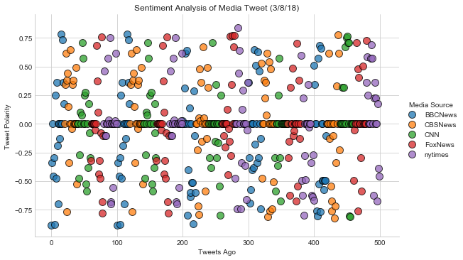
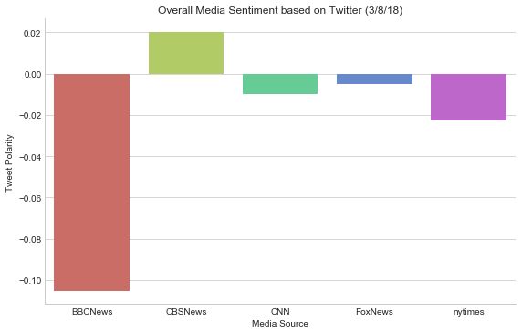

# NewsMood #
Twitter has become a wildly sprawling jungle of information—140 characters at a time. Somewhere between 350 million and 500 million tweets are estimated to be sent out per day. With such an explosion of data, on Twitter and elsewhere, it becomes more important than ever to tame it in some way, to concisely capture the essence of the data.

In this assignment, you'll create a Python script to perform a sentiment analysis of the Twitter activity of various news oulets, and to present your findings visually.

Your final output should provide a visualized summary of the sentiments expressed in Tweets sent out by the following news organizations: BBC, CBS, CNN, Fox, and New York times.

### Analysis ###
For March 8, 2018, BBC has the most negative sentiment overall whereas CBS has the most positive. These are based on the average Compound score for each news outlet.

Four out of the five news outlets had overall negative sentiments, so for March 8, the overall sentiment of the news was negative.


```python
# tweepy, pandas, matplotlib, seaborn, textblob, and VADER.
import tweepy
import json
import numpy as np
import pandas as pd
import matplotlib.pyplot as plt
import seaborn as sns
```


```python
# initializing sentiment analyzer
from vaderSentiment.vaderSentiment import SentimentIntensityAnalyzer
analyzer = SentimentIntensityAnalyzer()
```


```python
# twitter api keys
import config

consumer_key = config.key
consumer_secret = config.secret_key
access_token = config.token
access_token_secret = config.secret_token
```


```python
# Setup Tweepy API Authentication
auth = tweepy.OAuthHandler(consumer_key, consumer_secret)
auth.set_access_token(access_token, access_token_secret)
api = tweepy.API(auth, parser=tweepy.parsers.JSONParser())
```

### Tweet Information ###


```python
# list of news stations
target_terms = ["@BBCNews", "@CBSNews", "@CNN", "@FoxNews", "@nytimes"]

# holding the items in our list
tweet_info = []

# loop through each news station to get the recent 100 tweets (500 tweets total)
for x in range(5):
    
    # loop through all news stations
    for target in target_terms:
        public_tweets = api.user_timeline(target, page=x)
        
        # loop through all tweets
        for tweet in public_tweets:
            
            # run vader analysis on each tweet
            compound = analyzer.polarity_scores(tweet["text"])["compound"]
            pos = analyzer.polarity_scores(tweet["text"])["pos"]
            neu = analyzer.polarity_scores(tweet["text"])["neu"]
            neg = analyzer.polarity_scores(tweet["text"])["neg"]
            
            # add sentiments for each tweet into an array
            tweet_info.append({"Date": tweet["created_at"],
                               "Media Source": tweet['user']['screen_name'],
                               "Compound": compound,
                               "Positive": pos,
                               "Negative": neu,
                               "Neutral": neg,
                              "Text": tweet["text"]})

# create dataframe containing sentiment
tweet_info_df = pd.DataFrame(tweet_info) 

tweet_info_df["Tweets Ago"] = tweet_info_df["Date"].index

# cleanup dataframe
tweet_info_df = tweet_info_df[["Media Source","Date","Tweets Ago","Text", "Compound", "Negative", "Neutral", "Positive"]]

tweet_info_df

```


<div>
<style scoped>
    .dataframe tbody tr th:only-of-type {
        vertical-align: middle;
    }

    .dataframe tbody tr th {
        vertical-align: top;
    }

    .dataframe thead th {
        text-align: right;
    }
</style>
<table border="1" class="dataframe">
  <thead>
    <tr style="text-align: right;">
      <th></th>
      <th>Media Source</th>
      <th>Date</th>
      <th>Tweets Ago</th>
      <th>Text</th>
      <th>Compound</th>
      <th>Negative</th>
      <th>Neutral</th>
      <th>Positive</th>
    </tr>
  </thead>
  <tbody>
    <tr>
      <th>0</th>
      <td>BBCNews</td>
      <td>Thu Mar 08 22:37:52 +0000 2018</td>
      <td>0</td>
      <td>Friday's Daily Mirror: "M25 rapist is dead" \n...</td>
      <td>-0.8807</td>
      <td>0.495</td>
      <td>0.505</td>
      <td>0.000</td>
    </tr>
    <tr>
      <th>1</th>
      <td>BBCNews</td>
      <td>Thu Mar 08 22:36:35 +0000 2018</td>
      <td>1</td>
      <td>Friday's The Times: "Traitors are not safe on ...</td>
      <td>-0.3412</td>
      <td>0.862</td>
      <td>0.138</td>
      <td>0.000</td>
    </tr>
    <tr>
      <th>2</th>
      <td>BBCNews</td>
      <td>Thu Mar 08 22:36:18 +0000 2018</td>
      <td>2</td>
      <td>Friday's The Guardian: "Ministers set to offer...</td>
      <td>0.0000</td>
      <td>1.000</td>
      <td>0.000</td>
      <td>0.000</td>
    </tr>
    <tr>
      <th>3</th>
      <td>BBCNews</td>
      <td>Thu Mar 08 22:36:03 +0000 2018</td>
      <td>3</td>
      <td>Friday's The Sun: "Our lad's beating Vlad"\n#t...</td>
      <td>-0.4588</td>
      <td>0.769</td>
      <td>0.231</td>
      <td>0.000</td>
    </tr>
    <tr>
      <th>4</th>
      <td>BBCNews</td>
      <td>Thu Mar 08 22:35:40 +0000 2018</td>
      <td>4</td>
      <td>Friday's Daily Telegraph: "Give blood pressure...</td>
      <td>-0.2960</td>
      <td>0.864</td>
      <td>0.136</td>
      <td>0.000</td>
    </tr>
    <tr>
      <th>5</th>
      <td>BBCNews</td>
      <td>Thu Mar 08 20:31:12 +0000 2018</td>
      <td>5</td>
      <td>IoD chair accused of racist, sexist, and bully...</td>
      <td>-0.8779</td>
      <td>0.409</td>
      <td>0.591</td>
      <td>0.000</td>
    </tr>
    <tr>
      <th>6</th>
      <td>BBCNews</td>
      <td>Thu Mar 08 20:28:10 +0000 2018</td>
      <td>6</td>
      <td>RT @BBCSport: Back to winning ways!\n\nArsenal...</td>
      <td>0.2481</td>
      <td>0.748</td>
      <td>0.106</td>
      <td>0.145</td>
    </tr>
    <tr>
      <th>7</th>
      <td>BBCNews</td>
      <td>Thu Mar 08 20:12:33 +0000 2018</td>
      <td>7</td>
      <td>Knuckle-duster attack woman 'let down by syste...</td>
      <td>-0.4767</td>
      <td>0.693</td>
      <td>0.307</td>
      <td>0.000</td>
    </tr>
    <tr>
      <th>8</th>
      <td>BBCNews</td>
      <td>Thu Mar 08 19:53:19 +0000 2018</td>
      <td>8</td>
      <td>RT @BBC_HaveYourSay: The NHS is 70 years old t...</td>
      <td>0.3612</td>
      <td>0.868</td>
      <td>0.000</td>
      <td>0.132</td>
    </tr>
    <tr>
      <th>9</th>
      <td>BBCNews</td>
      <td>Thu Mar 08 19:07:31 +0000 2018</td>
      <td>9</td>
      <td>UK government to press on with Brexit bill des...</td>
      <td>-0.1877</td>
      <td>0.689</td>
      <td>0.181</td>
      <td>0.130</td>
    </tr>
    <tr>
      <th>10</th>
      <td>BBCNews</td>
      <td>Thu Mar 08 18:20:53 +0000 2018</td>
      <td>10</td>
      <td>KFC in partial return to ex-supplier Bidvest h...</td>
      <td>0.0000</td>
      <td>1.000</td>
      <td>0.000</td>
      <td>0.000</td>
    </tr>
    <tr>
      <th>11</th>
      <td>BBCNews</td>
      <td>Thu Mar 08 18:05:02 +0000 2018</td>
      <td>11</td>
      <td>Russian spy: Police name officer injured in at...</td>
      <td>-0.7003</td>
      <td>0.547</td>
      <td>0.453</td>
      <td>0.000</td>
    </tr>
    <tr>
      <th>12</th>
      <td>BBCNews</td>
      <td>Thu Mar 08 18:03:13 +0000 2018</td>
      <td>12</td>
      <td>RT @BBCSport: AC Milan 🆚 Arsenal is under way!...</td>
      <td>0.0000</td>
      <td>1.000</td>
      <td>0.000</td>
      <td>0.000</td>
    </tr>
    <tr>
      <th>13</th>
      <td>BBCNews</td>
      <td>Thu Mar 08 17:29:30 +0000 2018</td>
      <td>13</td>
      <td>University exams could be hit by new strike ac...</td>
      <td>-0.1280</td>
      <td>0.857</td>
      <td>0.143</td>
      <td>0.000</td>
    </tr>
    <tr>
      <th>14</th>
      <td>BBCNews</td>
      <td>Thu Mar 08 17:11:29 +0000 2018</td>
      <td>14</td>
      <td>RT @BBCSport: Aaron Ramsey is back in the Arse...</td>
      <td>0.0000</td>
      <td>1.000</td>
      <td>0.000</td>
      <td>0.000</td>
    </tr>
    <tr>
      <th>15</th>
      <td>BBCNews</td>
      <td>Thu Mar 08 16:55:54 +0000 2018</td>
      <td>15</td>
      <td>Meghan Markle hug a 'dream come true' for girl...</td>
      <td>0.7845</td>
      <td>0.470</td>
      <td>0.000</td>
      <td>0.530</td>
    </tr>
    <tr>
      <th>16</th>
      <td>BBCNews</td>
      <td>Thu Mar 08 16:47:39 +0000 2018</td>
      <td>16</td>
      <td>RT @bbc5live: “He was a gem"\n\nOscar-winning ...</td>
      <td>0.0000</td>
      <td>1.000</td>
      <td>0.000</td>
      <td>0.000</td>
    </tr>
    <tr>
      <th>17</th>
      <td>BBCNews</td>
      <td>Thu Mar 08 16:45:09 +0000 2018</td>
      <td>17</td>
      <td>RT @BBCFergusWalsh: Aged 82 but with the immun...</td>
      <td>0.7351</td>
      <td>0.744</td>
      <td>0.000</td>
      <td>0.256</td>
    </tr>
    <tr>
      <th>18</th>
      <td>BBCNews</td>
      <td>Thu Mar 08 16:40:18 +0000 2018</td>
      <td>18</td>
      <td>How exercise in old age prevents the immune sy...</td>
      <td>0.3612</td>
      <td>0.741</td>
      <td>0.000</td>
      <td>0.259</td>
    </tr>
    <tr>
      <th>19</th>
      <td>BBCNews</td>
      <td>Thu Mar 08 16:08:54 +0000 2018</td>
      <td>19</td>
      <td>Optician who claims to treat autism struck off...</td>
      <td>0.1779</td>
      <td>0.598</td>
      <td>0.171</td>
      <td>0.231</td>
    </tr>
    <tr>
      <th>20</th>
      <td>CBSNews</td>
      <td>Thu Mar 08 23:11:30 +0000 2018</td>
      <td>20</td>
      <td>In several letters with @steve_dorsey, "Pharma...</td>
      <td>0.0000</td>
      <td>1.000</td>
      <td>0.000</td>
      <td>0.000</td>
    </tr>
    <tr>
      <th>21</th>
      <td>CBSNews</td>
      <td>Thu Mar 08 22:41:32 +0000 2018</td>
      <td>21</td>
      <td>NEW: South Korean national security adviser to...</td>
      <td>0.3400</td>
      <td>0.888</td>
      <td>0.000</td>
      <td>0.112</td>
    </tr>
    <tr>
      <th>22</th>
      <td>CBSNews</td>
      <td>Thu Mar 08 22:40:01 +0000 2018</td>
      <td>22</td>
      <td>One of the best running backs in the 2018 NFL ...</td>
      <td>0.6124</td>
      <td>0.795</td>
      <td>0.045</td>
      <td>0.159</td>
    </tr>
    <tr>
      <th>23</th>
      <td>CBSNews</td>
      <td>Thu Mar 08 22:20:25 +0000 2018</td>
      <td>23</td>
      <td>Tom Brady's mop of brunette hair is no more --...</td>
      <td>-0.7650</td>
      <td>0.761</td>
      <td>0.239</td>
      <td>0.000</td>
    </tr>
    <tr>
      <th>24</th>
      <td>CBSNews</td>
      <td>Thu Mar 08 22:00:02 +0000 2018</td>
      <td>24</td>
      <td>"No matter how you slice it, falsity wins out"...</td>
      <td>0.3818</td>
      <td>0.720</td>
      <td>0.088</td>
      <td>0.192</td>
    </tr>
    <tr>
      <th>25</th>
      <td>CBSNews</td>
      <td>Thu Mar 08 21:42:45 +0000 2018</td>
      <td>25</td>
      <td>She was "originally only supposed to stay for ...</td>
      <td>0.4404</td>
      <td>0.868</td>
      <td>0.000</td>
      <td>0.132</td>
    </tr>
    <tr>
      <th>26</th>
      <td>CBSNews</td>
      <td>Thu Mar 08 21:24:17 +0000 2018</td>
      <td>26</td>
      <td>Judge recommends President Donald Trump mute r...</td>
      <td>0.1531</td>
      <td>0.654</td>
      <td>0.136</td>
      <td>0.210</td>
    </tr>
    <tr>
      <th>27</th>
      <td>CBSNews</td>
      <td>Thu Mar 08 21:13:04 +0000 2018</td>
      <td>27</td>
      <td>"Even in the proclamation the president just s...</td>
      <td>-0.3400</td>
      <td>0.876</td>
      <td>0.124</td>
      <td>0.000</td>
    </tr>
    <tr>
      <th>28</th>
      <td>CBSNews</td>
      <td>Thu Mar 08 21:04:33 +0000 2018</td>
      <td>28</td>
      <td>WATCH: Pres. Trump signs new tariffs on alumin...</td>
      <td>0.0000</td>
      <td>1.000</td>
      <td>0.000</td>
      <td>0.000</td>
    </tr>
    <tr>
      <th>29</th>
      <td>CBSNews</td>
      <td>Thu Mar 08 21:02:28 +0000 2018</td>
      <td>29</td>
      <td>"I thank you for the opportunity for what you ...</td>
      <td>0.6486</td>
      <td>0.782</td>
      <td>0.000</td>
      <td>0.218</td>
    </tr>
    <tr>
      <th>...</th>
      <td>...</td>
      <td>...</td>
      <td>...</td>
      <td>...</td>
      <td>...</td>
      <td>...</td>
      <td>...</td>
      <td>...</td>
    </tr>
    <tr>
      <th>470</th>
      <td>FoxNews</td>
      <td>Thu Mar 08 18:44:01 +0000 2018</td>
      <td>470</td>
      <td>.@HomeDepot pledges $50 million to train 20,00...</td>
      <td>0.0000</td>
      <td>1.000</td>
      <td>0.000</td>
      <td>0.000</td>
    </tr>
    <tr>
      <th>471</th>
      <td>FoxNews</td>
      <td>Thu Mar 08 18:39:48 +0000 2018</td>
      <td>471</td>
      <td>Nimble dad delivers daughter in front seat of ...</td>
      <td>-0.2960</td>
      <td>0.872</td>
      <td>0.128</td>
      <td>0.000</td>
    </tr>
    <tr>
      <th>472</th>
      <td>FoxNews</td>
      <td>Thu Mar 08 18:32:14 +0000 2018</td>
      <td>472</td>
      <td>JUST IN: UK officials say 21 people now being ...</td>
      <td>-0.5859</td>
      <td>0.787</td>
      <td>0.213</td>
      <td>0.000</td>
    </tr>
    <tr>
      <th>473</th>
      <td>FoxNews</td>
      <td>Thu Mar 08 18:30:00 +0000 2018</td>
      <td>473</td>
      <td>At a Cabinet meeting today, President @realDon...</td>
      <td>0.0000</td>
      <td>1.000</td>
      <td>0.000</td>
      <td>0.000</td>
    </tr>
    <tr>
      <th>474</th>
      <td>FoxNews</td>
      <td>Thu Mar 08 18:24:43 +0000 2018</td>
      <td>474</td>
      <td>Trump's parting words to adviser Gary Cohn: 'H...</td>
      <td>0.5023</td>
      <td>0.840</td>
      <td>0.000</td>
      <td>0.160</td>
    </tr>
    <tr>
      <th>475</th>
      <td>FoxNews</td>
      <td>Thu Mar 08 18:23:39 +0000 2018</td>
      <td>475</td>
      <td>'Where Is Their Disavowal?': @kimguilfoyle Rip...</td>
      <td>0.0000</td>
      <td>1.000</td>
      <td>0.000</td>
      <td>0.000</td>
    </tr>
    <tr>
      <th>476</th>
      <td>FoxNews</td>
      <td>Thu Mar 08 18:15:20 +0000 2018</td>
      <td>476</td>
      <td>.@seanspicer: "This has nothing to do with [@P...</td>
      <td>0.0000</td>
      <td>1.000</td>
      <td>0.000</td>
      <td>0.000</td>
    </tr>
    <tr>
      <th>477</th>
      <td>FoxNews</td>
      <td>Thu Mar 08 18:15:00 +0000 2018</td>
      <td>477</td>
      <td>.@NASA releases 'unearthly' pictures of Jupite...</td>
      <td>0.0000</td>
      <td>1.000</td>
      <td>0.000</td>
      <td>0.000</td>
    </tr>
    <tr>
      <th>478</th>
      <td>FoxNews</td>
      <td>Thu Mar 08 18:11:40 +0000 2018</td>
      <td>478</td>
      <td>Army sets sights on new sniper rifle https://t...</td>
      <td>0.0000</td>
      <td>1.000</td>
      <td>0.000</td>
      <td>0.000</td>
    </tr>
    <tr>
      <th>479</th>
      <td>FoxNews</td>
      <td>Thu Mar 08 18:04:01 +0000 2018</td>
      <td>479</td>
      <td>Disney boss tells shareholders that ‘The View’...</td>
      <td>0.7269</td>
      <td>0.681</td>
      <td>0.000</td>
      <td>0.319</td>
    </tr>
    <tr>
      <th>480</th>
      <td>nytimes</td>
      <td>Thu Mar 08 13:31:04 +0000 2018</td>
      <td>480</td>
      <td>Stormy Daniels was the topic du jour of late n...</td>
      <td>0.3612</td>
      <td>0.848</td>
      <td>0.000</td>
      <td>0.152</td>
    </tr>
    <tr>
      <th>481</th>
      <td>nytimes</td>
      <td>Thu Mar 08 13:20:02 +0000 2018</td>
      <td>481</td>
      <td>President Trump dined at the ornate home of a ...</td>
      <td>0.5859</td>
      <td>0.789</td>
      <td>0.000</td>
      <td>0.211</td>
    </tr>
    <tr>
      <th>482</th>
      <td>nytimes</td>
      <td>Thu Mar 08 13:08:00 +0000 2018</td>
      <td>482</td>
      <td>Ida B. Wells 1862-1931\n\n“Somebody must show ...</td>
      <td>0.2500</td>
      <td>0.905</td>
      <td>0.000</td>
      <td>0.095</td>
    </tr>
    <tr>
      <th>483</th>
      <td>nytimes</td>
      <td>Thu Mar 08 13:04:00 +0000 2018</td>
      <td>483</td>
      <td>Madhubala 1933-1969\n\nMadhubala was barely 16...</td>
      <td>0.0000</td>
      <td>1.000</td>
      <td>0.000</td>
      <td>0.000</td>
    </tr>
    <tr>
      <th>484</th>
      <td>nytimes</td>
      <td>Thu Mar 08 13:00:06 +0000 2018</td>
      <td>484</td>
      <td>Since 1851, obituaries in The New York Times h...</td>
      <td>0.0000</td>
      <td>1.000</td>
      <td>0.000</td>
      <td>0.000</td>
    </tr>
    <tr>
      <th>485</th>
      <td>nytimes</td>
      <td>Thu Mar 08 12:49:07 +0000 2018</td>
      <td>485</td>
      <td>Morning Briefing: Here's what you need to know...</td>
      <td>0.0000</td>
      <td>1.000</td>
      <td>0.000</td>
      <td>0.000</td>
    </tr>
    <tr>
      <th>486</th>
      <td>nytimes</td>
      <td>Thu Mar 08 12:41:05 +0000 2018</td>
      <td>486</td>
      <td>In Opinion\n\nOp-Ed contributor Sylvie Kauffma...</td>
      <td>0.5719</td>
      <td>0.761</td>
      <td>0.000</td>
      <td>0.239</td>
    </tr>
    <tr>
      <th>487</th>
      <td>nytimes</td>
      <td>Thu Mar 08 12:30:16 +0000 2018</td>
      <td>487</td>
      <td>In two months, the United States plans to open...</td>
      <td>0.6908</td>
      <td>0.759</td>
      <td>0.000</td>
      <td>0.241</td>
    </tr>
    <tr>
      <th>488</th>
      <td>nytimes</td>
      <td>Thu Mar 08 12:19:04 +0000 2018</td>
      <td>488</td>
      <td>The United States has moved to allow hunters t...</td>
      <td>0.5719</td>
      <td>0.783</td>
      <td>0.000</td>
      <td>0.217</td>
    </tr>
    <tr>
      <th>489</th>
      <td>nytimes</td>
      <td>Thu Mar 08 12:11:04 +0000 2018</td>
      <td>489</td>
      <td>President Trump is set to formalize tariffs on...</td>
      <td>0.0000</td>
      <td>1.000</td>
      <td>0.000</td>
      <td>0.000</td>
    </tr>
    <tr>
      <th>490</th>
      <td>nytimes</td>
      <td>Thu Mar 08 11:59:06 +0000 2018</td>
      <td>490</td>
      <td>The video shows a black man being Tasered and ...</td>
      <td>-0.6249</td>
      <td>0.758</td>
      <td>0.242</td>
      <td>0.000</td>
    </tr>
    <tr>
      <th>491</th>
      <td>nytimes</td>
      <td>Thu Mar 08 11:50:00 +0000 2018</td>
      <td>491</td>
      <td>@ChuBailiang Even those who thought that they ...</td>
      <td>0.2263</td>
      <td>0.909</td>
      <td>0.000</td>
      <td>0.091</td>
    </tr>
    <tr>
      <th>492</th>
      <td>nytimes</td>
      <td>Thu Mar 08 11:45:04 +0000 2018</td>
      <td>492</td>
      <td>A group of 11 nations — including major U.S. a...</td>
      <td>0.3612</td>
      <td>0.884</td>
      <td>0.000</td>
      <td>0.116</td>
    </tr>
    <tr>
      <th>493</th>
      <td>nytimes</td>
      <td>Thu Mar 08 11:30:27 +0000 2018</td>
      <td>493</td>
      <td>Morning Briefing: Here's what you need to know...</td>
      <td>0.0000</td>
      <td>1.000</td>
      <td>0.000</td>
      <td>0.000</td>
    </tr>
    <tr>
      <th>494</th>
      <td>nytimes</td>
      <td>Thu Mar 08 11:15:06 +0000 2018</td>
      <td>494</td>
      <td>Even those who thought that they had taken the...</td>
      <td>0.2263</td>
      <td>0.921</td>
      <td>0.000</td>
      <td>0.079</td>
    </tr>
    <tr>
      <th>495</th>
      <td>nytimes</td>
      <td>Thu Mar 08 11:00:04 +0000 2018</td>
      <td>495</td>
      <td>These extraordinary women — and so many others...</td>
      <td>0.0000</td>
      <td>1.000</td>
      <td>0.000</td>
      <td>0.000</td>
    </tr>
    <tr>
      <th>496</th>
      <td>nytimes</td>
      <td>Thu Mar 08 10:47:06 +0000 2018</td>
      <td>496</td>
      <td>Peter Madsen, who is said to have killed and d...</td>
      <td>-0.6705</td>
      <td>0.800</td>
      <td>0.200</td>
      <td>0.000</td>
    </tr>
    <tr>
      <th>497</th>
      <td>nytimes</td>
      <td>Thu Mar 08 10:30:10 +0000 2018</td>
      <td>497</td>
      <td>RT @RorySmith: What struck me most about Juven...</td>
      <td>0.1779</td>
      <td>0.817</td>
      <td>0.078</td>
      <td>0.105</td>
    </tr>
    <tr>
      <th>498</th>
      <td>nytimes</td>
      <td>Thu Mar 08 10:16:04 +0000 2018</td>
      <td>498</td>
      <td>"The E.U. is concerned that behind it all, the...</td>
      <td>-0.3875</td>
      <td>0.889</td>
      <td>0.111</td>
      <td>0.000</td>
    </tr>
    <tr>
      <th>499</th>
      <td>nytimes</td>
      <td>Thu Mar 08 09:59:08 +0000 2018</td>
      <td>499</td>
      <td>How to cut down on unwanted junk mail https://...</td>
      <td>-0.4588</td>
      <td>0.636</td>
      <td>0.364</td>
      <td>0.000</td>
    </tr>
  </tbody>
</table>
<p>500 rows × 8 columns</p>
</div>


```python
# Export the data in the DataFrame into a CSV file.
tweet_info_df.to_csv("NewsMood.csv", encoding='utf-8', index=False)
```

### Polarity of Individual Tweets ###


```python

# create scatterplot
scatter = sns.FacetGrid(data=tweet_info_df, hue='Media Source', aspect=1.61, size=5)
scatter.map(plt.scatter, 'Tweets Ago', 'Compound', edgecolors="black", alpha=0.75, s=100).add_legend()

# add title and lable axis
plt.title("Sentiment Analysis of Media Tweet (3/8/18)")
plt.ylabel("Tweet Polarity")
plt.xlabel("Tweets Ago")

# save .png image for plot
plt.savefig("SentimentAnalysis.png")
plt.show()
```





### Average Compound Scores of News Outlets ###


```python
# group dataframe by Media Source
media_source = tweet_info_df.groupby("Media Source")
#calculate average compound score
avg_cmp = media_source.mean()

tweet_avg = avg_cmp.reset_index(drop=False)
tweet_avg

# set type and palette for colors
_type = ['BBCNews', 'CBSNews', 'CNN', 'FoxNews', 'nytimes']
col_pal = sns.color_palette("hls", 5)

# create barplot
barbar = sns.factorplot(data=tweet_avg, x='Media Source', y='Compound', kind='bar', size=5, aspect=1.61, 
                        hue_order=_type, palette=col_pal)
sns.set_style("whitegrid")

# add title and label axis
plt.title("Overall Media Sentiment based on Twitter (3/8/18)")
plt.ylabel("Tweet Polarity")

# save .png image for plot
plt.savefig("SentimentAverage.png")
plt.show()
```

    /Users/abigailvasquez/anaconda3/envs/PythonData/lib/python3.6/site-packages/seaborn/categorical.py:1460: FutureWarning: remove_na is deprecated and is a private function. Do not use.
      stat_data = remove_na(group_data)




